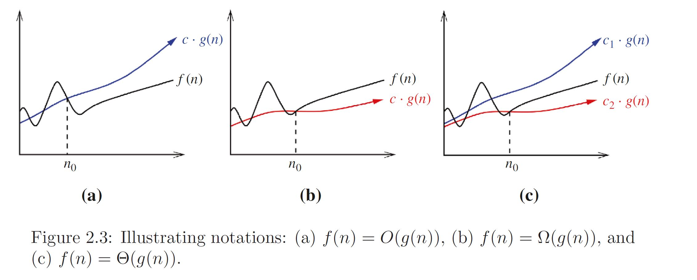
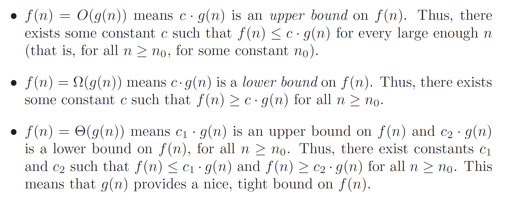
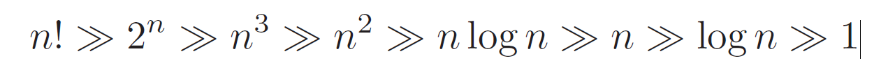

# The Algorithm Design Manual by Steven S. Skiena Notes

* This is a compilation of my notes while reading Algorithm Design Manual by Steven S. Skiena.

## Chapter 1 - Introduction to Algorithm Design

* There are three desirable properties for a good algorithm. We seek algorithms
that are correct and efficient, while being easy to implement.

* Correct algorithms usually come with a proof of correctness, which is an explanation of why we know that the algorithm must take every instance of the problem to the desired result. However, before we go further we demonstrate why “it’s obvious” never suffices as a proof of correctness, and is usually flat-out wrong.

### 1.2 Selecting the Right Jobs

* Recap on Permutations, Combinations & Factorial Numbers

    * The 3 things mentioned in the title have a lot to do with probability. Factorial numbers simply tell you how many possible ways that a specific number of objects can be arranged. An arrangement can also be called a **permutation**. . And then there are **combinations**.

    * Example: A set of numbers (1, 2, 3) could be arranged as:
        * `1, 2, 3 - 1, 3, 2 - 2, 1, 3 - 2, 3, 1 - 3, 1, 2 - 3, 2, 1`
        * `3 * 2 * 1 = 6` permutations, also known as `3!`
    
    * The number of possible arrangements (or permutations) for a specific number of objects is called the factorial of that number. For example, `1! = 1; 2! = 2; 3! = 6; 4! = 24; 5! = 120; 6! = 720`. (The exclamation point is also the symbol for factorial in mathematics.) By the way `0! = 1` because there's only one possible way to arrange zero objects! It's a bit of a paradox since there's really nothing to arrange!

    * **In permutations, order does matter.**

    * **In combinations, order doesn't matter.**

        * In both of these, the factorial function is used but with a slight difference between them.

        * `P(n,r) = n!/{(n-r)!}`
        * `C(n,r) = n!/{r!(n-r)!}`

        * You can divide the Permutation Function by `r!` to get the Combination Function.
    
    * A **permutation** is a set of `n` objects taken `r` at a time with no repetition in a specific order, while a **combination** is a set of `n` objects taken `r` at a time with no repetition but **rearranging the collected objects does NOT produce something different**.

* The `ExhaustiveScheduling` function proposed on Chapter 1 is an example of combination. Order does not matter for the `N` possible subsets of schedules. On another hand, `OptimalTSP` also proposed on Chapter 1 is an example of permutation, the order of the points does matter do the overall cost of the function.

### 1.3 Reasoning about Correctness

* We need tools to distinguish correct algorithms from incorrect ones, the primary one of which is called a proof.

* A proper mathematical proof consists of several parts. First, there is a clear, precise statement of what you are trying to prove. Second, there is a set of assumptions of things that are taken to be true, and hence can be used as part of the proof. Third, there is a chain of reasoning that takes you from these assumptions to the statement you are trying to prove. Finally, there is a little square ( ) or QED at the bottom to denote that you have finished, representing the Latin phrase for “thus it is demonstrated.”

* The book is not going to emphasize formal proofs of correctness, because they are very difficult to do right and quite misleading when you do them wrong. A proof is indeed a demonstration. Proofs are useful only when they are honest, crisp arguments that explain why an algorithm satisfies a non-trivial correctness property. Correct algorithms require careful exposition, and efforts to show both correctness and not incorrectness.

### 1.3.1 Problems and Properties

* Problem specifications have two parts: (1) the set of allowed input instances, and (2) the required properties of the algorithm’s output. It is impossible to prove the correctness of an algorithm for a fuzzily- stated problem. Put another way, ask the wrong question and you will get the wrong answer.

* Some problem specifications allow too broad a class of input instances. Sup- pose we had allowed film projects in our movie scheduling problem to have gaps in production (e.g. filming in September and November but a hiatus in October). Then the schedule associated with any particular film would consist of a given set of intervals. Our star would be free to take on two interleaving but not overlapping projects (such as the above-mentioned film nested with one filming in August and October). The earliest completion algorithm would not work for such a generalized scheduling problem. Indeed, no efficient algorithm exists for this generalized problem, as we will see in Section 11.3.2.

* **Take-Home Lesson: An important and honorable technique in algorithm de- sign is to narrow the set of allowable instances until there is a correct and efficient algorithm. For example, we can restrict a graph problem from general graphs down to trees, or a geometric problem from two dimensions down to one.**

* There are two common traps when specifying the output requirements of a problem. The first is asking an ill-defined question. Asking for the best route between two places on a map is a silly question, unless you define what best means. Do you mean the shortest route in total distance, or the fastest route, or the one minimizing the number of turns? All of these are liable to be different things.

* The second trap involves creating compound goals. The three route-planning criteria mentioned above are all well-defined goals that lead to correct, efficient optimization algorithms. But you must pick a single criterion. A goal like Find the shortest route from `a` to `b` that doesn’t use more than twice as many turns as necessary is perfectly well defined, but complicated to reason about and solve.

* Finding the right formulation for your problem is an important part of solving it. And studying the definition of all these classic algorithm problems will help you recognize when someone else has thought about similar problems before you.

### 1.3.2 Expressing Algorithms

* Reasoning about an algorithm is impossible without a careful description of the sequence of steps that are to be performed. The three most common forms of algorithmic notation are (1) English, (2) pseudocode, or (3) a real programming language. Pseudocode is perhaps the most mysterious of the bunch, but it is best defined as a programming language that never complains about syntax errors.

* All three methods are useful because there is a natural tradeoff between greater ease of expression and precision. English is the most natural but least precise programming language, while Java and C/C++ are precise but difficult to write and understand. Pseudocode is generally useful because it represents a happy medium.

### 1.3.3 Demonstrating Incorrectness

* The best way to prove that an algorithm is incorrect is to produce an instance on which it yields an incorrect answer. Such instances are called counterexamples. No rational person will ever defend the correctness of an algorithm after a counter-example has been identified. Very simple instances can instantly defeat reasonable-looking heuristics with a quick touch ́e. Good counterexamples have two important properties:

    * **Verifiability** – To demonstrate that a particular instance is a counterex- ample to a particular algorithm, you must be able to (1) calculate what answer your algorithm will give in this instance, and (2) display a better answer so as to prove that the algorithm didn’t find it.

    * Simplicity – **Good counter-examples have all unnecessary details stripped away**. They make clear exactly why the proposed algorithm fails. Simplicity is important because you must be able to hold the given instance in your head in order to reason about it. Once a counterexample has been found, it is worth simplifying it down to its essence. For example, the counterexample of Figure 1.6(l) could have been made simpler and better by reducing the number of overlapped segments from five to two.

* Think small – Note that the robot tour counter-examples I presented boiled down to six points or less, and the scheduling counter-examples to only three intervals. This is indicative of the fact that when algorithms fail, there is usually a very simple example on which they fail. Amateur algorists tend to draw a big messy instance and then stare at it helplessly. **The pros look carefully at several small examples**, because they are easier to verify and reason about.

* Think exhaustively – There are usually only a small number of possible instances for the first non-trivial value of n. For example, there are only three distinct ways two intervals on the line can occur: as disjoint intervals, as overlapping intervals, and as properly nesting intervals, one within the other. All cases of three intervals (including counter-examples to both of the movie heuristics) can be systematically constructed by adding a third segment in each possible way to these three instances.

* Hunt for the weakness – If a proposed algorithm is of the form “always take the biggest” (better known as the greedy algorithm), think about why that might prove to be the wrong thing to do. In particular, . . .

* Go for a tie – A devious way to break a greedy heuristic is to provide instances where everything is the same size. Suddenly the heuristic has nothing to base its decision on, and perhaps has the freedom to return something suboptimal as the answer.

### 1.4 Induction and Recursion

* Failure to find a counterexample to a given algorithm does not mean “it is obvious” that the algorithm is correct. A proof or demonstration of correctness is needed. Often mathematical induction is the method of choice.   

* When I first learned about mathematical induction it seemed like complete magic. You proved a formula like $\sum_{i=1}^{n} i = n(n+1)/2$ for some basis case like n = 1 or 2, then assumed it was true all the way to n−1 before proving it was in fact true for general n using the assumption. That was a proof? Ridiculous!

* When I first learned the programming technique of recursion it also seemed like complete magic. The program tested whether the input argument was some basis case like 1 or 2. If not, you solved the bigger case by breaking it into pieces and calling the subprogram itself to solve these pieces. That was a program? Ridiculous!

* The reason both seemed like magic is because recursion is **mathematical induction in action**. In both, we have general and boundary conditions, with the general condition breaking the problem into smaller and smaller pieces. The initial or boundary condition terminates the recursion. Once you understand either recursion or induction, you should be able to see why the other one also works.

* I’ve heard it said that a computer scientist is a mathematician who only knows how to prove things by induction. This is partially true because computer scientists are lousy at proving things, but primarily because so many of the algorithms we study are either recursive or incremental.

* A proof by induction consists of two cases. The first, the base case (or basis), proves the statement for n = 0 without assuming any knowledge of other cases. The second case, the induction step, proves that if the statement holds for any given case n = k, then it must also hold for the next case n = k + 1. These two steps establish that the statement holds for every natural number n.[3] The base case does not necessarily begin with n = 0, but often with n = 1, and possibly with any fixed natural number n = N, establishing the truth of the statement for all natural numbers n ≥ N.

* Consider the correctness of insertion sort, which we introduced at the be- ginning of this chapter. The reason it is correct can be shown inductively:

    * The basis case consists of a single element, and by definition a one-element array is completely sorted.

    * We assume that the first n − 1 elements of array A are completely sorted after n − 1 iterations of insertion sort.

    * To insert one last element x to A, we find where it goes, namely the unique spot between the biggest element less than or equal to x and the smallest element greater than x. This is done by moving all the greater elements back by one position, creating room for x in the desired location.

* One must be suspicious of inductive proofs, however, because very subtle reasoning errors can creep in. The first are boundary errors. For example, our insertion sort correctness proof above boldly stated that there was a unique place to insert x between two elements, when our basis case was a single-element array. Greater care is needed to properly deal with the special cases of inserting the minimum or maximum elements.

* The second and more common class of inductive proof errors concerns cava- lier extension claims. Adding one extra item to a given problem instance might cause the entire optimal solution to change. This was the case in our scheduling problem (see Figure 1.8). The optimal schedule after inserting a new segment may contain none of the segments of any particular optimal solution prior to insertion. Boldly ignoring such difficulties can lead to very convincing inductive proofs of incorrect algorithms.

### 1.5.1 Combinatorial Objects

* Modeling is the art of formulating your application in terms of precisely de- scribed, well-understood problems. Proper modeling is the key to applying algorithmic design techniques to real-world problems. Indeed, proper model- ing can eliminate the need to design or even implement algorithms, by relating your application to what has been done before. Proper modeling is the key to effectively using the “Hitchhiker’s Guide” in Part II of this book.

* Odds are very good that others have probably stumbled upon any algorithmic problem you care about, perhaps in substantially different contexts. But to find out what is known about your particular “widget optimization problem,” you can’t hope to find it in a book under widget. You must first formulate widget optimization in terms of computing properties of common structures such as those described below:

    * Permutations are arrangements, or orderings, of items. For example, {1,4,3,2} and {4,3,2,1} are two distinct permutations of the same set of four integers. We have already seen permutations in the robot opti- mization problem, and in sorting. Permutations are likely the object in question whenever your problem seeks an “arrangement,” “tour,” “order- ing,” or “sequence.”

    * Subsets/Combination represent selections from a set of items. For example, {1,3,4} and {2} are two distinct subsets of the first four integers. Order does not matter in subsets the way it does with permutations, so the subsets {1, 3, 4} and {4, 3, 1} would be considered identical. Subsets arose as can- didate solutions in the movie scheduling problem. They are likely the object in question whenever your problem seeks a “cluster,” “collection,” “committee,” “group,” “packaging,” or “selection.”

    * Trees represent hierarchical relationships between items. Figure 1.9(a) shows part of the family tree of the Skiena clan. Trees are likely the object in question whenever your problem seeks a “hierarchy,” “dominance relationship,” “ancestor/descendant relationship,” or “taxonomy.”

    * Graphs represent relationships between arbitrary pairs of objects. Figure 1.9(b) models a network of roads as a graph, where the vertices are cities and the edges are roads connecting pairs of cities. Graphs are likely the object in question whenever you seek a “network,” “circuit,” “web,” or “relationship.”

    * Points define locations in some geometric space. For example, the loca- tions of McDonald’s restaurants can be described by points on a map/plane. Points are likely the object in question whenever your problems work on “sites,” “positions,” “data records,” or “locations.”

    * Polygons define regions in some geometric spaces. For example, the bor- ders of a country can be described by a polygon on a map/plane. Polygons and polyhedra are likely the object in question whenever you are working on “shapes,” “regions,” “configurations,” or “boundaries.”

    * Strings represent sequences of characters, or patterns. For example, the names of students in a class can be represented by strings. Strings are likely the object in question whenever you are dealing with “text,” “char- acters,” “patterns,” or “labels.”

* These fundamental structures all have associated algorithm problems, which are presented in the catalog of Part II. Familiarity with these problems is im- portant, because they provide the language we use to model applications. To become fluent in this vocabulary, browse through the catalog and study the in- put and output pictures for each problem. Understanding these problems, even at a cartoon/definition level, will enable you to know where to look later when the problem arises in your application.

### 1.6 Proof by Contradiction

* Although some computer scientists only know how to prove things by induction, this isn’t true of everyone. The best sometimes use contradiction. The basic scheme of a contradiction argument is as follows:
    * Assume that the hypothesis (the statement you want to prove) is false.
    * Develop some logical consequences of this assumption.
    * Show that one consequence is demonstrably false, thereby showing that the assumption is incorrect and the hypothesis is true.

### 1.10 Exercises

* https://www.algorist.com/algowiki/index.php/Chapter_1

## Chapter 2 - Algorithm Analysis

* Algorithms are the most important and durable part of computer science because they can be studied in a language- and machine-independent way. This means we need techniques that let us compare the efficiency of algorithms without implementing them. Our two most important tools are (1) the RAM model of computation and (2) the asymptotic analysis of computational complexity. 

* Assessing algorithmic performance makes use of the “Big Oh” notation that proves essential to compare algorithms, and design better ones. This method of keeping score will be the most mathematically demanding part of this book. But once you understand the intuition behind this formalism it becomes a lot easier to deal with.

### 2.1 The RAM Model of Computation

* Machine-independent algorithm design depends upon a hypothetical computer called the Random Access Machine, or RAM. Under this model of computation, we are confronted with a computer where:

    * Each simple operation (+, *, –, =, if, call) takes exactly one time step.
    * Loops and subroutines are not considered simple operations. Instead, they are the composition of many single-step operations. It makes no sense for sort to be a single-step operation, since sorting 1,000,000 items will certainly take much longer than sorting ten items. The time it takes to run through a loop or execute a subprogram depends upon the number of loop iterations or the specific nature of the subprogram.
    * Each memory access takes exactly one time step. Furthermore, we have as much memory as we need. The RAM model takes no notice of whether an item is in cache or on the disk.

### 2.1.1 Best-Case,Worst-Case, and Average-Case Complexity

* Using the RAM model of computation, we can count how many steps our algorithm takes on any given input instance by executing it. However, to understand how good or bad an algorithm is in general, we must know how it works over all possible instances.

    * The worst-case complexity of the algorithm is the function defined by the maximum number of steps taken in any instance of size n. This represents the curve passing through the highest point in each column.
    * The best-case complexity of the algorithm is the function defined by the minimum number of steps taken in any instance of size n. This represents the curve passing through the lowest point of each column.
    * The average-case complexity or expected time of the algorithm, which is the function defined by the average number of steps over all instances of size n.

* Take-Home Lesson: Each of these time complexities defines a numerical function for any given algorithm, representing running time as a function of input size. These functions are just as well defined as any other numerical function, be it y = x2 −2x+1 or the price of Alphabet stock as a function of time. But time complexities are such complicated functions that we must simplify them for analysis using the “Big Oh” notation.

### 2.2 The Big Oh Notation

* The Big Oh notation ignores the difference between multiplicative constants. The functions f(n) = 2n and g(n) = n are identical in Big Oh analysis. This makes sense given our application. Suppose a given algorithm in (say) C language ran twice as fast as one with the same algorithm written in Java. This multiplicative factor of two can tell us nothing about the algorithm itself, because both programs implement exactly the same algorithm. We should ignore such constant factors when comparing two algorithms.

*  

* Big O = Worst case
* Big Theta = Average Case
* Big Omega = Best case

*  

* We do need to know which algorithm proves faster when sorting 10,000 or 1,000,000 items. The Big Oh notation enables us to ignore details and focus on the big picture.

* **Constant functions**, f(n) = 1: Such functions might measure the cost of adding two numbers, printing out “The Star Spangled Banner,” or the growth realized by functions such as f(n) = min(n, 100). In the big picture, there is no dependence on the parameter n.

* **Constant functions**, f(n) = 1: Such functions might measure the cost of adding two numbers, printing out “The Star Spangled Banner,” or the growth realized by functions such as f(n) = min(n, 100). In the big picture, there is no dependence on the parameter n.

* **Logarithmic functions**  f(n) = log n: Logarithmic time complexity shows up in algorithms such as binary search. Such functions grow quite slowly as n gets big, but faster than the constant function (which is standing still, after all).

* **Linear functions**, f(n) = n: Such functions measure the cost of looking at each item once (or twice, or ten times) in an n-element array, say to identify the biggest item, the smallest item, or compute the average value.

* **Superlinear functions**, f(n) = n lg n: This important class of functions arises in such algorithms as quicksort and mergesort. They grow just a little faster than linear (recall Figure 2.4), but enough so to rise to a higher dominance class.

* **Quadratic functions**, f(n) = n2: Such functions measure the cost of looking at most or all pairs of items in an n-element universe. These arise in algorithms such as insertion sort and selection sort.

* **Cubic functions**, f(n) = n3: Such functions enumerate all triples of items in an n-element universe. These also arise in certain dynamic programming algorithms, to be developed in Chapter 10.

* **Exponential functions**, f(n) = cn for a given constant c > 1: Functions like 2n arise when enumerating all subsets of n items. As we have seen, exponential algorithms become useless fast, but not as fast as. . .

* **Factorial functions**, f(n) = n!: Functions like n! arise when generating all permutations or orderings of n items.

* 

* Page 53