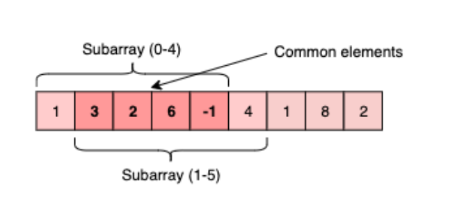
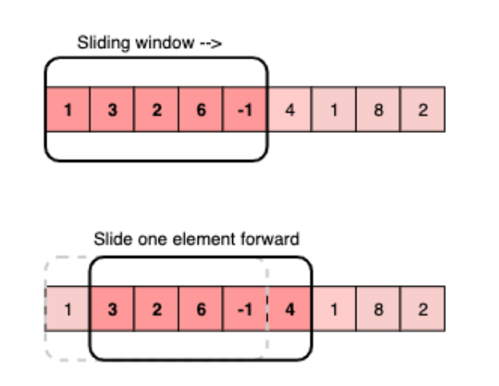
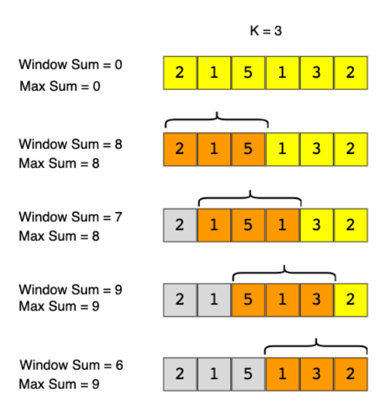
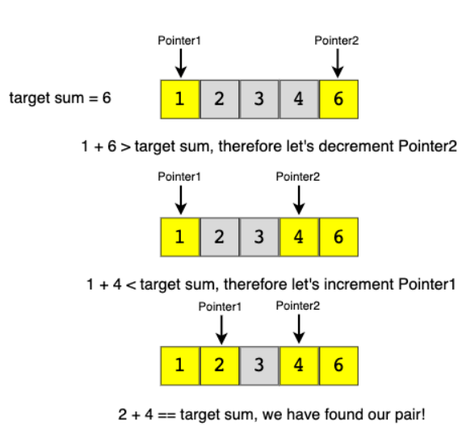
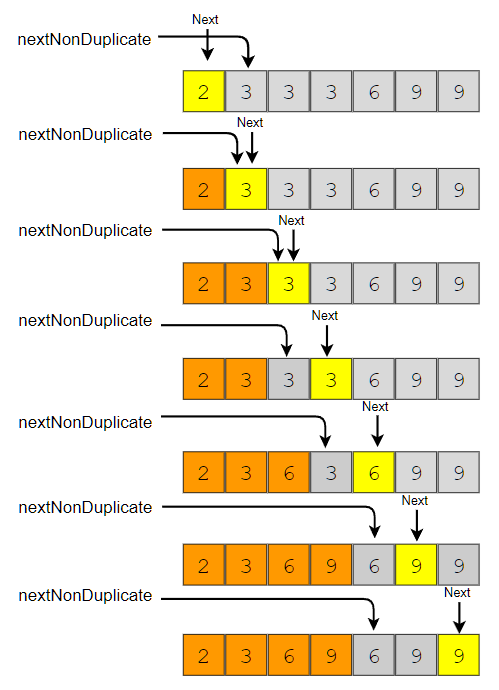
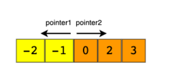
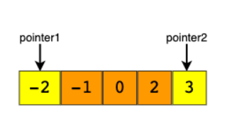

# Grokking the Coding Interview: Patterns for Coding Questions

* This course categorizes coding interview problems into a set of 16 patterns. Each pattern will be a complete tool - consisting of data structures, algorithms, and analysis techniques - to solve a specific category of problems. The goal is to develop an understanding of the underlying pattern, so that, we can apply that pattern to solve other problems.

## Pattern: Sliding Window

### Introduction

* Given an array, find the average of all subarrays of `K` contiguous elements in it.

* Examples
    * ```
        Input: [1, 3, 2, 6, -1, 4, 1, 8, 2], K=5
        Output: [2.2, 2.8, 2.4, 3.6, 2.8]
        ```

* Code
    * `solution1.java`
    * ```java
        import java.util.Arrays;

        class AverageOfSubarrayOfSizeK {
            public static double[] findAverages(int K, int[] arr) {
                double[] result = new double[arr.length - K + 1];
                for (int i = 0; i <= arr.length - K; i++) {
                    // find sum of next 'K' elements
                    double sum = 0;
                    for (int j = i; j < i + K; j++)
                        sum += arr[j];
                    result[i] = sum / K; // calculate average
                }

                return result;
            }

            public static void main(String[] args) {
                double[] result = AverageOfSubarrayOfSizeK.findAverages(5, 
                                    new int[] { 1, 3, 2, 6, -1, 4, 1, 8, 2 });
                System.out.println("Averages of subarrays of size K: " + Arrays.toString(result));
            }
        }
        ```

* Solution
    * Time complexity: Since for every element of the input array, we are calculating the sum of its next `K` elements, the time complexity of the above algorithm will be `O(N*K)` where `N` is the number of elements in the input array.

    * The inefficiency is that for any two consecutive subarrays of size ‘5’, the overlapping part (which will contain four elements) will be evaluated twice. For example, take the above-mentioned input:

    * 

    * As you can see, there are four overlapping elements between the subarray (indexed from `0-4`) and the subarray (indexed from `1-5`). Can we somehow reuse the sum we have calculated for the overlapping elements?

    * The efficient way to solve this problem would be to visualize each subarray as a sliding window of `5` elements. This means that we will slide the window by one element when we move on to the next subarray. To reuse the sum from the previous subarray, we will subtract the element going out of the window and add the element now being included in the sliding window. This will save us from going through the whole subarray to find the sum and, as a result, the algorithm complexity will reduce to `O(N)`.

    * 

* Code
    * `solution1.java`
    * ```java
        public static double[] findAveragesV2(int K, int[] arr) {
            double[] results = new double[arr.length - K + 1];

            int sum = 0;
            // O(K)
            for (int i = 0; i < K; i++) {
                sum += arr[i];
            }
            int i = 0;
            results[i] = sum/K;

            int firstIndex = 0;
            int lastIndex = K-1;

            // O(N-K)
            while (true) {
                sum -= arr[firstIndex];
                firstIndex++;
                lastIndex++;
                if (lastIndex == arr.length) break;
                sum += arr[lastIndex];
                results[++i] = sum/K;
            }
            
            return results;
        }
        ```

* In the following chapters, we will apply the Sliding Window approach to solve a few problems.

* In some problems, the size of the sliding window is not fixed. We have to expand or shrink the window based on the problem constraints. We will see a few examples of such problems in the next chapters.

### Maximum Sum Subarray of Size K (easy)

* Given an array of positive numbers and a positive number `k`, find the maximum `sum` of any contiguous subarray of size `k`.

* ```
    Input: [2, 1, 5, 1, 3, 2], k=3 
    Output: 9
    Explanation: Subarray with maximum sum is [5, 1, 3].
    ```

* ```
    Input: [2, 3, 4, 1, 5], k=2 
    Output: 7
    Explanation: Subarray with maximum sum is [3, 4].
    ```

* A basic brute force solution will be to calculate the sum of all `k` sized subarrays of the given array to find the subarray with the highest `sum`. We can start from every index of the given array and add the next `k` elements to find the subarray’s sum. Following is the visual representation of this algorithm for Example-1:

* 

* Code
    * `solution2.java`
    * ```java
        class MaxSumSubArrayOfSizeK {
            public static int findMaxSumSubArray(int k, int[] arr) {
                int maxSum = 0, windowSum;
                for (int i = 0; i <= arr.length - k; i++) {
                    windowSum = 0;
                    for (int j = i; j < i + k; j++) {
                        windowSum += arr[j];
                    }
                    maxSum = Math.max(maxSum, windowSum);
                }

                return maxSum;
            }
            
            public static void main(String[] args) {
                System.out.println("Maximum sum of a subarray of size K: "
                    + MaxSumSubArrayOfSizeK.findMaxSumSubArray(3, new int[] { 2, 1, 5, 1, 3, 2 }));
                System.out.println("Maximum sum of a subarray of size K: "
                    + MaxSumSubArrayOfSizeK.findMaxSumSubArray(2, new int[] { 2, 3, 4, 1, 5 }));
            }
        }
        ```

        * The above algorithm’s time complexity will be `O(N∗K)`, where `N` is the total number of elements in the given array. Is it possible to find a better algorithm than this?

* A better approach

* If you observe closely, you will realize that to calculate the sum of a contiguous subarray, we can utilize the sum of the previous subarray. For this, consider each subarray as a **Sliding Window** of size `k`. To calculate the sum of the next subarray, we need to slide the window ahead by one element. So to slide the window forward and calculate the sum of the new position of the sliding window, we need to do two things:

    * Subtract the element going out of the sliding window, i.e., subtract the first element of the window.

    * Add the new element getting included in the sliding window, i.e., the element coming right after the end of the window.

* This approach will save us from re-calculating the sum of the overlapping part of the sliding window. Here is what our algorithm will look like:

* Code
    * `solution2.java`
    * ```java
        public static double findMaxSumSubArrayV2(int K, int[] arr) {
            int sum = 0;
            // O(K)
            for (int i = 0; i < K; i++) {
                sum += arr[i];
            }
            int maxSum = sum;
            
            // O(N-K)
            for (int firstIndex = 0, lastIndex = K; lastIndex < arr.length; firstIndex++, lastIndex++) {
                sum -= arr[firstIndex];
                sum += arr[lastIndex];
                maxSum = Math.max(maxSum, sum);
            }
            
            return maxSum;
        }
        ```

* Complexity
    * The time complexity of the above algorithm will be `O(N)`.

    * The algorithm runs in constant space `O(1)`.

### Smallest Subarray with a Greater Sum (easy)

* Given an array of positive numbers and a positive number `S`, find the length of the smallest contiguous subarray whose `sum` is **greater than or equal** to `S`. Return `0` if no such subarray exists.

* Example
    * ```
        Input: [2, 1, 5, 2, 3, 2], S=7 
        Output: 2
        Explanation: The smallest subarray with a sum greater than or equal to '7' is [5, 2].
        ```
    
    * ```
        Input: [2, 1, 5, 2, 8], S=7 
        Output: 1
        Explanation: The smallest subarray with a sum greater than or equal to '7' is [8].
        ```
    
    * ```
        Input: [3, 4, 1, 1, 6], S=8 
        Output: 3
        Explanation: Smallest subarrays with a sum greater than or equal to '8' are [3, 4, 1] 
        or [1, 1, 6].
        ```

* This problem follows the Sliding Window pattern, and we can use a similar strategy as discussed in Maximum Sum Subarray of Size K. There is one difference though: in this problem, the sliding window size is not fixed. Here is how we will solve this problem:
    * First, we will add-up elements from the beginning of the array until their sum becomes greater than or equal to `S`.
    * These elements will constitute our sliding window. We are asked to find the smallest such window having a sum greater than or equal to `S`. We will remember the length of this window as the smallest window so far.
    * After this, we will keep adding one element in the sliding window (i.e., slide the window ahead) in a stepwise fashion.
    * In each step, we will also try to shrink the window from the beginning. We will shrink the window until the window’s sum is smaller than ‘S’ again. This is needed as we intend to find the smallest window. This shrinking will also happen in multiple steps; in each step, we will do two things:
        * Check if the current window length is the smallest so far, and if so, remember its length.
        * Subtract the first element of the window from the running sum to shrink the sliding window.
* Code  
    * `solution3.java`
    * ```java
        class MinSizeSubArraySum {
            public static int findMinSubArray(int S, int[] arr) {
                int windowSum = 0, minLength = Integer.MAX_VALUE;
                int windowStart = 0;
                for (int windowEnd = 0; windowEnd < arr.length; windowEnd++) {
                    windowSum += arr[windowEnd]; // add the next element
                    // shrink the window as small as possible until the 'windowSum' is smaller than 'S'
                    while (windowSum >= S) {
                        minLength = Math.min(minLength, windowEnd - windowStart + 1);
                        windowSum -= arr[windowStart]; // subtract the element going out
                        windowStart++; // slide the window ahead
                    }
                }

                return minLength == Integer.MAX_VALUE ? 0 : minLength;
            }

            public static void main(String[] args) {
                int result = MinSizeSubArraySum.findMinSubArray(7, new int[] { 2, 1, 5, 2, 3, 2 });
                System.out.println("Smallest subarray length: " + result);
                result = MinSizeSubArraySum.findMinSubArray(7, new int[] { 2, 1, 5, 2, 8 });
                System.out.println("Smallest subarray length: " + result);
                result = MinSizeSubArraySum.findMinSubArray(8, new int[] { 3, 4, 1, 1, 6 });
                System.out.println("Smallest subarray length: " + result);
            }
        }
        ```

* Time Complexity
    *  The time complexity of the above algorithm will be `O(N)`. The outer for loop runs for all elements, and the inner while loop processes each element only once; therefore, the time complexity of the algorithm will be `O(N+N)`, which is asymptotically equivalent to `O(N)`.

* Space Complexity
  * The algorithm runs in constant space `O(1)`

### Longest Substring with K Distinct Characters (medium)

* Given a `string`, find the length of the **longest substring** in it with no more than `K` **distinct characters**.
    * You can assume that `K` is less than or equal to the length of the given string.

* Example
    * ```
        Input: String="araaci", K=2
        Output: 4
        Explanation: The longest substring with no more than '2' distinct characters is "araa".
        ```
    * ``` 
        Input: String="araaci", K=1
        Output: 2
        Explanation: The longest substring with no more than '1' distinct characters is "aa".
        ```
    * ```
        Input: String="cbbebi", K=3
        Output: 5
        Explanation: The longest substrings with no more than '3' distinct characters are "cbbeb" & "bbebi".
        ```

* Solution
    * This problem follows the Sliding Window pattern, and we can use a similar dynamic sliding window strategy as discussed in Smallest Subarray with a Greater Sum. We can use a HashMap to remember the frequency of each character we have processed. Here is how we will solve this problem:

        * First, we will insert characters from the beginning of the string until we have `K` distinct characters in the `HashMap`.
        * These characters will constitute our sliding window. We are asked to find the longest such window having no more than `K` distinct characters. We will remember the length of this window as the longest window so far.
        * After this, we will keep adding one character in the sliding window (i.e., slide the window ahead) in a stepwise fashion.
        * In each step, we will try to shrink the window from the beginning if the count of distinct characters in the `HashMap` is larger than `K`. We will shrink the window until we have no more than `K` distinct characters in the `HashMap`. This is needed as we intend to find the longest window.
        * While shrinking, we’ll decrement the character’s frequency going out of the window and remove it from the `HashMap` if its frequency becomes `zero`.
        * At the end of each step, we’ll check if the current window length is the longest so far, and if so, remember its length.

* Code
    * `solution4.java`

    * ```java
        import java.util.*;

        class LongestSubstringKDistinct {
            public static int findLength(String str, int k) {
                if (str == null || str.length() == 0 || str.length() < k)
                throw new IllegalArgumentException();

                int windowStart = 0, maxLength = 0;
                Map<Character, Integer> charFrequencyMap = new HashMap<>();
                // in the following loop we'll try to extend the range [windowStart, windowEnd]
                for (int windowEnd = 0; windowEnd < str.length(); windowEnd++) {
                    char rightChar = str.charAt(windowEnd);
                    charFrequencyMap.put(rightChar, charFrequencyMap.getOrDefault(rightChar, 0) + 1);
                    // shrink the sliding window, until we are left with 'k' distinct characters in 
                    // the frequency map
                    while (charFrequencyMap.size() > k) {
                        char leftChar = str.charAt(windowStart);
                        charFrequencyMap.put(leftChar, charFrequencyMap.get(leftChar) - 1);
                        if (charFrequencyMap.get(leftChar) == 0) {
                            charFrequencyMap.remove(leftChar);
                        }
                        windowStart++; // shrink the window
                    }
                    // remember the maximum length so far
                    maxLength = Math.max(maxLength, windowEnd - windowStart + 1);
                }
                return maxLength;
            }

            public static void main(String[] args) {
                System.out.println("Length of the longest substring: " 
                + LongestSubstringKDistinct.findLength("araaci", 2));
                System.out.println("Length of the longest substring: " 
                + LongestSubstringKDistinct.findLength("araaci", 1));
                System.out.println("Length of the longest substring: " 
                + LongestSubstringKDistinct.findLength("cbbebi", 3));
            }
        }
        ```

* Time Complexity

    * The above algorithm’s time complexity will be `O(N)`, where `N` is the number of characters in the input string. The outer for loop runs for all characters, and the inner while loop processes each character only once; therefore, the time complexity of the algorithm will be `O(N+N)`, which is asymptotically equivalent to `O(N)`.

* Space Complexity

    * The algorithm’s space complexity is `O(K)`, as we will be storing a maximum of `K+1` characters in the `HashMap`.

### Fruits into Baskets (medium)

* You are visiting a farm to collect fruits. The farm has a single row of fruit trees. You will be given two baskets, and your goal is to pick as many fruits as possible to be placed in the given baskets. 

* You will be given an array of characters where each character represents a fruit tree. The farm has following restrictions:
  * Each basket can have only one type of fruit. There is no limit to how many fruit a basket can hold.
  * You can start with any tree, but you can’t skip a tree once you have started.
  * You will pick exactly one fruit from every tree until you cannot, i.e., you will stop when you have to pick from a third fruit type.
* Write a function to return the maximum number of fruits in both baskets.

* Write a function to return the maximum number of fruits in both baskets.

* Examples
    * ```
        Input: Fruit=['A', 'B', 'C', 'A', 'C']
        Output: 3
        Explanation: We can put 2 'C' in one basket and one 'A' in the other from the subarray ['C', 'A', 'C']
        ```
    * ```
        Input: Fruit = ['A', 'B', 'C', 'B', 'B', 'C']
        Output: 5
        Explanation: We can put 3 'B' in one basket and two 'C' in the other basket. This can be done if we start with the second letter: ['B', 'C', 'B', 'B', 'C']
        ```

* Solution

    * This problem follows the `Sliding Window` pattern and is quite similar to `Longest Substring with K Distinct Characters`. In this problem, we need to find the length of the longest subarray with no **more than two distinct characters** (or fruit types!). This transforms the current problem into `Longest Substring with K Distinct Characters where K=2`.

* Code
    * `solution5.java`
    * ```java
        import java.util.*;

        class MaxFruitCountOf2Types {
            public static int findLength(char[] arr) {
                int windowStart = 0, maxLength = 0;
                Map<Character, Integer> fruitFrequencyMap = new HashMap<>();
                // try to extend the range [windowStart, windowEnd]
                for (int windowEnd = 0; windowEnd < arr.length; windowEnd++) {
                    fruitFrequencyMap.put(arr[windowEnd], 
                                            fruitFrequencyMap.getOrDefault(arr[windowEnd], 0) + 1);
                    // shrink the sliding window, until we're left with '2' fruits in the frequency map
                    while (fruitFrequencyMap.size() > 2) {
                        fruitFrequencyMap.put(arr[windowStart], 
                                            fruitFrequencyMap.get(arr[windowStart]) - 1);
                        if (fruitFrequencyMap.get(arr[windowStart]) == 0) {
                            fruitFrequencyMap.remove(arr[windowStart]);
                        }
                        windowStart++; // shrink the window
                    }
                    maxLength = Math.max(maxLength, windowEnd - windowStart + 1);
                }

                return maxLength;
            }

            public static void main(String[] args) {
                System.out.println("Maximum number of fruits: " + 
                    MaxFruitCountOf2Types.findLength(new char[] { 'A', 'B', 'C', 'A', 'C' }));
                System.out.println("Maximum number of fruits: " + 
                    MaxFruitCountOf2Types.findLength(new char[] { 'A', 'B', 'C', 'B', 'B', 'C' }));
            }
        }
        ```

* Time Complexity

    * The above algorithm’s time complexity will be `O(N)`, where `N` is the number of characters in the input array. The outer 'for' loop runs for all characters, and the inner `while` loop processes each character only once; therefore, the time complexity of the algorithm will be `O(N+N)`, which is asymptotically equivalent to `O(N)`.

* Space Complexity
    * The algorithm runs in constant space `O(1)` as there can be a maximum of three types of fruits stored in the frequency map.

### Longest Substring with Distinct Characters (hard)

* Given a `string`, find the length of the **longest substring, which has all distinct characters**.

* Examples
    * ```
        Input: String="aabccbb"
        Output: 3
        Explanation: The longest substring with distinct characters is "abc".
        ```
    * ```
        Input: String="abbbb"
        Output: 2
        Explanation: The longest substring with distinct characters is "ab".
        ```
    * ```
        Input: String="abccde"
        Output: 3
        Explanation: Longest substrings with distinct characters are "abc" & "cde".
        ```

* Solution
    * This problem follows the Sliding Window pattern, and we can use a similar dynamic sliding window strategy as discussed in Longest Substring with K Distinct Characters. We can use a HashMap to remember the last index of each character we have processed. Whenever we get a duplicate character, we will shrink our sliding window to ensure that we always have distinct characters in the sliding window.
    
    * `solution6.java`
    * ```java
        import java.util.*;

        class NoRepeatSubstring {
            public static int findLength(String str) {
                int windowStart = 0, maxLength = 0;
                Map<Character, Integer> charIndexMap = new HashMap<>();
                // try to extend the range [windowStart, windowEnd]
                for (int windowEnd = 0; windowEnd < str.length(); windowEnd++) {
                    char rightChar = str.charAt(windowEnd);
                    // if the map already contains the 'rightChar', shrink the window from the 
                    // beginning so that we have only one occurrence of 'rightChar'
                    if (charIndexMap.containsKey(rightChar)) {
                        // this is tricky; in the current window, we will not have any 'rightChar' after 
                        // its previous index and if 'windowStart' is already ahead of the last index of
                        // 'rightChar', we'll keep 'windowStart'
                        windowStart = Math.max(windowStart, charIndexMap.get(rightChar) + 1);
                    }
                    charIndexMap.put(rightChar, windowEnd); // insert the 'rightChar' into the map
                    // remember the maximum length so far
                    maxLength = Math.max(maxLength, windowEnd - windowStart + 1); 
                }

                return maxLength;
            }

            public static void main(String[] args) {
                System.out.println("Length of the longest substring: " 
                                    + NoRepeatSubstring.findLength("aabccbb"));
                System.out.println("Length of the longest substring: " 
                                    + NoRepeatSubstring.findLength("abbbb"));
                System.out.println("Length of the longest substring: " 
                                    + NoRepeatSubstring.findLength("abccde"));
            }
        }
        ```

* Time Complexity
    * The above algorithm’s time complexity will be `O(N)`, where `N` is the number of characters in the input string.

* Space Complexity
    * The algorithm’s space complexity will be `O(K)`, where `K` is the number of distinct characters in the input string. This also means `K<=N`, because in the worst case, the whole string might not have any duplicate character, so the entire string will be added to the HashMap. Having said that, since we can expect a fixed set of characters in the input string (e.g., **26 for English letters**), we can say that the algorithm runs in fixed space `O(1)`; in this case, we can use a fixed-size array instead of the `HashMap`.

### Longest Substring with Same Letters after Replacement (hard)

* Given a string with **lowercase letters only**, if you are allowed to replace no more than `k` letters with any letter, find the length of the **longest substring having the same letters** after replacement.

* Examples

    * ```
        Input: String="aabccbb", k=2
        Output: 5
        Explanation: Replace the two 'c' with 'b' to have a longest repeating substring "bbbbb".
        ```

    * ```
        Input: String="abbcb", k=1
        Output: 4
        Explanation: Replace the 'c' with 'b' to have a longest repeating substring "bbbb".
        ```

    * ```
        Input: String="abccde", k=1
        Output: 3
        Explanation: Replace the 'b' or 'd' with 'c' to have the longest repeating substring "ccc".
        ```

* Solution
    * This problem follows the `Sliding Window pattern`, and we can use a similar dynamic sliding window strategy as discussed in `Longest Substring with Distinct Characters`. We can use a `HashMap` to count the **frequency of each letter**.
        * We will iterate through the string to add one letter at a time in the window.
        * We will also keep track of the **count of the maximum repeating letter** in any window (let’s call it **maxRepeatLetterCount**).
        * So, at any time, we know that we do have a window with one letter repeating **maxRepeatLetterCount** times; this means we should try to replace the remaining letters.
            * If the remaining letters are less than or equal to `k`, we can replace them all.
            * If we have more than `k` remaining letters, we should shrink the window as we cannot replace more than `k` letters.
  
    * While shrinking the window, we don’t need to update maxRepeatLetterCount   (hence, it represents the maximum repeating count of ANY letter for ANY window). Why don’t we need to update this count when we shrink the window? Since we have to replace all the remaining letters to get the longest substring having the same letter in any window, we can’t get a better answer from any other window even though all occurrences of the letter with frequency maxRepeatLetterCount is not in the current window.

* Code
    * `solution7.java`
    * ```java
        import java.util.*;

        class CharacterReplacement {
            public static int findLength(String str, int k) {
                int windowStart = 0, maxLength = 0, maxRepeatLetterCount = 0;
                Map<Character, Integer> letterFrequencyMap = new HashMap<>();
                // try to extend the range [windowStart, windowEnd]
                for (int windowEnd = 0; windowEnd < str.length(); windowEnd++) {
                    char rightChar = str.charAt(windowEnd);
                    letterFrequencyMap.put(rightChar, letterFrequencyMap.getOrDefault(rightChar, 0) + 1);
                    maxRepeatLetterCount = Math.max(maxRepeatLetterCount, letterFrequencyMap.get(rightChar));

                    // current window size is from windowStart to windowEnd, overall we have a letter 
                    // which is repeating 'maxRepeatLetterCount' times, this means we can have a window
                    //  which has one letter repeating 'maxRepeatLetterCount' times and the remaining 
                    // letters we should replace. If the remaining letters are more than 'k', it is the
                    // time to shrink the window as we are not allowed to replace more than 'k' letters
                    if (windowEnd - windowStart + 1 - maxRepeatLetterCount > k) {
                        char leftChar = str.charAt(windowStart);
                        letterFrequencyMap.put(leftChar, letterFrequencyMap.get(leftChar) - 1);
                        windowStart++;
                    }

                    maxLength = Math.max(maxLength, windowEnd - windowStart + 1);
                }

                return maxLength;
            }

            public static void main(String[] args) {
                System.out.println(CharacterReplacement.findLength("aabccbb", 2));
                System.out.println(CharacterReplacement.findLength("abbcb", 1));
                System.out.println(CharacterReplacement.findLength("abccde", 1));
            }
        }
        ```

* Time Complexity
    * The above algorithm’s time complexity will be `O(N)`, where `N` is the number of letters in the input string.

* Space Complexity
    * As we expect only the lower case letters in the input string, we can conclude that the space complexity will be `O(26)` to store each letter’s frequency in the HashMap, which is asymptotically equal to `O(1)`.

### Longest Subarray with Ones after Replacement (hard)

* Given an array containing `0`s and `1`s, if you are allowed to replace no more than `k` `0`s with `1`s, find the length of the longest contiguous subarray having all `1`s.

* Examples

    * ```
        Input: Array=[0, 1, 1, 0, 0, 0, 1, 1, 0, 1, 1], k=2
        Output: 6
        Explanation: Replace the '0' at index 5 and 8 to have the longest contiguous subarray of 1s having length 6.
        ```

    * ```
        Input: Array=[0, 1, 0, 0, 1, 1, 0, 1, 1, 0, 0, 1, 1], k=3
        Output: 9
        Explanation: Replace the '0' at index 6, 9, and 10 to have the longest contiguous subarray of 1s having length 9.
        ```

* Solution

    * This problem follows the `Sliding Window` pattern and is quite similar to `Longest Substring with same Letters after Replacement`. The only difference is that, in the problem, we only have two characters (`1`s and `0`s) in the input arrays.

    * Following a similar approach, we’ll iterate through the array to add one number at a time in the window. We’ll also keep track of the `maximum number of repeating 1`s in the current window (let’s call it maxOnesCount). So at any time, we know that we can have a window with 1s repeating `maxOnesCount` time, so we should try to replace the remaining `0`s. If we have more than `k` remaining `0`s, we should shrink the window as we are not allowed to replace more than `k` `0`s.

* Code  
    * `solution8.java`
    * ```java
        class ReplacingOnes {
            public static int findLength(int[] arr, int k) {
                int windowStart = 0, maxLength = 0, maxOnesCount = 0;
                // try to extend the range [windowStart, windowEnd]
                for (int windowEnd = 0; windowEnd < arr.length; windowEnd++) {
                    if (arr[windowEnd] == 1)
                        maxOnesCount++;

                    // current window size is from windowStart to windowEnd, overall we have a maximum 
                    // of 1s repeating a maximum of 'maxOnesCount' times, this means that we can have a
                    //  window with 'maxOnesCount' 1s and the remaining are 0s which should replace 
                    // with 1s. Now, if the remaining 0s are more than 'k', it is the time to shrink 
                    // the window as we are not allowed to replace more than 'k' Os.
                    if (windowEnd - windowStart + 1 - maxOnesCount > k) {
                        if (arr[windowStart] == 1)
                        maxOnesCount--;
                        windowStart++;
                }

                maxLength = Math.max(maxLength, windowEnd - windowStart + 1);
                }

                return maxLength;
            }

            public static void main(String[] args) {
                System.out.println(
                ReplacingOnes.findLength(new int[] { 0, 1, 1, 0, 0, 0, 1, 1, 0, 1, 1 }, 2));
                System.out.println(
                ReplacingOnes.findLength(new int[] { 0, 1, 0, 0, 1, 1, 0, 1, 1, 0, 0, 1, 1 }, 3));
            }
        }
        ```

* Time Complexity

    * The above algorithm’s time complexity will be `O(N)`, where `N` is the count of numbers in the input array.

* Space Complexity

    * The algorithm runs in constant space `O(1)`.

### Problem Challenge 1: Permutation in a String (hard)

* Given a string and a pattern, find out if the string contains any permutation of the pattern.

* Given a string and a pattern, find out if the string contains any permutation of the pattern.
    * abc
    * acb
    * bac
    * bca
    * cab
    * cba

* Examples

    * ```
        Input: String="oidbcaf", Pattern="abc"
        Output: true
        Explanation: The string contains "bca" which is a permutation of the given pattern.
        ```

    * ```
        Input: String="odicf", Pattern="dc"
        Output: false
        Explanation: No permutation of the pattern is present in the given string as a substring.
        ```

    * ```
        Input: String="bcdxabcdy", Pattern="bcdyabcdx"
        Output: true
        Explanation: Both the string and the pattern are a permutation of each other.
        ```

    * ```
        Input: String="aaacb", Pattern="abc"
        Output: true
        Explanation: The string contains "acb" which is a permutation of the given pattern.
        ```

* Solution

    * This problem follows the `Sliding Window pattern`, and we can use a similar sliding window strategy as discussed in `Longest Substring with K Distinct Characters`. We can use a `HashMap` to remember the frequencies of all characters in the given pattern. Our goal will be to match all the characters from this `HashMap` with a sliding window in the given string. Here are the steps of our algorithm:

        * Create a `HashMap` to calculate the frequencies of all characters in the pattern.
        * Iterate through the string, adding one character at a time in the sliding window.
        * If the character being added matches a character in the `HashMap`, decrement its frequency in the map. If the character frequency becomes zero, we got a complete match.
        * If at any time, the number of characters matched is equal to the number of distinct characters in the pattern (i.e., total characters in the `HashMap`), we have gotten our required permutation.
        * If the window size is greater than the length of the pattern, shrink the window to make it equal to the pattern’s size. At the same time, if the character going out was part of the pattern, put it back in the frequency `HashMap`.

* Code
    * `solution9.java`
    * ```java
        import java.util.*;

        class StringPermutation {
            public static boolean findPermutation(String str, String pattern) {
                int windowStart = 0, matched = 0;
                Map<Character, Integer> charFrequencyMap = new HashMap<>();
                for (char chr : pattern.toCharArray())
                    charFrequencyMap.put(chr, charFrequencyMap.getOrDefault(chr, 0) + 1);

                // our goal is to match all the characters from the 'charFrequencyMap' with the 
                // current window try to extend the range [windowStart, windowEnd]
                for (int windowEnd = 0; windowEnd < str.length(); windowEnd++) {
                    char rightChar = str.charAt(windowEnd);
                    if (charFrequencyMap.containsKey(rightChar)) {
                        // decrement the frequency of the matched character
                        charFrequencyMap.put(rightChar, charFrequencyMap.get(rightChar) - 1);
                        if (charFrequencyMap.get(rightChar) == 0) // character is completely matched
                        matched++;
                    }

                    if (matched == charFrequencyMap.size())
                        return true;

                    if (windowEnd >= pattern.length() - 1) { // shrink the window by one character
                        char leftChar = str.charAt(windowStart++);
                        if (charFrequencyMap.containsKey(leftChar)) {
                        if (charFrequencyMap.get(leftChar) == 0)
                            matched--; // before putting the character back, decrement the matched count
                        // put the character back for matching
                        charFrequencyMap.put(leftChar, charFrequencyMap.get(leftChar) + 1);
                        }
                    }
                }

                return false;
            }

            public static void main(String[] args) {
                System.out.println("Permutation exist: " 
                    + StringPermutation.findPermutation("oidbcaf", "abc"));
                System.out.println("Permutation exist: " 
                    + StringPermutation.findPermutation("odicf", "dc"));
                System.out.println("Permutation exist: " 
                    + StringPermutation.findPermutation("bcdxabcdy", "bcdyabcdx"));
                System.out.println("Permutation exist: " 
                    + StringPermutation.findPermutation("aaacb", "abc"));
            }
        }
        ```
    
* Time Complexity

    * The above algorithm’s time complexity will be O(`N` + `M`), where `N` and `M` are the number of characters in the input string and the pattern, respectively.

* Space Complexity

    * The algorithm’s space complexity is `O(M)` since, in the worst case, the whole pattern can have distinct characters that will go into the `HashMap`.

### Problem Challenge 2: String Anagrams (hard)

* Given a string and a pattern, find all anagrams of the pattern in the given string.

* Every anagram is a permutation of a string. As we know, when we are not allowed to repeat characters while finding permutations of a string, we get `N!` permutations (or anagrams) of a string having `N` characters. For example, here are the six anagrams of the string “abc”:
    * abc
    * acb
    * bac
    * bca
    * cab
    * cba

* Write a function to return a list of starting indices of the anagrams of the pattern in the given string.

* Examples

    * ```
        Input: String="ppqp", Pattern="pq"
        Output: [1, 2]
        Explanation: The two anagrams of the pattern in the given string are "pq" and "qp".
        ```

    * ```
        Input: String="abbcabc", Pattern="abc"
        Output: [2, 3, 4]
        Explanation: The three anagrams of the pattern in the given string are "bca", "cab", and "abc".
        ```

* Solution

    * This problem follows the `Sliding Window` pattern and is very similar to `Permutation in a String`. In this problem, we need to find every occurrence of any permutation of the pattern in the string. We will use a list to store the starting indices of the anagrams of the pattern in the string.

* Code'
    * `solution10.java`
    * ```java
        import java.util.*;

        class StringAnagrams {
            public static List<Integer> findStringAnagrams(String str, String pattern) {
                int windowStart = 0, matched = 0;
                Map<Character, Integer> charFrequencyMap = new HashMap<>();
                for (char chr : pattern.toCharArray())
                    charFrequencyMap.put(chr, charFrequencyMap.getOrDefault(chr, 0) + 1);

                List<Integer> resultIndices = new ArrayList<Integer>();
                // our goal is to match all the characters from the map with the current window
                for (int windowEnd = 0; windowEnd < str.length(); windowEnd++) {
                    char rightChar = str.charAt(windowEnd);
                    // decrement the frequency of the matched character
                    if (charFrequencyMap.containsKey(rightChar)) {
                        charFrequencyMap.put(rightChar, charFrequencyMap.get(rightChar) - 1);
                        if (charFrequencyMap.get(rightChar) == 0)
                            matched++;
                    }

                    if (matched == charFrequencyMap.size()) // have we found an anagram?
                        resultIndices.add(windowStart);

                    if (windowEnd >= pattern.length() - 1) { // shrink the window
                        char leftChar = str.charAt(windowStart++);
                        if (charFrequencyMap.containsKey(leftChar)) {
                            if (charFrequencyMap.get(leftChar) == 0)
                                matched--; // before putting the character back, decrement the matched count
                            // put the character back
                            charFrequencyMap.put(leftChar, charFrequencyMap.get(leftChar) + 1);
                        }
                    }
                }

                return resultIndices;
            }

            public static void main(String[] args) {
                System.out.println(StringAnagrams.findStringAnagrams("ppqp", "pq"));
                System.out.println(StringAnagrams.findStringAnagrams("abbcabc", "abc"));
            }
        }
        ```

* Time Complexity

    * The time complexity of the above algorithm will be `O(N + M)` where `N` and `M` are the number of characters in the input string and the pattern respectively.

* Space Complexity

    * The space complexity of the algorithm is `O(M)` since in the worst case, the whole pattern can have distinct characters which will go into the HashMap. In the worst case, we also need `O(N)` space for the result list, this will happen when the pattern has only one character and the string contains only that character.

### Problem Challenge 4: Words Concatenation (hard)

* Given a `string` and a `list` of words, find all the `starting indices` of substrings in the given string that are a **concatenation of all the given words** exactly once **without any overlapping** of words. **It is given that all words are of the same length.**

* Examples
    * ```
        Input: String="catfoxcat", Words=["cat", "fox"]
        Output: [0, 3]
        Explanation: The two substring containing both the words are "catfox" & "foxcat".
        ```

    * ```
        Input: String="catcatfoxfox", Words=["cat", "fox"]
        Output: [3]
        Explanation: The only substring containing both the words is "catfox".
        ```

* Solution

    * This problem follows the Sliding Window pattern and has a lot of similarities with Maximum Sum Subarray of Size K. We will keep track of all the words in a HashMap and try to match them in the given string. Here are the set of steps for our algorithm:

        * Keep the frequency of every word in a HashMap.
        * Starting from every index in the string, try to match all the words.
        * In each iteration, keep track of all the words that we have already seen in another HashMap.
        * If a word is not found or has a higher frequency than required, we can move on to the next character in the string.
        * Store the index if we have found all the words.

* Code  
    * `solution11.java`
    * ```java
        import java.util.*;

        class WordConcatenation {
            public static List<Integer> findWordConcatenation(String str, String[] words) {
                Map<String, Integer> wordFrequencyMap = new HashMap<>();
                for (String word : words)
                    wordFrequencyMap.put(word, wordFrequencyMap.getOrDefault(word, 0) + 1);

                List<Integer> resultIndices = new ArrayList<Integer>();
                int wordsCount = words.length, wordLength = words[0].length();

                for (int i = 0; i <= str.length() - wordsCount * wordLength; i++) {
                    Map<String, Integer> wordsSeen = new HashMap<>();
                    for (int j = 0; j < wordsCount; j++) {
                        int nextWordIndex = i + j * wordLength;
                        // get the next word from the string
                        String word = str.substring(nextWordIndex, nextWordIndex + wordLength);
                        if (!wordFrequencyMap.containsKey(word)) // break if we don't need this word
                            break;

                        // add the word to the 'wordsSeen' map
                        wordsSeen.put(word, wordsSeen.getOrDefault(word, 0) + 1); 

                        // no need to process further if the word has higher frequency than required 
                        if (wordsSeen.get(word) > wordFrequencyMap.getOrDefault(word, 0))
                            break;

                        if (j + 1 == wordsCount) // store index if we have found all the words
                        resultIndices.add(i);
                    }
                }

                return resultIndices;
            }

            public static void main(String[] args) {
                List<Integer> result = WordConcatenation.findWordConcatenation(
                                                    "catfoxcat", new String[] { "cat", "fox" });
                System.out.println(result);
                result = WordConcatenation.findWordConcatenation(
                                                    "catcatfoxfox", new String[] { "cat", "fox" });
                System.out.println(result);
            }
        }
        ```

* Time Complexity

    * The time complexity of the above algorithm will be `O(N * M * Len)` where `N` is the number of characters in the given string, `M` is the total number of words, and ‘Len’ is the length of a word.

* Space Complexity
    * The space complexity of the algorithm is `O(M)` since at most, we will be storing all the words in the two `HashMaps`. In the worst case, we also need `O(N)` space for the resulting list. So, the overall space complexity of the algorithm will be `O(M+N)`.

## Pattern: Two Pointers

### Introduction

* In problems where we deal with `sorted arrays` (or `LinkedLists`) and need to find a set of elements that fulfill certain constraints, the `Two Pointers` approach becomes quite useful. The set of elements could be a `pair`, a `triplet` or even a `subarray`. For example, take a look at the following problem:

* ```
    Given an array of sorted numbers and a target sum, find a pair in the array whose sum is equal to the given target.
    ```

* To solve this problem, we can consider each element one by one (pointed out by the first pointer) and iterate through the remaining elements (pointed out by the second pointer) to find a pair with the given sum. The time complexity of this algorithm will be `O(N^2)` where `N` is the number of elements in the input array.

* Given that the input array is sorted, an efficient way would be to start with one pointer in the beginning and another pointer at the end. At every step, we will see if the numbers pointed by the two pointers add up to the target sum. If they do not, we will do one of two things:

    * If the sum of the two numbers pointed by the two pointers is greater than the target sum, this means that we need a pair with a smaller sum. So, to try more pairs, we can decrement the end-pointer.
    * If the sum of the two numbers pointed by the two pointers is smaller than the target sum, this means that we need a pair with a larger sum. So, to try more pairs, we can increment the start-pointer.

* Here is the visual representation of this algorithm:

*  

* The time complexity of the above algorithm will be `O(N)`.

* In the following chapters, we will apply the Two Pointers approach to solve a few problems.

### Pair with Target Sum (easy)

* Given an `array of sorted numbers` and a `target sum`, find a `pair` in the array whose `sum is equal to the given target`.

* Write a function to `return the indices` of the two numbers (i.e. the pair) such that they add up to the given target.

* Examples
    * ```
        Input: [1, 2, 3, 4, 6], target=6
        Output: [1, 3]
        Explanation: The numbers at index 1 and 3 add up to 6: 2+4=6
        ```

    * ```
        Input: [2, 5, 9, 11], target=11
        Output: [0, 2]
        Explanation: The numbers at index 0 and 2 add up to 11: 2+9=11
        ```

* Solution

    * Since the given array is sorted, a brute-force solution could be to iterate through the array, taking one number at a time and **searching for the second number through** `Binary Search`. The time complexity of this algorithm will be `O(N*logN)`. Can we do better than this?

    * We can follow the `Two Pointers` approach. We will start with one pointer pointing to the **beginning of the array** and another **pointing at the end**. At every step, we will see if the numbers pointed by the two pointers add up to the target `sum`. If they do, we have found our pair; otherwise, we will do one of two things:

        * If the `sum` of the two numbers pointed by the two pointers **is greater** than the target `sum`, this means that we need a pair with a smaller `sum`. So, to try more pairs, we can decrement the `end-pointer`. 
        * If the `sum` of the two numbers pointed by the two pointers **is smaller** than the target `sum`, this means that we need a pair with a larger sum. So, to try more pairs, we can increment the `start-pointer`.
    
    *  

* Code  
    * `solution1.java`
    * ```java
        public static int[] findPair(int[] nums, int target) {
            int startIndex = 0;
            int endIndex = nums.length - 1;
            while (startIndex < endIndex) {
                int sum = nums[startIndex] + nums[endIndex];
                if (sum == target) {
                    return new int[]{startIndex, endIndex};
                }
                if (sum > target) {
                    endIndex--;
                } else {
                    startIndex++;
                }
            }
            return new int[]{};
        }
        ```

* Time Complexity
    * The time complexity of the above algorithm will be `O(N)`, where `N` is the total number of elements in the given array.

* Space Complexity
    * The algorithm runs in constant space `O(1)`.

* An Alternate approach
    * Instead of using a `two-pointer` or a `binary search` approach, we can utilize a `HashTable` to search for the required pair. We can iterate through the array one number at a time. Let’s say during our iteration we are at number `X`, so we need to find `Y` such that `X + Y == Target`. We will do two things here:
        * Search for `Y` (which is equivalent to `Target−X`) in the `HashTable`. If it is there, we have found the required pair.
        * Otherwise, insert `X` in the `HashTable`, so that we can search it for the later numbers.

* Code
    * `solution1.java`
    * ```java
        public static int[] search(int[] arr, int targetSum) {
            HashMap<Integer, Integer> nums = new HashMap<>(); // to store numbers and indices
            for (int i = 0; i < arr.length; i++) {
                if (nums.containsKey(targetSum - arr[i]))
                    return new int[] { nums.get(targetSum - arr[i]), i };
                else
                    nums.put(arr[i], i); // put the number and its index in the map
            }
            return new int[] { -1, -1 }; // pair not found
        }
        ```

* Time Complexity
    * The time complexity of the above algorithm will be `O(N)`, where `N` is the total number of elements in the given array.

* Space Complexity
    * The space complexity will also be `O(N)`, as, in the worst case, we will be pushing `N` numbers in the `HashTable`.

### Remove Duplicates (easy)

* Given an array of `sorted numbers`, remove `all duplicates` from it. You should not use any extra space; after removing the duplicates `in-place` return the `length of the subarray` that has no duplicate in it.

* Examples

    * ```
        Input: [2, 3, 3, 3, 6, 9, 9]
        Output: 4
        Explanation: The first four elements after removing the duplicates will be [2, 3, 6, 9].
        ```
    * ```
        Input: [2, 2, 2, 11]
        Output: 2
        Explanation: The first two elements after removing the duplicates will be [2, 11].
        ```

* Solution

    * In this problem, we need to remove the duplicates in-place such that the resultant length of the array remains sorted. As the input array is sorted, therefore, one way to do this is to shift the elements `left` whenever we encounter duplicates. In other words, we will keep one pointer for iterating the array and one pointer for placing the next non-duplicate number. **So our algorithm will be to iterate the array and whenever we see a non-duplicate number we move it next to the last non-duplicate number we’ve seen.**

    * 

* Code
    * `solution2.java`
    * ```java
        class RemoveDuplicates {

            public static int remove(int[] arr) {
                int nextNonDuplicate = 1; // index of the next non-duplicate element
                for (int i = 0; i < arr.length; i++) {
                    if (arr[nextNonDuplicate - 1] != arr[i]) {
                        arr[nextNonDuplicate] = arr[i];
                        nextNonDuplicate++;
                    }
                }

                return nextNonDuplicate;
            }

            public static void main(String[] args) {
                int[] arr = new int[] { 2, 3, 3, 3, 6, 9, 9 };
                System.out.println(RemoveDuplicates.remove(arr));

                arr = new int[] { 2, 2, 2, 11 };
                System.out.println(RemoveDuplicates.remove(arr));
            }
        }
        ```

* Time Complexity
    * The time complexity of the above algorithm will be `O(N)`, where `N` is the total number of elements in the given array.

* Space Complexity
    * The algorithm runs in constant space `O(1)`.

* Similar Questions
    * Problem 1: Given an unsorted array of numbers and a target ‘key’, remove all instances of ‘key’ in-place and return the new length of the array.

* Examples
    * ```
        Input: [3, 2, 3, 6, 3, 10, 9, 3], Key=3
        Output: 4
        Explanation: The first four elements after removing every 'Key' will be [2, 6, 10, 9].
        ```
    * ```
        Input: [2, 11, 2, 2, 1], Key=2
        Output: 2
        Explanation: The first two elements after removing every 'Key' will be [11, 1].
        ```

* Solution
    * This problem is quite similar to our parent problem. We can follow a two-pointer approach and shift numbers left upon encountering the ‘key’. Here is what the code will look like:

* Code
    * `solution3.java`
    * ```java
        class RemoveElement {

            public static int remove(int[] arr, int key) {
                int nextElement = 0; // index of the next element which is not 'key'
                for (int i = 0; i < arr.length; i++) {
                    if (arr[i] != key) {
                        arr[nextElement] = arr[i];
                        nextElement++;
                    }
                }

                return nextElement;
            }

            public static void main(String[] args) {
                int[] arr = new int[] { 3, 2, 3, 6, 3, 10, 9, 3 };
                System.out.println(RemoveElement.remove(arr, 3));

                arr = new int[] { 2, 11, 2, 2, 1 };
                System.out.println(RemoveElement.remove(arr, 2));
            }
        }
        ```

* Time and Space Complexity
    * The time complexity of the above algorithm will be `O(N)`, where `N` is the total number of elements in the given array.

    * The algorithm runs in constant space `O(1)`.

## Squaring a Sorted Array (easy)

* Given a `sorted array`, create a new `array` containing `squares of all the numbers` of the input array in the `sorted order`.

* Solution
    * This is a straightforward question. The only trick is that we can have negative numbers in the input array, which will make it a bit difficult to generate the output array with squares in sorted order.

    * An easier approach could be to `first find the index` of the first non-negative number in the array. After that, we can use `Two Pointers to iterate the array`. One pointer will move forward to iterate the non-negative numbers, and the other pointer will move backward to iterate the negative numbers. At any step, whichever number gives us a bigger square will be added to the output array. For the above-mentioned Example-1, we will do something like this:

    * 

    * Since the numbers at both ends can give us the largest square, an alternate approach could be to use two pointers starting at both ends of the input array. At any step, whichever pointer gives us the bigger square, we add it to the result array and move to the next/previous number according to the pointer. For the above-mentioned Example-1, we will do something like this:

    * 

* Code  
    * `solution4.java`
    * ```java
        class SortedArraySquares {

            public static int[] makeSquares(int[] arr) {
                int n = arr.length;
                int[] squares = new int[n];
                int highestSquareIdx = n - 1;
                int left = 0, right = arr.length - 1;
                while (left <= right) {
                    int leftSquare = arr[left] * arr[left];
                    int rightSquare = arr[right] * arr[right];
                    if (leftSquare > rightSquare) {
                        squares[highestSquareIdx--] = leftSquare;
                        left++;
                    } else {
                        squares[highestSquareIdx--] = rightSquare;
                        right--;
                    }
                }
                return squares;
            }

            public static void main(String[] args) {

                int[] result = SortedArraySquares.makeSquares(new int[] { -2, -1, 0, 2, 3 });
                for (int num : result)
                    System.out.print(num + " ");
                System.out.println();

                result = SortedArraySquares.makeSquares(new int[] { -3, -1, 0, 1, 2 });
                for (int num : result)
                    System.out.print(num + " ");
                System.out.println();
            }
        }
        ```

* Time Complexity
    * The above algorithm’s time complexity will be `O(N)` as we are iterating the input array only once.

* Space Complexity
    * The above algorithm’s space complexity will also be `O(N)`; this space will be used for the output array.

## Triplet Sum to Zero (medium)

* Given an `array` of `unsorted numbers`, find all `unique triplets` in it that `add up` to zero.

* Example 
    * ```
        Input: [-3, 0, 1, 2, -1, 1, -2]
        Output: [-3, 1, 2], [-2, 0, 2], [-2, 1, 1], [-1, 0, 1]
        Explanation: There are four unique triplets whose sum is equal to zero.
        ```
    * ```
        Input: [-5, 2, -1, -2, 3]
        Output: [[-5, 2, 3], [-2, -1, 3]]
        Explanation: There are two unique triplets whose sum is equal to zero.
        ```

* Solution
    * This problem follows the `Two Pointers` pattern and shares similarities with `Pair with Target Sum`. A couple of differences are that the input array is not sorted and instead of a pair we need to find triplets with a target sum of zero.

    * To follow a similar approach, first, we will sort the array and then iterate through it taking one number at a time. Let’s say during our iteration we are at number `X`, so we need to find `Y` and `Z` such that `X` + `Y` + `Z` == `0`. At this stage, our problem translates into finding a pair whose `sum` is equal to `-X` (as from the above equation `Y` + `Z` == `-X`).

    * Another difference from `Pair with Target Sum` is that we need to find all the unique triplets. To handle this, we have to skip any duplicate number. Since we will be sorting the array, so all the duplicate numbers will be next to each other and are easier to skip.

* Code  
    * `solution5.java`
    * ```java
        import java.util.*;

        class TripletSumToZero {

            public static List<List<Integer>> searchTriplets(int[] arr) {
                Arrays.sort(arr);
                List<List<Integer>> triplets = new ArrayList<>();
                for (int i = 0; i < arr.length - 2; i++) {
                    if (i > 0 && arr[i] == arr[i - 1]) // skip same element to avoid duplicate triplets
                        continue;
                    searchPair(arr, -arr[i], i + 1, triplets);
                }

                return triplets;
            }

            private static void searchPair(int[] arr, int targetSum, 
                                            int left, List<List<Integer>> triplets) {
                int right = arr.length - 1;
                while (left < right) {
                    int currentSum = arr[left] + arr[right];
                    if (currentSum == targetSum) { // found the triplet
                        triplets.add(Arrays.asList(-targetSum, arr[left], arr[right]));
                        left++;
                        right--;
                        while (left < right && arr[left] == arr[left - 1])
                            left++; // skip same element to avoid duplicate triplets
                        while (left < right && arr[right] == arr[right + 1])
                            right--; // skip same element to avoid duplicate triplets
                    } else if (targetSum > currentSum) {
                        left++; // we need a pair with a bigger sum
                    } else {
                        right--; // we need a pair with a smaller sum
                    }
                }
            }

            public static void main(String[] args) {
                System.out.println(TripletSumToZero.searchTriplets(
                                    new int[] { -3, 0, 1, 2, -1, 1, -2 }));
                System.out.println(TripletSumToZero.searchTriplets(new int[] { -5, 2, -1, -2, 3 }));
            }
        }
        ```

* Time Complexity
    * Sorting the array will take `O(N * logN)`. The `searchPair()` function will take `O(N)`. As we are calling `searchPair()` for every number in the input array, this means that overall `searchTriplets()` will take `O(N * logN + N^2)`, which is asymptotically equivalent to `O(N^2)`.

* Space Complexity
    * Ignoring the space required for the output array, the space complexity of the above algorithm will be `O(N)` which is required for sorting.

## Triplet Sum Close to Target (medium)

* Given an array of `unsorted numbers` and a `target number`, find a `triplet` in the array whose `sum` is as close to the `target number` as possible, return `the sum of the triplet`. If there are more than one such triplet, return the sum of the triplet with the `smallest sum`.


* Examples
    * ```
        Input: [-2, 0, 1, 2], target=2
        Output: 1
        Explanation: The triplet [-2, 1, 2] has the closest sum to the target.
        ```
    * ```
        Input: [-3, -1, 1, 2], target=1
        Output: 0
        Explanation: The triplet [-3, 1, 2] has the closest sum to the target.
        ```
    * ```
        Input: [1, 0, 1, 1], target=100
        Output: 3
        Explanation: The triplet [1, 1, 1] has the closest sum to the target.
        ```

* Solution
    * This problem follows the `Two Pointers` pattern and is quite similar to `Triplet Sum to Zero`.

    * We can follow a similar approach to iterate through the array, taking `one number at a time`. At every step, we will save the difference between the `triplet` and the `target number`, so that in the end, we can return the triplet with the `closest sum`.

* Code
    * ```java
        import java.util.*;

        class TripletSumCloseToTarget {

            public static int searchTriplet(int[] arr, int targetSum) {
                if (arr == null || arr.length < 3)
                    throw new IllegalArgumentException();

                Arrays.sort(arr);
                
                int smallestDifference = Integer.MAX_VALUE;
                
                for (int i = 0; i < arr.length - 2; i++) {
                    int left = i + 1, right = arr.length - 1;
                    while (left < right) {
                        // comparing the sum of three numbers to the 'targetSum' can cause overflow
                        // so, we will try to find a target difference
                        int targetDiff = targetSum - arr[i] - arr[left] - arr[right];
                        if (targetDiff == 0) //  we've found a triplet with an exact sum
                            return targetSum; // return sum of all the numbers

                        // the second part of the above 'if' is to handle the smallest sum when we have 
                        // more than one solution
                        if (Math.abs(targetDiff) < Math.abs(smallestDifference)
                            || (Math.abs(targetDiff) == Math.abs(smallestDifference) 
                                                && targetDiff > smallestDifference))
                        smallestDifference = targetDiff; // save the closest and the biggest difference

                        if (targetDiff > 0)
                        left++; // we need a triplet with a bigger sum
                        else
                        right--; // we need a triplet with a smaller sum
                    }
                }
                return targetSum - smallestDifference;
            }

            public static void main(String[] args) {
                System.out.println(
                TripletSumCloseToTarget.searchTriplet(new int[] { -2, 0, 1, 2 }, 2));
                System.out.println(
                TripletSumCloseToTarget.searchTriplet(new int[] { -3, -1, 1, 2 }, 1));
                System.out.println(
                TripletSumCloseToTarget.searchTriplet(new int[] { 1, 0, 1, 1 }, 100));
            }
        }
        ```

* Time Complexity
    * Sorting the array will take O(N* logN)O(N∗logN). Overall, the function will take `O(N * logN + N^2)`, which is asymptotically equivalent to `O(N^2)`.

* Space Complexity
    * The above algorithm’s space complexity will be `O(N)`, which is required for sorting.

## Triplets with Smaller Sum (medium)

* Given an array `arr` of `unsorted numbers` and a `target sum`, count `all triplets` in it such that `arr[i] + arr[j] + arr[k] < target` where `i, j, and k are three different indices`. Write a function to return the count of such triplets.

* Examples
    * ```
        Input: [-1, 0, 2, 3], target=3 
        Output: 2
        Explanation: There are two triplets whose sum is less than the target: [-1, 0, 3], [-1, 0, 2]
        ```
    * ```
        Input: [-1, 4, 2, 1, 3], target=5 
        Output: 4
        Explanation: There are four triplets whose sum is less than the target: 
        [-1, 1, 4], [-1, 1, 3], [-1, 1, 2], [-1, 2, 3]
        ```

* Solution
    * This problem follows the `Two Pointers` pattern and shares similarities with `Triplet Sum to Zero`. The only difference is that, in this problem, we need to find the `triplets whose sum is less than the given target`. To meet the condition `i != j != k` we need to make sure that each number is not used more than once.

    * Following a similar approach, first, we can `sort the array` and then iterate through it, taking one number at a time. Let’s say during our iteration we are at number `X`, so we need to find `Y` and `Z` such that `X + Y + Z < target`. At this stage, our problem translates into finding a pair whose sum is less than `target - X` (as from the above equation `Y + Z == target - X`). We can use a similar approach as discussed in `Triplet Sum to Zero`.

* Code
    * `solution7.java`
    * ```java
        ``import java.util.*;

        class TripletWithSmallerSum {

            public static int searchTriplets(int[] arr, int target) {
                Arrays.sort(arr);
                int count = 0;
                for (int i = 0; i < arr.length - 2; i++) {
                    count += searchPair(arr, target - arr[i], i);
                }
                return count;
            }

            private static int searchPair(int[] arr, int targetSum, int first) {
                int count = 0;
                int left = first + 1, right = arr.length - 1;
                while (left < right) {
                    if (arr[left] + arr[right] < targetSum) { // found the triplet
                        // since arr[right] >= arr[left], therefore, we can replace arr[right] by any 
                        // number between left and right to get a sum less than the target sum
                        count += right - left;
                        left++;
                    } else {
                        right--; // we need a pair with a smaller sum
                    }
                }
                return count;
            }

            public static void main(String[] args) {
                System.out.println(
                    TripletWithSmallerSum.searchTriplets(new int[] { -1, 0, 2, 3 }, 3));
                System.out.println(
                    TripletWithSmallerSum.searchTriplets(new int[] { -1, 4, 2, 1, 3 }, 5));
            }
        }
        ```

* Time Complexity
    * Sorting the array will take `O(N * logN)`. The `searchPair()` will take `O(N)`. So, overall `searchTriplets()` will take `O(N * logN + N^2)`, which is asymptotically equivalent to `O(N^2)`.

* Space Complexity
    * The space complexity of the above algorithm will be `O(N)` which is required for sorting if we are not using an in-place sorting algorithm.

* Similar Problems
    * Write a function to return the list of all such triplets instead of the count. How will the time complexity change in this case?

* Solution 
    * Following a similar approach we can create a list containing all the triplets. Here is the code - only the highlighted lines have changed:

    * ```java
        import java.util.*;

        class TripletWithSmallerSum {

            public static List<List<Integer>> searchTriplets(int[] arr, int target) {
                Arrays.sort(arr);
                List<List<Integer>> triplets = new ArrayList<>();
                for (int i = 0; i < arr.length - 2; i++) {
                    searchPair(arr, target - arr[i], i, triplets);
                }
                return triplets;
            }

            private static void searchPair(int[] arr, int targetSum, int first, List<List<Integer>> triplets) {
                int left = first + 1, right = arr.length - 1;
                while (left < right) {
                    if (arr[left] + arr[right] < targetSum) { // found the triplet
                        // since arr[right] >= arr[left], therefore, we can replace arr[right] by any 
                        // number between left and right to get a sum less than the target sum
                        for (int i = right; i > left; i--)
                            triplets.add(Arrays.asList(arr[first], arr[left], arr[i]));
                        left++;
                    } else {
                        right--; // we need a pair with a smaller sum
                    }
                }
            }

            public static void main(String[] args) {
                System.out.println(
                TripletWithSmallerSum.searchTriplets(new int[] { -1, 0, 2, 3 }, 3));
                System.out.println(
                TripletWithSmallerSum.searchTriplets(new int[] { -1, 4, 2, 1, 3 }, 5));
            }
        }
        ```
* Another simpler approach could be to check every triplet of the array with three nested loops and create a list of triplets that meet the required condition.

* Time Complexity
    * Sorting the array will take `O(N * logN)`. The `searchPair()`, in this case, will take `O(N^2)`; the main while loop will run in `O(N)` but the nested for loop can also take `O(N)` - this will happen when the target sum is bigger than every triplet in the array. 
    * So, overall `searchTriplets()` will take `O(N * logN + N^3)`, which is asymptotically equivalent to `O(N^3)`.

* Space Complexity
    * Ignoring the space required for the output array, the space complexity of the above algorithm will be `O(N)` which is required for sorting.

### Subarrays with Product Less than a Target (medium)

* Given an `array` with `positive numbers` and a `positive target number`, find all of its `contiguous subarrays` whose `product is less than the target number`.

* Examples
    * ```
        Input: [2, 5, 3, 10], target=30 
        Output: [2], [5], [2, 5], [3], [5, 3], [10]
        Explanation: There are six contiguous subarrays whose product is less than the target.
        ```

    * ```
        Input: [8, 2, 6, 5], target=50 
        Output: [8], [2], [8, 2], [6], [2, 6], [5], [6, 5] 
        Explanation: There are seven contiguous subarrays whose product is less than the target.
        ```

* Solution
    * This problem follows the `Sliding Window` and the `Two Pointers` pattern and shares similarities with `Triplets with Smaller Sum` with two differences:
    * In this problem, the input array is `not sorted`.
    * Instead of finding triplets with sum less than a target, we need to find all subarrays having a product less than the target.
    * The implementation will be quite similar to `Triplets with Smaller Sum`.

* Code
    * `solution8.java`
    * ```java
        import java.util.*;

        class SubarrayProductLessThanK {

            public static List<List<Integer>> findSubarrays(int[] arr, int target) {
                List<List<Integer>> result = new ArrayList<>();
                double product = 1;
                int left = 0;
                for (int right = 0; right < arr.length; right++) {
                    product *= arr[right];
                    while (product >= target && left < arr.length)
                        product /= arr[left++];
                    // since the product of all numbers from left to right is less than the target 
                    // therefore, all subarrays from left to right will have a product less than the 
                    // target too; to avoid duplicates, we will start with a subarray containing only 
                    // arr[right] and then extend it
                    List<Integer> tempList = new LinkedList<>();
                    for (int i = right; i >= left; i--) {
                        tempList.add(0, arr[i]);
                        result.add(new ArrayList<>(tempList));
                    }
                }
                return result;
            }

            public static void main(String[] args) {
                System.out.println(
                    SubarrayProductLessThanK.findSubarrays(new int[] { 2, 5, 3, 10 }, 30));
                System.out.println(
                    SubarrayProductLessThanK.findSubarrays(new int[] { 8, 2, 6, 5 }, 50));
            }
        }
        ```

* Time Complexity

    * The main `for-loop` managing the sliding window takes `O(N)` but creating subarrays can take up to `O(N^2)` in the worst case. Therefore overall, our algorithm will take `O(N^3)`.

* Space Complexity

    * So, at most, we need space for `O(n^2)` output lists. At worst, each subarray can take `O(n)` space, so overall, our algorithm’s space complexity will be `O(n^3)`.


### Dutch National Flag Problem (medium)

* Given an `array` containing `0s, 1s and 2s`, `sort the array in-place`. You should treat numbers of the array as objects, hence, we can’t count `0s, 1s, and 2s` to recreate the array.

* The flag of the `Netherlands` consists of three colors: `red, white and blue`; and since our input array also consists of three different numbers that is why it is called `Dutch National Flag` problem.

* Solution
    * The brute force solution will be to use an `in-place sorting algorithm like Heapsort` which will take `O(N*logN)`. Can we do better than this? Is it possible to sort the array in one iteration?

    * We can use a `Two Pointers` approach while iterating through the array. Let’s say the two pointers are called `low` and `high` which are pointing to the first and the last element of the array respectively. So while iterating, we will move all 0s before low and all 2s after high so that in the end, all 1s will be between low and high.

* Code
    * `solution9.java`
    * ```java
        class DutchFlag {
            public static void sort(int[] arr) {
                // all elements < low are 0 and all elements > high are 2
                // all elements from >= low < i are 1
                int low = 0, high = arr.length - 1;
                for (int i = 0; i <= high;) {
                    if (arr[i] == 0) {
                        swap(arr, i, low);
                        // increment 'i' and 'low'
                        i++;
                        low++;
                    } else if (arr[i] == 1) {
                        i++;
                    } else { // the case for arr[i] == 2
                        swap(arr, i, high);
                        // decrement 'high' only, after the swap the number at index 'i' could be 0, 1, 
                        //  or 2
                        high--;
                    }
                }
            }

            private static void swap(int[] arr, int i, int j) {
                int temp = arr[i];
                arr[i] = arr[j];
                arr[j] = temp;
            }

            public static void main(String[] args) {
                int[] arr = new int[] { 1, 0, 2, 1, 0 };
                DutchFlag.sort(arr);
                for (int num : arr)
                    System.out.print(num + " ");
                System.out.println();

                arr = new int[] { 2, 2, 0, 1, 2, 0 };
                DutchFlag.sort(arr);
                for (int num : arr)
                    System.out.print(num + " ");
            }
        }
        ```

* Time Complexity
    * The time complexity of the above algorithm will be `O(N)` as we are iterating the input array only once.

* Space Complexity
    * The algorithm runs in constant space `O(1)`.