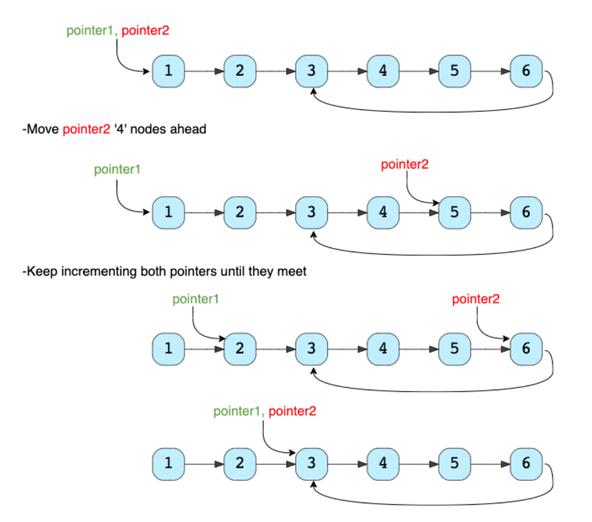

# Grokking the Coding Interview: Patterns for Coding Questions

* This course categorizes coding interview problems into a set of 16 patterns. Each pattern will be a complete tool - consisting of data structures, algorithms, and analysis techniques - to solve a specific category of problems. The goal is to develop an understanding of the underlying pattern, so that, we can apply that pattern to solve other problems.

## Pattern: Sliding Window

### Introduction

* Given an array, find the average of all subarrays of `K` contiguous elements in it.

* Examples
    * ```
        Input: [1, 3, 2, 6, -1, 4, 1, 8, 2], K=5
        Output: [2.2, 2.8, 2.4, 3.6, 2.8]
        ```

* Code
    * `solution1.java`
    * ```java
        import java.util.Arrays;

        class AverageOfSubarrayOfSizeK {
            public static double[] findAverages(int K, int[] arr) {
                double[] result = new double[arr.length - K + 1];
                for (int i = 0; i <= arr.length - K; i++) {
                    // find sum of next 'K' elements
                    double sum = 0;
                    for (int j = i; j < i + K; j++)
                        sum += arr[j];
                    result[i] = sum / K; // calculate average
                }

                return result;
            }

            public static void main(String[] args) {
                double[] result = AverageOfSubarrayOfSizeK.findAverages(5, 
                                    new int[] { 1, 3, 2, 6, -1, 4, 1, 8, 2 });
                System.out.println("Averages of subarrays of size K: " + Arrays.toString(result));
            }
        }
        ```

* Solution
    * Time complexity: Since for every element of the input array, we are calculating the sum of its next `K` elements, the time complexity of the above algorithm will be `O(N*K)` where `N` is the number of elements in the input array.

    * The inefficiency is that for any two consecutive subarrays of size ‘5’, the overlapping part (which will contain four elements) will be evaluated twice. For example, take the above-mentioned input:

    * 

    * As you can see, there are four overlapping elements between the subarray (indexed from `0-4`) and the subarray (indexed from `1-5`). Can we somehow reuse the sum we have calculated for the overlapping elements?

    * The efficient way to solve this problem would be to visualize each subarray as a sliding window of `5` elements. This means that we will slide the window by one element when we move on to the next subarray. To reuse the sum from the previous subarray, we will subtract the element going out of the window and add the element now being included in the sliding window. This will save us from going through the whole subarray to find the sum and, as a result, the algorithm complexity will reduce to `O(N)`.

    * 

* Code
    * `solution1.java`
    * ```java
        public static double[] findAveragesV2(int K, int[] arr) {
            double[] results = new double[arr.length - K + 1];

            int sum = 0;
            // O(K)
            for (int i = 0; i < K; i++) {
                sum += arr[i];
            }
            int i = 0;
            results[i] = sum/K;

            int firstIndex = 0;
            int lastIndex = K-1;

            // O(N-K)
            while (true) {
                sum -= arr[firstIndex];
                firstIndex++;
                lastIndex++;
                if (lastIndex == arr.length) break;
                sum += arr[lastIndex];
                results[++i] = sum/K;
            }
            
            return results;
        }
        ```

* In the following chapters, we will apply the Sliding Window approach to solve a few problems.

* In some problems, the size of the sliding window is not fixed. We have to expand or shrink the window based on the problem constraints. We will see a few examples of such problems in the next chapters.

### Maximum Sum Subarray of Size K (easy)

* Given an array of positive numbers and a positive number `k`, find the maximum `sum` of any contiguous subarray of size `k`.

* ```
    Input: [2, 1, 5, 1, 3, 2], k=3 
    Output: 9
    Explanation: Subarray with maximum sum is [5, 1, 3].
    ```

* ```
    Input: [2, 3, 4, 1, 5], k=2 
    Output: 7
    Explanation: Subarray with maximum sum is [3, 4].
    ```

* A basic brute force solution will be to calculate the sum of all `k` sized subarrays of the given array to find the subarray with the highest `sum`. We can start from every index of the given array and add the next `k` elements to find the subarray’s sum. Following is the visual representation of this algorithm for Example-1:

* 

* Code
    * `solution2.java`
    * ```java
        class MaxSumSubArrayOfSizeK {
            public static int findMaxSumSubArray(int k, int[] arr) {
                int maxSum = 0, windowSum;
                for (int i = 0; i <= arr.length - k; i++) {
                    windowSum = 0;
                    for (int j = i; j < i + k; j++) {
                        windowSum += arr[j];
                    }
                    maxSum = Math.max(maxSum, windowSum);
                }

                return maxSum;
            }
            
            public static void main(String[] args) {
                System.out.println("Maximum sum of a subarray of size K: "
                    + MaxSumSubArrayOfSizeK.findMaxSumSubArray(3, new int[] { 2, 1, 5, 1, 3, 2 }));
                System.out.println("Maximum sum of a subarray of size K: "
                    + MaxSumSubArrayOfSizeK.findMaxSumSubArray(2, new int[] { 2, 3, 4, 1, 5 }));
            }
        }
        ```

        * The above algorithm’s time complexity will be `O(N∗K)`, where `N` is the total number of elements in the given array. Is it possible to find a better algorithm than this?

* A better approach

* If you observe closely, you will realize that to calculate the sum of a contiguous subarray, we can utilize the sum of the previous subarray. For this, consider each subarray as a **Sliding Window** of size `k`. To calculate the sum of the next subarray, we need to slide the window ahead by one element. So to slide the window forward and calculate the sum of the new position of the sliding window, we need to do two things:

    * Subtract the element going out of the sliding window, i.e., subtract the first element of the window.

    * Add the new element getting included in the sliding window, i.e., the element coming right after the end of the window.

* This approach will save us from re-calculating the sum of the overlapping part of the sliding window. Here is what our algorithm will look like:

* Code
    * `solution2.java`
    * ```java
        public static double findMaxSumSubArrayV2(int K, int[] arr) {
            int sum = 0;
            // O(K)
            for (int i = 0; i < K; i++) {
                sum += arr[i];
            }
            int maxSum = sum;
            
            // O(N-K)
            for (int firstIndex = 0, lastIndex = K; lastIndex < arr.length; firstIndex++, lastIndex++) {
                sum -= arr[firstIndex];
                sum += arr[lastIndex];
                maxSum = Math.max(maxSum, sum);
            }
            
            return maxSum;
        }
        ```

* Complexity
    * The time complexity of the above algorithm will be `O(N)`.

    * The algorithm runs in constant space `O(1)`.

### Smallest Subarray with a Greater Sum (easy)

* Given an array of positive numbers and a positive number `S`, find the length of the smallest contiguous subarray whose `sum` is **greater than or equal** to `S`. Return `0` if no such subarray exists.

* Example
    * ```
        Input: [2, 1, 5, 2, 3, 2], S=7 
        Output: 2
        Explanation: The smallest subarray with a sum greater than or equal to '7' is [5, 2].
        ```
    
    * ```
        Input: [2, 1, 5, 2, 8], S=7 
        Output: 1
        Explanation: The smallest subarray with a sum greater than or equal to '7' is [8].
        ```
    
    * ```
        Input: [3, 4, 1, 1, 6], S=8 
        Output: 3
        Explanation: Smallest subarrays with a sum greater than or equal to '8' are [3, 4, 1] 
        or [1, 1, 6].
        ```

* This problem follows the Sliding Window pattern, and we can use a similar strategy as discussed in Maximum Sum Subarray of Size K. There is one difference though: in this problem, the sliding window size is not fixed. Here is how we will solve this problem:
    * First, we will add-up elements from the beginning of the array until their sum becomes greater than or equal to `S`.
    * These elements will constitute our sliding window. We are asked to find the smallest such window having a sum greater than or equal to `S`. We will remember the length of this window as the smallest window so far.
    * After this, we will keep adding one element in the sliding window (i.e., slide the window ahead) in a stepwise fashion.
    * In each step, we will also try to shrink the window from the beginning. We will shrink the window until the window’s sum is smaller than ‘S’ again. This is needed as we intend to find the smallest window. This shrinking will also happen in multiple steps; in each step, we will do two things:
        * Check if the current window length is the smallest so far, and if so, remember its length.
        * Subtract the first element of the window from the running sum to shrink the sliding window.
* Code  
    * `solution3.java`
    * ```java
        class MinSizeSubArraySum {
            public static int findMinSubArray(int S, int[] arr) {
                int windowSum = 0, minLength = Integer.MAX_VALUE;
                int windowStart = 0;
                for (int windowEnd = 0; windowEnd < arr.length; windowEnd++) {
                    windowSum += arr[windowEnd]; // add the next element
                    // shrink the window as small as possible until the 'windowSum' is smaller than 'S'
                    while (windowSum >= S) {
                        minLength = Math.min(minLength, windowEnd - windowStart + 1);
                        windowSum -= arr[windowStart]; // subtract the element going out
                        windowStart++; // slide the window ahead
                    }
                }

                return minLength == Integer.MAX_VALUE ? 0 : minLength;
            }

            public static void main(String[] args) {
                int result = MinSizeSubArraySum.findMinSubArray(7, new int[] { 2, 1, 5, 2, 3, 2 });
                System.out.println("Smallest subarray length: " + result);
                result = MinSizeSubArraySum.findMinSubArray(7, new int[] { 2, 1, 5, 2, 8 });
                System.out.println("Smallest subarray length: " + result);
                result = MinSizeSubArraySum.findMinSubArray(8, new int[] { 3, 4, 1, 1, 6 });
                System.out.println("Smallest subarray length: " + result);
            }
        }
        ```

* Time Complexity
    *  The time complexity of the above algorithm will be `O(N)`. The outer for loop runs for all elements, and the inner while loop processes each element only once; therefore, the time complexity of the algorithm will be `O(N+N)`, which is asymptotically equivalent to `O(N)`.

* Space Complexity
  * The algorithm runs in constant space `O(1)`

### Longest Substring with K Distinct Characters (medium)

* Given a `string`, find the length of the **longest substring** in it with no more than `K` **distinct characters**.
    * You can assume that `K` is less than or equal to the length of the given string.

* Example
    * ```
        Input: String="araaci", K=2
        Output: 4
        Explanation: The longest substring with no more than '2' distinct characters is "araa".
        ```
    * ``` 
        Input: String="araaci", K=1
        Output: 2
        Explanation: The longest substring with no more than '1' distinct characters is "aa".
        ```
    * ```
        Input: String="cbbebi", K=3
        Output: 5
        Explanation: The longest substrings with no more than '3' distinct characters are "cbbeb" & "bbebi".
        ```

* Solution
    * This problem follows the Sliding Window pattern, and we can use a similar dynamic sliding window strategy as discussed in Smallest Subarray with a Greater Sum. We can use a HashMap to remember the frequency of each character we have processed. Here is how we will solve this problem:

        * First, we will insert characters from the beginning of the string until we have `K` distinct characters in the `HashMap`.
        * These characters will constitute our sliding window. We are asked to find the longest such window having no more than `K` distinct characters. We will remember the length of this window as the longest window so far.
        * After this, we will keep adding one character in the sliding window (i.e., slide the window ahead) in a stepwise fashion.
        * In each step, we will try to shrink the window from the beginning if the count of distinct characters in the `HashMap` is larger than `K`. We will shrink the window until we have no more than `K` distinct characters in the `HashMap`. This is needed as we intend to find the longest window.
        * While shrinking, we’ll decrement the character’s frequency going out of the window and remove it from the `HashMap` if its frequency becomes `zero`.
        * At the end of each step, we’ll check if the current window length is the longest so far, and if so, remember its length.

* Code
    * `solution4.java`

    * ```java
        import java.util.*;

        class LongestSubstringKDistinct {
            public static int findLength(String str, int k) {
                if (str == null || str.length() == 0 || str.length() < k)
                throw new IllegalArgumentException();

                int windowStart = 0, maxLength = 0;
                Map<Character, Integer> charFrequencyMap = new HashMap<>();
                // in the following loop we'll try to extend the range [windowStart, windowEnd]
                for (int windowEnd = 0; windowEnd < str.length(); windowEnd++) {
                    char rightChar = str.charAt(windowEnd);
                    charFrequencyMap.put(rightChar, charFrequencyMap.getOrDefault(rightChar, 0) + 1);
                    // shrink the sliding window, until we are left with 'k' distinct characters in 
                    // the frequency map
                    while (charFrequencyMap.size() > k) {
                        char leftChar = str.charAt(windowStart);
                        charFrequencyMap.put(leftChar, charFrequencyMap.get(leftChar) - 1);
                        if (charFrequencyMap.get(leftChar) == 0) {
                            charFrequencyMap.remove(leftChar);
                        }
                        windowStart++; // shrink the window
                    }
                    // remember the maximum length so far
                    maxLength = Math.max(maxLength, windowEnd - windowStart + 1);
                }
                return maxLength;
            }

            public static void main(String[] args) {
                System.out.println("Length of the longest substring: " 
                + LongestSubstringKDistinct.findLength("araaci", 2));
                System.out.println("Length of the longest substring: " 
                + LongestSubstringKDistinct.findLength("araaci", 1));
                System.out.println("Length of the longest substring: " 
                + LongestSubstringKDistinct.findLength("cbbebi", 3));
            }
        }
        ```

* Time Complexity

    * The above algorithm’s time complexity will be `O(N)`, where `N` is the number of characters in the input string. The outer for loop runs for all characters, and the inner while loop processes each character only once; therefore, the time complexity of the algorithm will be `O(N+N)`, which is asymptotically equivalent to `O(N)`.

* Space Complexity

    * The algorithm’s space complexity is `O(K)`, as we will be storing a maximum of `K+1` characters in the `HashMap`.

### Fruits into Baskets (medium)

* You are visiting a farm to collect fruits. The farm has a single row of fruit trees. You will be given two baskets, and your goal is to pick as many fruits as possible to be placed in the given baskets. 

* You will be given an array of characters where each character represents a fruit tree. The farm has following restrictions:
  * Each basket can have only one type of fruit. There is no limit to how many fruit a basket can hold.
  * You can start with any tree, but you can’t skip a tree once you have started.
  * You will pick exactly one fruit from every tree until you cannot, i.e., you will stop when you have to pick from a third fruit type.
* Write a function to return the maximum number of fruits in both baskets.

* Write a function to return the maximum number of fruits in both baskets.

* Examples
    * ```
        Input: Fruit=['A', 'B', 'C', 'A', 'C']
        Output: 3
        Explanation: We can put 2 'C' in one basket and one 'A' in the other from the subarray ['C', 'A', 'C']
        ```
    * ```
        Input: Fruit = ['A', 'B', 'C', 'B', 'B', 'C']
        Output: 5
        Explanation: We can put 3 'B' in one basket and two 'C' in the other basket. This can be done if we start with the second letter: ['B', 'C', 'B', 'B', 'C']
        ```

* Solution

    * This problem follows the `Sliding Window` pattern and is quite similar to `Longest Substring with K Distinct Characters`. In this problem, we need to find the length of the longest subarray with no **more than two distinct characters** (or fruit types!). This transforms the current problem into `Longest Substring with K Distinct Characters where K=2`.

* Code
    * `solution5.java`
    * ```java
        import java.util.*;

        class MaxFruitCountOf2Types {
            public static int findLength(char[] arr) {
                int windowStart = 0, maxLength = 0;
                Map<Character, Integer> fruitFrequencyMap = new HashMap<>();
                // try to extend the range [windowStart, windowEnd]
                for (int windowEnd = 0; windowEnd < arr.length; windowEnd++) {
                    fruitFrequencyMap.put(arr[windowEnd], 
                                            fruitFrequencyMap.getOrDefault(arr[windowEnd], 0) + 1);
                    // shrink the sliding window, until we're left with '2' fruits in the frequency map
                    while (fruitFrequencyMap.size() > 2) {
                        fruitFrequencyMap.put(arr[windowStart], 
                                            fruitFrequencyMap.get(arr[windowStart]) - 1);
                        if (fruitFrequencyMap.get(arr[windowStart]) == 0) {
                            fruitFrequencyMap.remove(arr[windowStart]);
                        }
                        windowStart++; // shrink the window
                    }
                    maxLength = Math.max(maxLength, windowEnd - windowStart + 1);
                }

                return maxLength;
            }

            public static void main(String[] args) {
                System.out.println("Maximum number of fruits: " + 
                    MaxFruitCountOf2Types.findLength(new char[] { 'A', 'B', 'C', 'A', 'C' }));
                System.out.println("Maximum number of fruits: " + 
                    MaxFruitCountOf2Types.findLength(new char[] { 'A', 'B', 'C', 'B', 'B', 'C' }));
            }
        }
        ```

* Time Complexity

    * The above algorithm’s time complexity will be `O(N)`, where `N` is the number of characters in the input array. The outer 'for' loop runs for all characters, and the inner `while` loop processes each character only once; therefore, the time complexity of the algorithm will be `O(N+N)`, which is asymptotically equivalent to `O(N)`.

* Space Complexity
    * The algorithm runs in constant space `O(1)` as there can be a maximum of three types of fruits stored in the frequency map.

### Longest Substring with Distinct Characters (hard)

* Given a `string`, find the length of the **longest substring, which has all distinct characters**.

* Examples
    * ```
        Input: String="aabccbb"
        Output: 3
        Explanation: The longest substring with distinct characters is "abc".
        ```
    * ```
        Input: String="abbbb"
        Output: 2
        Explanation: The longest substring with distinct characters is "ab".
        ```
    * ```
        Input: String="abccde"
        Output: 3
        Explanation: Longest substrings with distinct characters are "abc" & "cde".
        ```

* Solution
    * This problem follows the Sliding Window pattern, and we can use a similar dynamic sliding window strategy as discussed in Longest Substring with K Distinct Characters. We can use a HashMap to remember the last index of each character we have processed. Whenever we get a duplicate character, we will shrink our sliding window to ensure that we always have distinct characters in the sliding window.
    
    * `solution6.java`
    * ```java
        import java.util.*;

        class NoRepeatSubstring {
            public static int findLength(String str) {
                int windowStart = 0, maxLength = 0;
                Map<Character, Integer> charIndexMap = new HashMap<>();
                // try to extend the range [windowStart, windowEnd]
                for (int windowEnd = 0; windowEnd < str.length(); windowEnd++) {
                    char rightChar = str.charAt(windowEnd);
                    // if the map already contains the 'rightChar', shrink the window from the 
                    // beginning so that we have only one occurrence of 'rightChar'
                    if (charIndexMap.containsKey(rightChar)) {
                        // this is tricky; in the current window, we will not have any 'rightChar' after 
                        // its previous index and if 'windowStart' is already ahead of the last index of
                        // 'rightChar', we'll keep 'windowStart'
                        windowStart = Math.max(windowStart, charIndexMap.get(rightChar) + 1);
                    }
                    charIndexMap.put(rightChar, windowEnd); // insert the 'rightChar' into the map
                    // remember the maximum length so far
                    maxLength = Math.max(maxLength, windowEnd - windowStart + 1); 
                }

                return maxLength;
            }

            public static void main(String[] args) {
                System.out.println("Length of the longest substring: " 
                                    + NoRepeatSubstring.findLength("aabccbb"));
                System.out.println("Length of the longest substring: " 
                                    + NoRepeatSubstring.findLength("abbbb"));
                System.out.println("Length of the longest substring: " 
                                    + NoRepeatSubstring.findLength("abccde"));
            }
        }
        ```

* Time Complexity
    * The above algorithm’s time complexity will be `O(N)`, where `N` is the number of characters in the input string.

* Space Complexity
    * The algorithm’s space complexity will be `O(K)`, where `K` is the number of distinct characters in the input string. This also means `K<=N`, because in the worst case, the whole string might not have any duplicate character, so the entire string will be added to the HashMap. Having said that, since we can expect a fixed set of characters in the input string (e.g., **26 for English letters**), we can say that the algorithm runs in fixed space `O(1)`; in this case, we can use a fixed-size array instead of the `HashMap`.

### Longest Substring with Same Letters after Replacement (hard)

* Given a string with **lowercase letters only**, if you are allowed to replace no more than `k` letters with any letter, find the length of the **longest substring having the same letters** after replacement.

* Examples

    * ```
        Input: String="aabccbb", k=2
        Output: 5
        Explanation: Replace the two 'c' with 'b' to have a longest repeating substring "bbbbb".
        ```

    * ```
        Input: String="abbcb", k=1
        Output: 4
        Explanation: Replace the 'c' with 'b' to have a longest repeating substring "bbbb".
        ```

    * ```
        Input: String="abccde", k=1
        Output: 3
        Explanation: Replace the 'b' or 'd' with 'c' to have the longest repeating substring "ccc".
        ```

* Solution
    * This problem follows the `Sliding Window pattern`, and we can use a similar dynamic sliding window strategy as discussed in `Longest Substring with Distinct Characters`. We can use a `HashMap` to count the **frequency of each letter**.
        * We will iterate through the string to add one letter at a time in the window.
        * We will also keep track of the **count of the maximum repeating letter** in any window (let’s call it **maxRepeatLetterCount**).
        * So, at any time, we know that we do have a window with one letter repeating **maxRepeatLetterCount** times; this means we should try to replace the remaining letters.
            * If the remaining letters are less than or equal to `k`, we can replace them all.
            * If we have more than `k` remaining letters, we should shrink the window as we cannot replace more than `k` letters.
  
    * While shrinking the window, we don’t need to update maxRepeatLetterCount   (hence, it represents the maximum repeating count of ANY letter for ANY window). Why don’t we need to update this count when we shrink the window? Since we have to replace all the remaining letters to get the longest substring having the same letter in any window, we can’t get a better answer from any other window even though all occurrences of the letter with frequency maxRepeatLetterCount is not in the current window.

* Code
    * `solution7.java`
    * ```java
        import java.util.*;

        class CharacterReplacement {
            public static int findLength(String str, int k) {
                int windowStart = 0, maxLength = 0, maxRepeatLetterCount = 0;
                Map<Character, Integer> letterFrequencyMap = new HashMap<>();
                // try to extend the range [windowStart, windowEnd]
                for (int windowEnd = 0; windowEnd < str.length(); windowEnd++) {
                    char rightChar = str.charAt(windowEnd);
                    letterFrequencyMap.put(rightChar, letterFrequencyMap.getOrDefault(rightChar, 0) + 1);
                    maxRepeatLetterCount = Math.max(maxRepeatLetterCount, letterFrequencyMap.get(rightChar));

                    // current window size is from windowStart to windowEnd, overall we have a letter 
                    // which is repeating 'maxRepeatLetterCount' times, this means we can have a window
                    //  which has one letter repeating 'maxRepeatLetterCount' times and the remaining 
                    // letters we should replace. If the remaining letters are more than 'k', it is the
                    // time to shrink the window as we are not allowed to replace more than 'k' letters
                    if (windowEnd - windowStart + 1 - maxRepeatLetterCount > k) {
                        char leftChar = str.charAt(windowStart);
                        letterFrequencyMap.put(leftChar, letterFrequencyMap.get(leftChar) - 1);
                        windowStart++;
                    }

                    maxLength = Math.max(maxLength, windowEnd - windowStart + 1);
                }

                return maxLength;
            }

            public static void main(String[] args) {
                System.out.println(CharacterReplacement.findLength("aabccbb", 2));
                System.out.println(CharacterReplacement.findLength("abbcb", 1));
                System.out.println(CharacterReplacement.findLength("abccde", 1));
            }
        }
        ```

* Time Complexity
    * The above algorithm’s time complexity will be `O(N)`, where `N` is the number of letters in the input string.

* Space Complexity
    * As we expect only the lower case letters in the input string, we can conclude that the space complexity will be `O(26)` to store each letter’s frequency in the HashMap, which is asymptotically equal to `O(1)`.

### Longest Subarray with Ones after Replacement (hard)

* Given an array containing `0`s and `1`s, if you are allowed to replace no more than `k` `0`s with `1`s, find the length of the longest contiguous subarray having all `1`s.

* Examples

    * ```
        Input: Array=[0, 1, 1, 0, 0, 0, 1, 1, 0, 1, 1], k=2
        Output: 6
        Explanation: Replace the '0' at index 5 and 8 to have the longest contiguous subarray of 1s having length 6.
        ```

    * ```
        Input: Array=[0, 1, 0, 0, 1, 1, 0, 1, 1, 0, 0, 1, 1], k=3
        Output: 9
        Explanation: Replace the '0' at index 6, 9, and 10 to have the longest contiguous subarray of 1s having length 9.
        ```

* Solution

    * This problem follows the `Sliding Window` pattern and is quite similar to `Longest Substring with same Letters after Replacement`. The only difference is that, in the problem, we only have two characters (`1`s and `0`s) in the input arrays.

    * Following a similar approach, we’ll iterate through the array to add one number at a time in the window. We’ll also keep track of the `maximum number of repeating 1`s in the current window (let’s call it maxOnesCount). So at any time, we know that we can have a window with 1s repeating `maxOnesCount` time, so we should try to replace the remaining `0`s. If we have more than `k` remaining `0`s, we should shrink the window as we are not allowed to replace more than `k` `0`s.

* Code  
    * `solution8.java`
    * ```java
        class ReplacingOnes {
            public static int findLength(int[] arr, int k) {
                int windowStart = 0, maxLength = 0, maxOnesCount = 0;
                // try to extend the range [windowStart, windowEnd]
                for (int windowEnd = 0; windowEnd < arr.length; windowEnd++) {
                    if (arr[windowEnd] == 1)
                        maxOnesCount++;

                    // current window size is from windowStart to windowEnd, overall we have a maximum 
                    // of 1s repeating a maximum of 'maxOnesCount' times, this means that we can have a
                    //  window with 'maxOnesCount' 1s and the remaining are 0s which should replace 
                    // with 1s. Now, if the remaining 0s are more than 'k', it is the time to shrink 
                    // the window as we are not allowed to replace more than 'k' Os.
                    if (windowEnd - windowStart + 1 - maxOnesCount > k) {
                        if (arr[windowStart] == 1)
                        maxOnesCount--;
                        windowStart++;
                }

                maxLength = Math.max(maxLength, windowEnd - windowStart + 1);
                }

                return maxLength;
            }

            public static void main(String[] args) {
                System.out.println(
                ReplacingOnes.findLength(new int[] { 0, 1, 1, 0, 0, 0, 1, 1, 0, 1, 1 }, 2));
                System.out.println(
                ReplacingOnes.findLength(new int[] { 0, 1, 0, 0, 1, 1, 0, 1, 1, 0, 0, 1, 1 }, 3));
            }
        }
        ```

* Time Complexity

    * The above algorithm’s time complexity will be `O(N)`, where `N` is the count of numbers in the input array.

* Space Complexity

    * The algorithm runs in constant space `O(1)`.

### Problem Challenge 1: Permutation in a String (hard)

* Given a string and a pattern, find out if the string contains any permutation of the pattern.

* Given a string and a pattern, find out if the string contains any permutation of the pattern.
    * abc
    * acb
    * bac
    * bca
    * cab
    * cba

* Examples

    * ```
        Input: String="oidbcaf", Pattern="abc"
        Output: true
        Explanation: The string contains "bca" which is a permutation of the given pattern.
        ```

    * ```
        Input: String="odicf", Pattern="dc"
        Output: false
        Explanation: No permutation of the pattern is present in the given string as a substring.
        ```

    * ```
        Input: String="bcdxabcdy", Pattern="bcdyabcdx"
        Output: true
        Explanation: Both the string and the pattern are a permutation of each other.
        ```

    * ```
        Input: String="aaacb", Pattern="abc"
        Output: true
        Explanation: The string contains "acb" which is a permutation of the given pattern.
        ```

* Solution

    * This problem follows the `Sliding Window pattern`, and we can use a similar sliding window strategy as discussed in `Longest Substring with K Distinct Characters`. We can use a `HashMap` to remember the frequencies of all characters in the given pattern. Our goal will be to match all the characters from this `HashMap` with a sliding window in the given string. Here are the steps of our algorithm:

        * Create a `HashMap` to calculate the frequencies of all characters in the pattern.
        * Iterate through the string, adding one character at a time in the sliding window.
        * If the character being added matches a character in the `HashMap`, decrement its frequency in the map. If the character frequency becomes zero, we got a complete match.
        * If at any time, the number of characters matched is equal to the number of distinct characters in the pattern (i.e., total characters in the `HashMap`), we have gotten our required permutation.
        * If the window size is greater than the length of the pattern, shrink the window to make it equal to the pattern’s size. At the same time, if the character going out was part of the pattern, put it back in the frequency `HashMap`.

* Code
    * `solution9.java`
    * ```java
        import java.util.*;

        class StringPermutation {
            public static boolean findPermutation(String str, String pattern) {
                int windowStart = 0, matched = 0;
                Map<Character, Integer> charFrequencyMap = new HashMap<>();
                for (char chr : pattern.toCharArray())
                    charFrequencyMap.put(chr, charFrequencyMap.getOrDefault(chr, 0) + 1);

                // our goal is to match all the characters from the 'charFrequencyMap' with the 
                // current window try to extend the range [windowStart, windowEnd]
                for (int windowEnd = 0; windowEnd < str.length(); windowEnd++) {
                    char rightChar = str.charAt(windowEnd);
                    if (charFrequencyMap.containsKey(rightChar)) {
                        // decrement the frequency of the matched character
                        charFrequencyMap.put(rightChar, charFrequencyMap.get(rightChar) - 1);
                        if (charFrequencyMap.get(rightChar) == 0) // character is completely matched
                        matched++;
                    }

                    if (matched == charFrequencyMap.size())
                        return true;

                    if (windowEnd >= pattern.length() - 1) { // shrink the window by one character
                        char leftChar = str.charAt(windowStart++);
                        if (charFrequencyMap.containsKey(leftChar)) {
                        if (charFrequencyMap.get(leftChar) == 0)
                            matched--; // before putting the character back, decrement the matched count
                        // put the character back for matching
                        charFrequencyMap.put(leftChar, charFrequencyMap.get(leftChar) + 1);
                        }
                    }
                }

                return false;
            }

            public static void main(String[] args) {
                System.out.println("Permutation exist: " 
                    + StringPermutation.findPermutation("oidbcaf", "abc"));
                System.out.println("Permutation exist: " 
                    + StringPermutation.findPermutation("odicf", "dc"));
                System.out.println("Permutation exist: " 
                    + StringPermutation.findPermutation("bcdxabcdy", "bcdyabcdx"));
                System.out.println("Permutation exist: " 
                    + StringPermutation.findPermutation("aaacb", "abc"));
            }
        }
        ```
    
* Time Complexity

    * The above algorithm’s time complexity will be O(`N` + `M`), where `N` and `M` are the number of characters in the input string and the pattern, respectively.

* Space Complexity

    * The algorithm’s space complexity is `O(M)` since, in the worst case, the whole pattern can have distinct characters that will go into the `HashMap`.

### Problem Challenge 2: String Anagrams (hard)

* Given a string and a pattern, find all anagrams of the pattern in the given string.

* Every anagram is a permutation of a string. As we know, when we are not allowed to repeat characters while finding permutations of a string, we get `N!` permutations (or anagrams) of a string having `N` characters. For example, here are the six anagrams of the string “abc”:
    * abc
    * acb
    * bac
    * bca
    * cab
    * cba

* Write a function to return a list of starting indices of the anagrams of the pattern in the given string.

* Examples

    * ```
        Input: String="ppqp", Pattern="pq"
        Output: [1, 2]
        Explanation: The two anagrams of the pattern in the given string are "pq" and "qp".
        ```

    * ```
        Input: String="abbcabc", Pattern="abc"
        Output: [2, 3, 4]
        Explanation: The three anagrams of the pattern in the given string are "bca", "cab", and "abc".
        ```

* Solution

    * This problem follows the `Sliding Window` pattern and is very similar to `Permutation in a String`. In this problem, we need to find every occurrence of any permutation of the pattern in the string. We will use a list to store the starting indices of the anagrams of the pattern in the string.

* Code'
    * `solution10.java`
    * ```java
        import java.util.*;

        class StringAnagrams {
            public static List<Integer> findStringAnagrams(String str, String pattern) {
                int windowStart = 0, matched = 0;
                Map<Character, Integer> charFrequencyMap = new HashMap<>();
                for (char chr : pattern.toCharArray())
                    charFrequencyMap.put(chr, charFrequencyMap.getOrDefault(chr, 0) + 1);

                List<Integer> resultIndices = new ArrayList<Integer>();
                // our goal is to match all the characters from the map with the current window
                for (int windowEnd = 0; windowEnd < str.length(); windowEnd++) {
                    char rightChar = str.charAt(windowEnd);
                    // decrement the frequency of the matched character
                    if (charFrequencyMap.containsKey(rightChar)) {
                        charFrequencyMap.put(rightChar, charFrequencyMap.get(rightChar) - 1);
                        if (charFrequencyMap.get(rightChar) == 0)
                            matched++;
                    }

                    if (matched == charFrequencyMap.size()) // have we found an anagram?
                        resultIndices.add(windowStart);

                    if (windowEnd >= pattern.length() - 1) { // shrink the window
                        char leftChar = str.charAt(windowStart++);
                        if (charFrequencyMap.containsKey(leftChar)) {
                            if (charFrequencyMap.get(leftChar) == 0)
                                matched--; // before putting the character back, decrement the matched count
                            // put the character back
                            charFrequencyMap.put(leftChar, charFrequencyMap.get(leftChar) + 1);
                        }
                    }
                }

                return resultIndices;
            }

            public static void main(String[] args) {
                System.out.println(StringAnagrams.findStringAnagrams("ppqp", "pq"));
                System.out.println(StringAnagrams.findStringAnagrams("abbcabc", "abc"));
            }
        }
        ```

* Time Complexity

    * The time complexity of the above algorithm will be `O(N + M)` where `N` and `M` are the number of characters in the input string and the pattern respectively.

* Space Complexity

    * The space complexity of the algorithm is `O(M)` since in the worst case, the whole pattern can have distinct characters which will go into the HashMap. In the worst case, we also need `O(N)` space for the result list, this will happen when the pattern has only one character and the string contains only that character.

### Problem Challenge 4: Words Concatenation (hard)

* Given a `string` and a `list` of words, find all the `starting indices` of substrings in the given string that are a **concatenation of all the given words** exactly once **without any overlapping** of words. **It is given that all words are of the same length.**

* Examples
    * ```
        Input: String="catfoxcat", Words=["cat", "fox"]
        Output: [0, 3]
        Explanation: The two substring containing both the words are "catfox" & "foxcat".
        ```

    * ```
        Input: String="catcatfoxfox", Words=["cat", "fox"]
        Output: [3]
        Explanation: The only substring containing both the words is "catfox".
        ```

* Solution

    * This problem follows the Sliding Window pattern and has a lot of similarities with Maximum Sum Subarray of Size K. We will keep track of all the words in a HashMap and try to match them in the given string. Here are the set of steps for our algorithm:

        * Keep the frequency of every word in a HashMap.
        * Starting from every index in the string, try to match all the words.
        * In each iteration, keep track of all the words that we have already seen in another HashMap.
        * If a word is not found or has a higher frequency than required, we can move on to the next character in the string.
        * Store the index if we have found all the words.

* Code  
    * `solution11.java`
    * ```java
        import java.util.*;

        class WordConcatenation {
            public static List<Integer> findWordConcatenation(String str, String[] words) {
                Map<String, Integer> wordFrequencyMap = new HashMap<>();
                for (String word : words)
                    wordFrequencyMap.put(word, wordFrequencyMap.getOrDefault(word, 0) + 1);

                List<Integer> resultIndices = new ArrayList<Integer>();
                int wordsCount = words.length, wordLength = words[0].length();

                for (int i = 0; i <= str.length() - wordsCount * wordLength; i++) {
                    Map<String, Integer> wordsSeen = new HashMap<>();
                    for (int j = 0; j < wordsCount; j++) {
                        int nextWordIndex = i + j * wordLength;
                        // get the next word from the string
                        String word = str.substring(nextWordIndex, nextWordIndex + wordLength);
                        if (!wordFrequencyMap.containsKey(word)) // break if we don't need this word
                            break;

                        // add the word to the 'wordsSeen' map
                        wordsSeen.put(word, wordsSeen.getOrDefault(word, 0) + 1); 

                        // no need to process further if the word has higher frequency than required 
                        if (wordsSeen.get(word) > wordFrequencyMap.getOrDefault(word, 0))
                            break;

                        if (j + 1 == wordsCount) // store index if we have found all the words
                        resultIndices.add(i);
                    }
                }

                return resultIndices;
            }

            public static void main(String[] args) {
                List<Integer> result = WordConcatenation.findWordConcatenation(
                                                    "catfoxcat", new String[] { "cat", "fox" });
                System.out.println(result);
                result = WordConcatenation.findWordConcatenation(
                                                    "catcatfoxfox", new String[] { "cat", "fox" });
                System.out.println(result);
            }
        }
        ```

* Time Complexity

    * The time complexity of the above algorithm will be `O(N * M * Len)` where `N` is the number of characters in the given string, `M` is the total number of words, and ‘Len’ is the length of a word.

* Space Complexity
    * The space complexity of the algorithm is `O(M)` since at most, we will be storing all the words in the two `HashMaps`. In the worst case, we also need `O(N)` space for the resulting list. So, the overall space complexity of the algorithm will be `O(M+N)`.

## Pattern: Two Pointers

### Introduction

* In problems where we deal with `sorted arrays` (or `LinkedLists`) and need to find a set of elements that fulfill certain constraints, the `Two Pointers` approach becomes quite useful. The set of elements could be a `pair`, a `triplet` or even a `subarray`. For example, take a look at the following problem:

* ```
    Given an array of sorted numbers and a target sum, find a pair in the array whose sum is equal to the given target.
    ```

* To solve this problem, we can consider each element one by one (pointed out by the first pointer) and iterate through the remaining elements (pointed out by the second pointer) to find a pair with the given sum. The time complexity of this algorithm will be `O(N^2)` where `N` is the number of elements in the input array.

* Given that the input array is sorted, an efficient way would be to start with one pointer in the beginning and another pointer at the end. At every step, we will see if the numbers pointed by the two pointers add up to the target sum. If they do not, we will do one of two things:

    * If the sum of the two numbers pointed by the two pointers is greater than the target sum, this means that we need a pair with a smaller sum. So, to try more pairs, we can decrement the end-pointer.
    * If the sum of the two numbers pointed by the two pointers is smaller than the target sum, this means that we need a pair with a larger sum. So, to try more pairs, we can increment the start-pointer.

* Here is the visual representation of this algorithm:

*  

* The time complexity of the above algorithm will be `O(N)`.

* In the following chapters, we will apply the Two Pointers approach to solve a few problems.

### Pair with Target Sum (easy)

* Given an `array of sorted numbers` and a `target sum`, find a `pair` in the array whose `sum is equal to the given target`.

* Write a function to `return the indices` of the two numbers (i.e. the pair) such that they add up to the given target.

* Examples
    * ```
        Input: [1, 2, 3, 4, 6], target=6
        Output: [1, 3]
        Explanation: The numbers at index 1 and 3 add up to 6: 2+4=6
        ```

    * ```
        Input: [2, 5, 9, 11], target=11
        Output: [0, 2]
        Explanation: The numbers at index 0 and 2 add up to 11: 2+9=11
        ```

* Solution

    * Since the given array is sorted, a brute-force solution could be to iterate through the array, taking one number at a time and **searching for the second number through** `Binary Search`. The time complexity of this algorithm will be `O(N*logN)`. Can we do better than this?

    * We can follow the `Two Pointers` approach. We will start with one pointer pointing to the **beginning of the array** and another **pointing at the end**. At every step, we will see if the numbers pointed by the two pointers add up to the target `sum`. If they do, we have found our pair; otherwise, we will do one of two things:

        * If the `sum` of the two numbers pointed by the two pointers **is greater** than the target `sum`, this means that we need a pair with a smaller `sum`. So, to try more pairs, we can decrement the `end-pointer`. 
        * If the `sum` of the two numbers pointed by the two pointers **is smaller** than the target `sum`, this means that we need a pair with a larger sum. So, to try more pairs, we can increment the `start-pointer`.
    
    *  

* Code  
    * `solution1.java`
    * ```java
        public static int[] findPair(int[] nums, int target) {
            int startIndex = 0;
            int endIndex = nums.length - 1;
            while (startIndex < endIndex) {
                int sum = nums[startIndex] + nums[endIndex];
                if (sum == target) {
                    return new int[]{startIndex, endIndex};
                }
                if (sum > target) {
                    endIndex--;
                } else {
                    startIndex++;
                }
            }
            return new int[]{};
        }
        ```

* Time Complexity
    * The time complexity of the above algorithm will be `O(N)`, where `N` is the total number of elements in the given array.

* Space Complexity
    * The algorithm runs in constant space `O(1)`.

* An Alternate approach
    * Instead of using a `two-pointer` or a `binary search` approach, we can utilize a `HashTable` to search for the required pair. We can iterate through the array one number at a time. Let’s say during our iteration we are at number `X`, so we need to find `Y` such that `X + Y == Target`. We will do two things here:
        * Search for `Y` (which is equivalent to `Target−X`) in the `HashTable`. If it is there, we have found the required pair.
        * Otherwise, insert `X` in the `HashTable`, so that we can search it for the later numbers.

* Code
    * `solution1.java`
    * ```java
        public static int[] search(int[] arr, int targetSum) {
            HashMap<Integer, Integer> nums = new HashMap<>(); // to store numbers and indices
            for (int i = 0; i < arr.length; i++) {
                if (nums.containsKey(targetSum - arr[i]))
                    return new int[] { nums.get(targetSum - arr[i]), i };
                else
                    nums.put(arr[i], i); // put the number and its index in the map
            }
            return new int[] { -1, -1 }; // pair not found
        }
        ```

* Time Complexity
    * The time complexity of the above algorithm will be `O(N)`, where `N` is the total number of elements in the given array.

* Space Complexity
    * The space complexity will also be `O(N)`, as, in the worst case, we will be pushing `N` numbers in the `HashTable`.

### Remove Duplicates (easy)

* Given an array of `sorted numbers`, remove `all duplicates` from it. You should not use any extra space; after removing the duplicates `in-place` return the `length of the subarray` that has no duplicate in it.

* Examples

    * ```
        Input: [2, 3, 3, 3, 6, 9, 9]
        Output: 4
        Explanation: The first four elements after removing the duplicates will be [2, 3, 6, 9].
        ```
    * ```
        Input: [2, 2, 2, 11]
        Output: 2
        Explanation: The first two elements after removing the duplicates will be [2, 11].
        ```

* Solution

    * In this problem, we need to remove the duplicates in-place such that the resultant length of the array remains sorted. As the input array is sorted, therefore, one way to do this is to shift the elements `left` whenever we encounter duplicates. In other words, we will keep one pointer for iterating the array and one pointer for placing the next non-duplicate number. **So our algorithm will be to iterate the array and whenever we see a non-duplicate number we move it next to the last non-duplicate number we’ve seen.**

    * 

* Code
    * `solution2.java`
    * ```java
        class RemoveDuplicates {

            public static int remove(int[] arr) {
                int nextNonDuplicate = 1; // index of the next non-duplicate element
                for (int i = 0; i < arr.length; i++) {
                    if (arr[nextNonDuplicate - 1] != arr[i]) {
                        arr[nextNonDuplicate] = arr[i];
                        nextNonDuplicate++;
                    }
                }

                return nextNonDuplicate;
            }

            public static void main(String[] args) {
                int[] arr = new int[] { 2, 3, 3, 3, 6, 9, 9 };
                System.out.println(RemoveDuplicates.remove(arr));

                arr = new int[] { 2, 2, 2, 11 };
                System.out.println(RemoveDuplicates.remove(arr));
            }
        }
        ```

* Time Complexity
    * The time complexity of the above algorithm will be `O(N)`, where `N` is the total number of elements in the given array.

* Space Complexity
    * The algorithm runs in constant space `O(1)`.

* Similar Questions
    * Problem 1: Given an unsorted array of numbers and a target ‘key’, remove all instances of ‘key’ in-place and return the new length of the array.

* Examples
    * ```
        Input: [3, 2, 3, 6, 3, 10, 9, 3], Key=3
        Output: 4
        Explanation: The first four elements after removing every 'Key' will be [2, 6, 10, 9].
        ```
    * ```
        Input: [2, 11, 2, 2, 1], Key=2
        Output: 2
        Explanation: The first two elements after removing every 'Key' will be [11, 1].
        ```

* Solution
    * This problem is quite similar to our parent problem. We can follow a two-pointer approach and shift numbers left upon encountering the ‘key’. Here is what the code will look like:

* Code
    * `solution3.java`
    * ```java
        class RemoveElement {

            public static int remove(int[] arr, int key) {
                int nextElement = 0; // index of the next element which is not 'key'
                for (int i = 0; i < arr.length; i++) {
                    if (arr[i] != key) {
                        arr[nextElement] = arr[i];
                        nextElement++;
                    }
                }

                return nextElement;
            }

            public static void main(String[] args) {
                int[] arr = new int[] { 3, 2, 3, 6, 3, 10, 9, 3 };
                System.out.println(RemoveElement.remove(arr, 3));

                arr = new int[] { 2, 11, 2, 2, 1 };
                System.out.println(RemoveElement.remove(arr, 2));
            }
        }
        ```

* Time and Space Complexity
    * The time complexity of the above algorithm will be `O(N)`, where `N` is the total number of elements in the given array.

    * The algorithm runs in constant space `O(1)`.

### Squaring a Sorted Array (easy)

* Given a `sorted array`, create a new `array` containing `squares of all the numbers` of the input array in the `sorted order`.

* Solution
    * This is a straightforward question. The only trick is that we can have negative numbers in the input array, which will make it a bit difficult to generate the output array with squares in sorted order.

    * An easier approach could be to `first find the index` of the first non-negative number in the array. After that, we can use `Two Pointers to iterate the array`. One pointer will move forward to iterate the non-negative numbers, and the other pointer will move backward to iterate the negative numbers. At any step, whichever number gives us a bigger square will be added to the output array. For the above-mentioned Example-1, we will do something like this:

    * 

    * Since the numbers at both ends can give us the largest square, an alternate approach could be to use two pointers starting at both ends of the input array. At any step, whichever pointer gives us the bigger square, we add it to the result array and move to the next/previous number according to the pointer. For the above-mentioned Example-1, we will do something like this:

    * 

* Code  
    * `solution4.java`
    * ```java
        class SortedArraySquares {

            public static int[] makeSquares(int[] arr) {
                int n = arr.length;
                int[] squares = new int[n];
                int highestSquareIdx = n - 1;
                int left = 0, right = arr.length - 1;
                while (left <= right) {
                    int leftSquare = arr[left] * arr[left];
                    int rightSquare = arr[right] * arr[right];
                    if (leftSquare > rightSquare) {
                        squares[highestSquareIdx--] = leftSquare;
                        left++;
                    } else {
                        squares[highestSquareIdx--] = rightSquare;
                        right--;
                    }
                }
                return squares;
            }

            public static void main(String[] args) {

                int[] result = SortedArraySquares.makeSquares(new int[] { -2, -1, 0, 2, 3 });
                for (int num : result)
                    System.out.print(num + " ");
                System.out.println();

                result = SortedArraySquares.makeSquares(new int[] { -3, -1, 0, 1, 2 });
                for (int num : result)
                    System.out.print(num + " ");
                System.out.println();
            }
        }
        ```

* Time Complexity
    * The above algorithm’s time complexity will be `O(N)` as we are iterating the input array only once.

* Space Complexity
    * The above algorithm’s space complexity will also be `O(N)`; this space will be used for the output array.

### Triplet Sum to Zero (medium)

* Given an `array` of `unsorted numbers`, find all `unique triplets` in it that `add up` to zero.

* Example 
    * ```
        Input: [-3, 0, 1, 2, -1, 1, -2]
        Output: [-3, 1, 2], [-2, 0, 2], [-2, 1, 1], [-1, 0, 1]
        Explanation: There are four unique triplets whose sum is equal to zero.
        ```
    * ```
        Input: [-5, 2, -1, -2, 3]
        Output: [[-5, 2, 3], [-2, -1, 3]]
        Explanation: There are two unique triplets whose sum is equal to zero.
        ```

* Solution
    * This problem follows the `Two Pointers` pattern and shares similarities with `Pair with Target Sum`. A couple of differences are that the input array is not sorted and instead of a pair we need to find triplets with a target sum of zero.

    * To follow a similar approach, first, we will sort the array and then iterate through it taking one number at a time. Let’s say during our iteration we are at number `X`, so we need to find `Y` and `Z` such that `X` + `Y` + `Z` == `0`. At this stage, our problem translates into finding a pair whose `sum` is equal to `-X` (as from the above equation `Y` + `Z` == `-X`).

    * Another difference from `Pair with Target Sum` is that we need to find all the unique triplets. To handle this, we have to skip any duplicate number. Since we will be sorting the array, so all the duplicate numbers will be next to each other and are easier to skip.

* Code  
    * `solution5.java`
    * ```java
        import java.util.*;

        class TripletSumToZero {

            public static List<List<Integer>> searchTriplets(int[] arr) {
                Arrays.sort(arr);
                List<List<Integer>> triplets = new ArrayList<>();
                for (int i = 0; i < arr.length - 2; i++) {
                    if (i > 0 && arr[i] == arr[i - 1]) // skip same element to avoid duplicate triplets
                        continue;
                    searchPair(arr, -arr[i], i + 1, triplets);
                }

                return triplets;
            }

            private static void searchPair(int[] arr, int targetSum, 
                                            int left, List<List<Integer>> triplets) {
                int right = arr.length - 1;
                while (left < right) {
                    int currentSum = arr[left] + arr[right];
                    if (currentSum == targetSum) { // found the triplet
                        triplets.add(Arrays.asList(-targetSum, arr[left], arr[right]));
                        left++;
                        right--;
                        while (left < right && arr[left] == arr[left - 1])
                            left++; // skip same element to avoid duplicate triplets
                        while (left < right && arr[right] == arr[right + 1])
                            right--; // skip same element to avoid duplicate triplets
                    } else if (targetSum > currentSum) {
                        left++; // we need a pair with a bigger sum
                    } else {
                        right--; // we need a pair with a smaller sum
                    }
                }
            }

            public static void main(String[] args) {
                System.out.println(TripletSumToZero.searchTriplets(
                                    new int[] { -3, 0, 1, 2, -1, 1, -2 }));
                System.out.println(TripletSumToZero.searchTriplets(new int[] { -5, 2, -1, -2, 3 }));
            }
        }
        ```

* Time Complexity
    * Sorting the array will take `O(N * logN)`. The `searchPair()` function will take `O(N)`. As we are calling `searchPair()` for every number in the input array, this means that overall `searchTriplets()` will take `O(N * logN + N^2)`, which is asymptotically equivalent to `O(N^2)`.

* Space Complexity
    * Ignoring the space required for the output array, the space complexity of the above algorithm will be `O(N)` which is required for sorting.

### Triplet Sum Close to Target (medium)

* Given an array of `unsorted numbers` and a `target number`, find a `triplet` in the array whose `sum` is as close to the `target number` as possible, return `the sum of the triplet`. If there are more than one such triplet, return the sum of the triplet with the `smallest sum`.


* Examples
    * ```
        Input: [-2, 0, 1, 2], target=2
        Output: 1
        Explanation: The triplet [-2, 1, 2] has the closest sum to the target.
        ```
    * ```
        Input: [-3, -1, 1, 2], target=1
        Output: 0
        Explanation: The triplet [-3, 1, 2] has the closest sum to the target.
        ```
    * ```
        Input: [1, 0, 1, 1], target=100
        Output: 3
        Explanation: The triplet [1, 1, 1] has the closest sum to the target.
        ```

* Solution
    * This problem follows the `Two Pointers` pattern and is quite similar to `Triplet Sum to Zero`.

    * We can follow a similar approach to iterate through the array, taking `one number at a time`. At every step, we will save the difference between the `triplet` and the `target number`, so that in the end, we can return the triplet with the `closest sum`.

* Code
    * ```java
        import java.util.*;

        class TripletSumCloseToTarget {

            public static int searchTriplet(int[] arr, int targetSum) {
                if (arr == null || arr.length < 3)
                    throw new IllegalArgumentException();

                Arrays.sort(arr);
                
                int smallestDifference = Integer.MAX_VALUE;
                
                for (int i = 0; i < arr.length - 2; i++) {
                    int left = i + 1, right = arr.length - 1;
                    while (left < right) {
                        // comparing the sum of three numbers to the 'targetSum' can cause overflow
                        // so, we will try to find a target difference
                        int targetDiff = targetSum - arr[i] - arr[left] - arr[right];
                        if (targetDiff == 0) //  we've found a triplet with an exact sum
                            return targetSum; // return sum of all the numbers

                        // the second part of the above 'if' is to handle the smallest sum when we have 
                        // more than one solution
                        if (Math.abs(targetDiff) < Math.abs(smallestDifference)
                            || (Math.abs(targetDiff) == Math.abs(smallestDifference) 
                                                && targetDiff > smallestDifference))
                        smallestDifference = targetDiff; // save the closest and the biggest difference

                        if (targetDiff > 0)
                        left++; // we need a triplet with a bigger sum
                        else
                        right--; // we need a triplet with a smaller sum
                    }
                }
                return targetSum - smallestDifference;
            }

            public static void main(String[] args) {
                System.out.println(
                TripletSumCloseToTarget.searchTriplet(new int[] { -2, 0, 1, 2 }, 2));
                System.out.println(
                TripletSumCloseToTarget.searchTriplet(new int[] { -3, -1, 1, 2 }, 1));
                System.out.println(
                TripletSumCloseToTarget.searchTriplet(new int[] { 1, 0, 1, 1 }, 100));
            }
        }
        ```

* Time Complexity
    * Sorting the array will take O(N* logN)O(N∗logN). Overall, the function will take `O(N * logN + N^2)`, which is asymptotically equivalent to `O(N^2)`.

* Space Complexity
    * The above algorithm’s space complexity will be `O(N)`, which is required for sorting.

### Triplets with Smaller Sum (medium)

* Given an array `arr` of `unsorted numbers` and a `target sum`, count `all triplets` in it such that `arr[i] + arr[j] + arr[k] < target` where `i, j, and k are three different indices`. Write a function to return the count of such triplets.

* Examples
    * ```
        Input: [-1, 0, 2, 3], target=3 
        Output: 2
        Explanation: There are two triplets whose sum is less than the target: [-1, 0, 3], [-1, 0, 2]
        ```
    * ```
        Input: [-1, 4, 2, 1, 3], target=5 
        Output: 4
        Explanation: There are four triplets whose sum is less than the target: 
        [-1, 1, 4], [-1, 1, 3], [-1, 1, 2], [-1, 2, 3]
        ```

* Solution
    * This problem follows the `Two Pointers` pattern and shares similarities with `Triplet Sum to Zero`. The only difference is that, in this problem, we need to find the `triplets whose sum is less than the given target`. To meet the condition `i != j != k` we need to make sure that each number is not used more than once.

    * Following a similar approach, first, we can `sort the array` and then iterate through it, taking one number at a time. Let’s say during our iteration we are at number `X`, so we need to find `Y` and `Z` such that `X + Y + Z < target`. At this stage, our problem translates into finding a pair whose sum is less than `target - X` (as from the above equation `Y + Z == target - X`). We can use a similar approach as discussed in `Triplet Sum to Zero`.

* Code
    * `solution7.java`
    * ```java
        ``import java.util.*;

        class TripletWithSmallerSum {

            public static int searchTriplets(int[] arr, int target) {
                Arrays.sort(arr);
                int count = 0;
                for (int i = 0; i < arr.length - 2; i++) {
                    count += searchPair(arr, target - arr[i], i);
                }
                return count;
            }

            private static int searchPair(int[] arr, int targetSum, int first) {
                int count = 0;
                int left = first + 1, right = arr.length - 1;
                while (left < right) {
                    if (arr[left] + arr[right] < targetSum) { // found the triplet
                        // since arr[right] >= arr[left], therefore, we can replace arr[right] by any 
                        // number between left and right to get a sum less than the target sum
                        count += right - left;
                        left++;
                    } else {
                        right--; // we need a pair with a smaller sum
                    }
                }
                return count;
            }

            public static void main(String[] args) {
                System.out.println(
                    TripletWithSmallerSum.searchTriplets(new int[] { -1, 0, 2, 3 }, 3));
                System.out.println(
                    TripletWithSmallerSum.searchTriplets(new int[] { -1, 4, 2, 1, 3 }, 5));
            }
        }
        ```

* Time Complexity
    * Sorting the array will take `O(N * logN)`. The `searchPair()` will take `O(N)`. So, overall `searchTriplets()` will take `O(N * logN + N^2)`, which is asymptotically equivalent to `O(N^2)`.

* Space Complexity
    * The space complexity of the above algorithm will be `O(N)` which is required for sorting if we are not using an in-place sorting algorithm.

* Similar Problems
    * Write a function to return the list of all such triplets instead of the count. How will the time complexity change in this case?

* Solution 
    * Following a similar approach we can create a list containing all the triplets. Here is the code - only the highlighted lines have changed:

    * ```java
        import java.util.*;

        class TripletWithSmallerSum {

            public static List<List<Integer>> searchTriplets(int[] arr, int target) {
                Arrays.sort(arr);
                List<List<Integer>> triplets = new ArrayList<>();
                for (int i = 0; i < arr.length - 2; i++) {
                    searchPair(arr, target - arr[i], i, triplets);
                }
                return triplets;
            }

            private static void searchPair(int[] arr, int targetSum, int first, List<List<Integer>> triplets) {
                int left = first + 1, right = arr.length - 1;
                while (left < right) {
                    if (arr[left] + arr[right] < targetSum) { // found the triplet
                        // since arr[right] >= arr[left], therefore, we can replace arr[right] by any 
                        // number between left and right to get a sum less than the target sum
                        for (int i = right; i > left; i--)
                            triplets.add(Arrays.asList(arr[first], arr[left], arr[i]));
                        left++;
                    } else {
                        right--; // we need a pair with a smaller sum
                    }
                }
            }

            public static void main(String[] args) {
                System.out.println(
                TripletWithSmallerSum.searchTriplets(new int[] { -1, 0, 2, 3 }, 3));
                System.out.println(
                TripletWithSmallerSum.searchTriplets(new int[] { -1, 4, 2, 1, 3 }, 5));
            }
        }
        ```
* Another simpler approach could be to check every triplet of the array with three nested loops and create a list of triplets that meet the required condition.

* Time Complexity
    * Sorting the array will take `O(N * logN)`. The `searchPair()`, in this case, will take `O(N^2)`; the main while loop will run in `O(N)` but the nested for loop can also take `O(N)` - this will happen when the target sum is bigger than every triplet in the array. 
    * So, overall `searchTriplets()` will take `O(N * logN + N^3)`, which is asymptotically equivalent to `O(N^3)`.

* Space Complexity
    * Ignoring the space required for the output array, the space complexity of the above algorithm will be `O(N)` which is required for sorting.

### Subarrays with Product Less than a Target (medium)

* Given an `array` with `positive numbers` and a `positive target number`, find all of its `contiguous subarrays` whose `product is less than the target number`.

* Examples
    * ```
        Input: [2, 5, 3, 10], target=30 
        Output: [2], [5], [2, 5], [3], [5, 3], [10]
        Explanation: There are six contiguous subarrays whose product is less than the target.
        ```

    * ```
        Input: [8, 2, 6, 5], target=50 
        Output: [8], [2], [8, 2], [6], [2, 6], [5], [6, 5] 
        Explanation: There are seven contiguous subarrays whose product is less than the target.
        ```

* Solution
    * This problem follows the `Sliding Window` and the `Two Pointers` pattern and shares similarities with `Triplets with Smaller Sum` with two differences:
    * In this problem, the input array is `not sorted`.
    * Instead of finding triplets with sum less than a target, we need to find all subarrays having a product less than the target.
    * The implementation will be quite similar to `Triplets with Smaller Sum`.

* Code
    * `solution8.java`
    * ```java
        import java.util.*;

        class SubarrayProductLessThanK {

            public static List<List<Integer>> findSubarrays(int[] arr, int target) {
                List<List<Integer>> result = new ArrayList<>();
                double product = 1;
                int left = 0;
                for (int right = 0; right < arr.length; right++) {
                    product *= arr[right];
                    while (product >= target && left < arr.length)
                        product /= arr[left++];
                    // since the product of all numbers from left to right is less than the target 
                    // therefore, all subarrays from left to right will have a product less than the 
                    // target too; to avoid duplicates, we will start with a subarray containing only 
                    // arr[right] and then extend it
                    List<Integer> tempList = new LinkedList<>();
                    for (int i = right; i >= left; i--) {
                        tempList.add(0, arr[i]);
                        result.add(new ArrayList<>(tempList));
                    }
                }
                return result;
            }

            public static void main(String[] args) {
                System.out.println(
                    SubarrayProductLessThanK.findSubarrays(new int[] { 2, 5, 3, 10 }, 30));
                System.out.println(
                    SubarrayProductLessThanK.findSubarrays(new int[] { 8, 2, 6, 5 }, 50));
            }
        }
        ```

* Time Complexity

    * The main `for-loop` managing the sliding window takes `O(N)` but creating subarrays can take up to `O(N^2)` in the worst case. Therefore overall, our algorithm will take `O(N^3)`.

* Space Complexity

    * So, at most, we need space for `O(n^2)` output lists. At worst, each subarray can take `O(n)` space, so overall, our algorithm’s space complexity will be `O(n^3)`.


### Dutch National Flag Problem (medium)

* Given an `array` containing `0s, 1s and 2s`, `sort the array in-place`. You should treat numbers of the array as objects, hence, we can’t count `0s, 1s, and 2s` to recreate the array.

* The flag of the `Netherlands` consists of three colors: `red, white and blue`; and since our input array also consists of three different numbers that is why it is called `Dutch National Flag` problem.

* Solution
    * The brute force solution will be to use an `in-place sorting algorithm like Heapsort` which will take `O(N*logN)`. Can we do better than this? Is it possible to sort the array in one iteration?

    * We can use a `Two Pointers` approach while iterating through the array. Let’s say the two pointers are called `low` and `high` which are pointing to the first and the last element of the array respectively. So while iterating, we will move all 0s before low and all 2s after high so that in the end, all 1s will be between low and high.

* Code
    * `solution9.java`
    * ```java
        class DutchFlag {
            public static void sort(int[] arr) {
                // all elements < low are 0 and all elements > high are 2
                // all elements from >= low < i are 1
                int low = 0, high = arr.length - 1;
                for (int i = 0; i <= high;) {
                    if (arr[i] == 0) {
                        swap(arr, i, low);
                        // increment 'i' and 'low'
                        i++;
                        low++;
                    } else if (arr[i] == 1) {
                        i++;
                    } else { // the case for arr[i] == 2
                        swap(arr, i, high);
                        // decrement 'high' only, after the swap the number at index 'i' could be 0, 1, 
                        //  or 2
                        high--;
                    }
                }
            }

            private static void swap(int[] arr, int i, int j) {
                int temp = arr[i];
                arr[i] = arr[j];
                arr[j] = temp;
            }

            public static void main(String[] args) {
                int[] arr = new int[] { 1, 0, 2, 1, 0 };
                DutchFlag.sort(arr);
                for (int num : arr)
                    System.out.print(num + " ");
                System.out.println();

                arr = new int[] { 2, 2, 0, 1, 2, 0 };
                DutchFlag.sort(arr);
                for (int num : arr)
                    System.out.print(num + " ");
            }
        }
        ```

* Time Complexity
    * The time complexity of the above algorithm will be `O(N)` as we are iterating the input array only once.

* Space Complexity
    * The algorithm runs in constant space `O(1)`.

### Problem Challenge 1: Quadruple Sum to Target (medium)

* Given an array of unsorted numbers and a target number, find all unique quadruplets in it, whose sum is equal to the target number.

* Examples
    * ```
        Input: [4, 1, 2, -1, 1, -3], target=1
        Output: [-3, -1, 1, 4], [-3, 1, 1, 2]
        Explanation: Both the quadruplets add up to the target.
        ```
    * ```
        Input: [2, 0, -1, 1, -2, 2], target=2
        Output: [-2, 0, 2, 2], [-1, 0, 1, 2]
        Explanation: Both the quadruplets add up to the target.
        ```

* Solution

    * This problem follows the `Two Pointers` pattern and shares similarities with `Triplet Sum to Zero`.

    * We can follow a similar approach to iterate through the array, taking one number at a time. At every step during the iteration, we will search for the quadruplets similar to `Triplet Sum to Zero` whose sum is equal to the given target.

* Code
    * `solution10.java`
    * ```java
        import java.util.*;

        class QuadrupleSumToTarget {

            public static List<List<Integer>> searchQuadruplets(int[] arr, int target) {
                Arrays.sort(arr);
                List<List<Integer>> quadruplets = new ArrayList<>();
                for (int i = 0; i < arr.length - 3; i++) {
                    // skip same element to avoid duplicate quadruplets
                    if (i > 0 && arr[i] == arr[i - 1]) 
                        continue;
                    for (int j = i + 1; j < arr.length - 2; j++) {
                        // skip same element to avoid duplicate quadruplets
                        if (j > i + 1 && arr[j] == arr[j - 1]) 
                            continue;
                        searchPairs(arr, target, i, j, quadruplets);
                    }
                }
                return quadruplets;
            }

            private static void searchPairs(int[] arr, int targetSum, int first, 
                                            int second, List<List<Integer>> quadruplets) {
                int left = second + 1;
                int right = arr.length - 1;
                while (left < right) {
                    int sum = arr[first] + arr[second] + arr[left] + arr[right];
                    if (sum == targetSum) { // found the quadruplet
                        quadruplets.add(Arrays.asList(arr[first], arr[second], arr[left], arr[right]));
                        left++;
                        right--;
                        while (left < right && arr[left] == arr[left - 1])
                            left++; // skip same element to avoid duplicate quadruplets
                        while (left < right && arr[right] == arr[right + 1])
                            right--; // skip same element to avoid duplicate quadruplets
                    } else if (sum < targetSum)
                        left++; // we need a pair with a bigger sum
                    else
                        right--; // we need a pair with a smaller sum
                }
            }

            public static void main(String[] args) {
                System.out.println(
                    QuadrupleSumToTarget.searchQuadruplets(new int[] { 4, 1, 2, -1, 1, -3 }, 1));
                System.out.println(
                    QuadrupleSumToTarget.searchQuadruplets(new int[] { 2, 0, -1, 1, -2, 2 }, 2));
            }
        }
        ```

* Time Complexity
    * Sorting the array will take `O(N*logN)`. Overall `searchQuadruplets()` will take `O(N * logN + N^3)`, which is asymptotically equivalent to `O(N^3)`.

* Space Complexity
    * The space complexity of the above algorithm will be `O(N)` which is required for sorting.

### Problem Challenge 2: Comparing Strings containing Backspaces (medium) 

* Given two strings containing backspaces (identified by the character `#`), check if the two strings are equal.

* Examples
    * ```
        Input: str1="xy#z", str2="xzz#"
        Output: true
        Explanation: After applying backspaces the strings become "xz" and "xz" respectively.
        ```
    * ```
        Input: str1="xy#z", str2="xyz#"
        Output: false
        Explanation: After applying backspaces the strings become "xz" and "xy" respectively.
        ```
    * ```
        Input: str1="xp#", str2="xyz##"
        Output: true
        Explanation: After applying backspaces the strings become "x" and "x" respectively.
        In "xyz##", the first '#' removes the character 'z' and the second '#' removes the character 'y'.
        ```
    * ```
        Input: str1="xywrrmp", str2="xywrrmu#p"
        Output: true
        Explanation: After applying backspaces the strings become "xywrrmp" and "xywrrmp" respectively.
        ```

* Solution
    * To compare the given strings, first, we need to apply the backspaces. An efficient way to do this would be `from the end of both the strings`. We can have separate pointers, pointing to the last element of the given strings. We can start comparing the characters pointed out by both the pointers to see if the strings are equal. If, at any stage, the character pointed out by any of the pointers is a backspace (’#’), we will skip and apply the backspace until we have a valid character available for comparison.

* Code
    * `solution11.java`
    * ```java
        class BackspaceCompare {

            public static boolean compare(String str1, String str2) {
                // use two pointer approach to compare the strings
                int index1 = str1.length() - 1, index2 = str2.length() - 1;
                while (index1 >= 0 || index2 >= 0) {

                    int i1 = getNextValidCharIndex(str1, index1);
                    int i2 = getNextValidCharIndex(str2, index2);

                    if (i1 < 0 && i2 < 0) // reached the end of both the strings
                        return true;

                    if (i1 < 0 || i2 < 0) // reached the end of one of the strings
                        return false;

                    if (str1.charAt(i1) != str2.charAt(i2)) // check if the characters are equal
                        return false;

                    index1 = i1 - 1;
                    index2 = i2 - 1;
                }

                return true;
            }

            private static int getNextValidCharIndex(String str, int index) {
                int backspaceCount = 0;
                while (index >= 0) {
                    if (str.charAt(index) == '#') // found a backspace character
                        backspaceCount++;
                    else if (backspaceCount > 0) // a non-backspace character
                        backspaceCount--;
                    else
                        break;

                    index--; // skip a backspace or a valid character
                }
                return index;
            }

            public static void main(String[] args) {
                System.out.println(BackspaceCompare.compare("xy#z", "xzz#"));
                System.out.println(BackspaceCompare.compare("xy#z", "xyz#"));
                System.out.println(BackspaceCompare.compare("xp#", "xyz##"));    
                System.out.println(BackspaceCompare.compare("xywrrmp", "xywrrmu#p"));
            }
        }
        ```

* Time Complexity
    * The time complexity of the above algorithm will be O(M+N)O(M+N) where `M` and `N` are the lengths of the two input strings respectively.

* Space Complexity
    * The algorithm runs in constant space `O(1)`.

### Problem Challenge 3: Minimum Window Sort (medium)

* Given an array, find the length of the smallest subarray in it which when sorted will sort the whole array.

* Examples
    * ```
        Input: [1, 2, 5, 3, 7, 10, 9, 12]
        Output: 5
        Explanation: We need to sort only the subarray [5, 3, 7, 10, 9] to make the whole array sorted
        ```
    * ```
        Input: [1, 3, 2, 0, -1, 7, 10]
        Output: 5
        Explanation: We need to sort only the subarray [1, 3, 2, 0, -1] to make the whole array sorted
        ```
    * ```
        Input: [1, 2, 3]
        Output: 0
        Explanation: The array is already sorted
        ```
    * ```
        Input: [3, 2, 1]
        Output: 3
        Explanation: The whole array needs to be sorted.
        ```

* Solution
    * As we know, once an array is sorted (in ascending order), the smallest number is at the beginning and the largest number is at the end of the array. So if we start from the beginning of the array to find the first element which is out of sorting order i.e., which is smaller than its previous element, and similarly from the end of array to find the first element which is bigger than its previous element, will sorting the subarray between these two numbers result in the whole array being sorted?

    * Let’s try to understand this with Example-2 mentioned above. In the following array, what are the first numbers out of sorting order from the beginning and the end of the array:

    * `[1, 3, 2, 0, -1, 7, 10]`

        * Starting from the beginning of the array the first number out of the sorting order is ‘2’ as it is smaller than its previous element which is ‘3’.
        * Starting from the end of the array the first number out of the sorting order is ‘0’ as it is bigger than its previous element which is ‘-1’
    
    * As you can see, sorting the numbers between ‘3’ and ‘-1’ will not sort the whole array. To see this, the following will be our original array after the sorted subarray:

    * `[1, -1, 0, 2, 3, 7, 10]`

    * The problem here is that the smallest number of our subarray is ‘-1’ which dictates that we need to include more numbers from the beginning of the array to make the whole array sorted. We will have a similar problem if the maximum of the subarray is bigger than some elements at the end of the array. To sort the whole array we need to include all such elements that are smaller than the biggest element of the subarray. So our final algorithm will look like:
        * From the beginning and end of the array, find the first elements that are out of the sorting order. The two elements will be our candidate subarray. 
        * Find the maximum and minimum of this subarray.
        * Extend the subarray from beginning to include any number which is bigger than the minimum of the subarray.
        * Similarly, extend the subarray from the end to include any number which is smaller than the maximum of the subarray.

* Code
    * `solution12.java`
    * ```java
        class ShortestWindowSort {

            public static int sort(int[] arr) {
                int low = 0, high = arr.length - 1;
                // find the first number out of sorting order from the beginning
                while (low < arr.length - 1 && arr[low] <= arr[low + 1])
                    low++;

                if (low == arr.length - 1) // if the array is sorted
                    return 0;

                // find the first number out of sorting order from the end
                while (high > 0 && arr[high] >= arr[high - 1])
                    high--;

                // find the maximum and minimum of the subarray
                int subarrayMax = Integer.MIN_VALUE, subarrayMin = Integer.MAX_VALUE;
                for (int k = low; k <= high; k++) {
                    subarrayMax = Math.max(subarrayMax, arr[k]);
                    subarrayMin = Math.min(subarrayMin, arr[k]);
                }

                // extend the subarray to include any number which is bigger than the minimum of 
                // the subarray 
                while (low > 0 && arr[low - 1] > subarrayMin)
                    low--;
                // extend the subarray to include any number which is smaller than the maximum of 
                // the subarray
                while (high < arr.length - 1 && arr[high + 1] < subarrayMax)
                    high++;

                return high - low + 1;
            }

            public static void main(String[] args) {
                System.out.println(ShortestWindowSort.sort(new int[] { 1, 2, 5, 3, 7, 10, 9, 12 }));
                System.out.println(ShortestWindowSort.sort(new int[] { 1, 3, 2, 0, -1, 7, 10 }));
                System.out.println(ShortestWindowSort.sort(new int[] { 1, 2, 3 }));
                System.out.println(ShortestWindowSort.sort(new int[] { 3, 2, 1 }));
            }
        }
        ```

* Time Complexity
    * The time complexity of the above algorithm will be `O(N)`

* Space Complexity
    * The algorithm runs in constant space `O(1)`

## Pattern: Islands (Matrix Traversal)

### Number of Islands (easy)

* Given a 2D array (i.e., a `matrix`) containing only `1`s (land) and `0`s (water), count the number of islands in it.

* An island is a connected set of `1`s (land) and is surrounded by either an `edge` or `0`s (water). Each cell is considered connected to other cells horizontally or vertically (not diagonally).

* Examples
    * ```
        Input: new int[][]{
            {0, 1, 1, 1, 0},
            {0, 0, 0, 1, 1},
            {0, 1, 1, 1, 0},
            {0, 1, 1, 0, 0},
            {0, 0, 0, 0, 0}
        }
        Output: 1
        ```

    * ```
        Input: new int[][]{
            {1, 0, 1, 0, 0},
            {1, 0, 1, 0, 1},
            {0, 0, 0, 0, 0},
            {0, 1, 0, 1, 0},
            {0, 0, 0, 0, 0}
        }
        Output: 5
        ```

    * ```
        Input: new int[][]{
            {1, 1, 1, 0, 0},
            {0, 1, 0, 0, 1},
            {0, 0, 1, 1, 0},
            {0, 0, 1, 0, 0},
            {0, 0, 1, 0, 0}
        }
        Output: 3
        ```

* Solution

    * We can traverse the matrix linearly to find islands.

    * Whenever we find a cell with the value `1` (i.e., land), we have found an island. Using that cell as the root node, we will perform a `Depth First Search (DFS)` or `Breadth First Search (BFS)` to find all of its connected land cells. During our `DFS` or `BFS` traversal, we will find and mark all the horizontally and vertically connected land cells. 

    * We need to have a mechanism to mark each land cell to ensure that each land cell is visited only once. To mark a cell visited, we have two options:
        * We can update the given input matrix. Whenever we see a `1`, we will make it `0`.
        * A separate boolean matrix can be used to record whether or not each cell has been visited. 

    * Following is the `DFS` or `BFS` traversal of the example-2 mentioned above:

    * 

    * By following the above algorithm, every time DFS or BFS is triggered, we are sure that we have found an island. We will keep a running count to calculate the total number of islands.

    * Bellow, we will see three solutions based on:
        * DFS
        * BFS
        * BFS with visited matrix

* Code (DFS)

* ```java
    import java.util.*;

    class NumOfIslandsDFS {
        public static int countIslands(int[][] matrix) {

            int rows = matrix.length;
            int cols = matrix[0].length;
            int totalIslands = 0;

            for (int i = 0; i < rows; i++) {
                for (int j = 0; j < cols; j++) {
                    if (matrix[i][j] == 1) { // only if the cell is a land
                        // we have found an island
                        totalIslands++;
                        visitIslandDFS(matrix, i, j);
                    }
                }
            }
            return totalIslands;
        }

        private static void visitIslandDFS(int[][] matrix, int x, int y) {
            if (x < 0 || x >= matrix.length || y < 0 || y >= matrix[0].length)
                return; // return, if it is not a valid cell
            if (matrix[x][y] == 0)
                return; // return, if it is a water cell

            matrix[x][y] = 0; // mark the cell visited by making it a water cell

            // recursively visit all neighboring cells (horizontally & vertically)
            visitIslandDFS(matrix, x + 1, y); // lower cell
            visitIslandDFS(matrix, x - 1, y); // upper cell
            visitIslandDFS(matrix, x, y + 1); // right cell
            visitIslandDFS(matrix, x, y - 1); // left cell
        }

        public static void main(String[] args) {
            System.out.println(NumOfIslandsDFS.countIslands(
                new int[][] {
                    { 0, 1, 1, 1, 0 },
                    { 0, 0, 0, 1, 1 },
                    { 0, 1, 1, 1, 0 },
                    { 0, 1, 1, 0, 0 },
                    { 0, 0, 0, 0, 0 }
                }));

            System.out.println(NumOfIslandsDFS.countIslands(
                new int[][] {
                    { 1, 1, 1, 0, 0 },
                    { 0, 1, 0, 0, 1 },
                    { 0, 0, 1, 1, 0 },
                    { 0, 0, 1, 0, 0 },
                    { 0, 0, 1, 0, 0 }
                }));
        }
    }
    ```

* Code (BFS)
    * ```java
        import java.util.*;

        class NumOfIslandsBFS {
            public static int countIslands(int[][] matrix) {

                int rows = matrix.length;
                int cols = matrix[0].length;
                int totalIslands = 0;

                for (int i = 0; i < rows; i++) {
                    for (int j = 0; j < cols; j++) {
                        if (matrix[i][j] == 1) { // only if the cell is a land
                            // we have found an island
                            totalIslands++;
                            visitIslandBFS(matrix, i, j);
                        }
                    }
                }
                return totalIslands;
            }

            private static void visitIslandBFS(int[][] matrix, int x, int y) {
                Queue<int[]> neighbors = new LinkedList<>();
                neighbors.add(new int[] { x, y });
                while (!neighbors.isEmpty()) {
                    int row = neighbors.peek()[0];
                    int col = neighbors.peek()[1];
                    neighbors.remove();

                    if (row < 0 || row >= matrix.length || col < 0 || col >= matrix[0].length)
                        continue; // continue, if it is not a valid cell
                    if (matrix[row][col] == 0)
                        continue; // continue if it is a water cell

                    matrix[row][col] = 0; // mark the cell visited by making it a water cell

                    // insert all neighboring cells to the queue for BFS
                    neighbors.add(new int[] { row + 1, col }); // lower cell
                    neighbors.add(new int[] { row - 1, col }); // upper cell
                    neighbors.add(new int[] { row, col + 1 }); // right cell
                    neighbors.add(new int[] { row, col - 1 }); // left cell
                }
            }

            public static void main(String[] args) {
                System.out.println(NumOfIslandsBFS.countIslands(
                    new int[][] {
                        { 0, 1, 1, 1, 0 },
                        { 0, 0, 0, 1, 1 },
                        { 0, 1, 1, 1, 0 },
                        { 0, 1, 1, 0, 0 },
                        { 0, 0, 0, 0, 0 }
                    }));

                System.out.println(NumOfIslandsBFS.countIslands(
                    new int[][] {
                        { 1, 1, 1, 0, 0 },
                        { 0, 1, 0, 0, 1 },
                        { 0, 0, 1, 1, 0 },
                        { 0, 0, 1, 0, 0 },
                        { 0, 0, 1, 0, 0 }
                    }));
            }
        }
        ```

* Code (BFS with visited matrix)

* ```java
    import java.util.*;

    class NumOfIslandsVisited {
        public static int countIslands(int[][] matrix) {
            int rows = matrix.length;
            int cols = matrix[0].length;
            boolean[][] visited = new boolean[rows][cols];
            int totalIsland = 0;

            for (int i = 0; i < rows; i++) {
                for (int j = 0; j < cols; j++) {
                        // if the cell has not been visited before and is a land
                        if (!visited[i][j] && matrix[i][j] == 1) {
                        // we have found an island
                        totalIsland++;
                        visitIslandBFS(matrix, visited, i, j);
                    }
                }
            }
            return totalIsland;
        }

        private static void visitIslandBFS(int[][] matrix, boolean[][] visited, int x, int y) {
            Queue<int[]> neighbors = new LinkedList<>();
            neighbors.add(new int[] { x, y });
            while (!neighbors.isEmpty()) {
                int row = neighbors.peek()[0];
                int col = neighbors.peek()[1];
                neighbors.remove();

                if (row < 0 || col < 0 || row >= matrix.length || col >= matrix[0].length)
                    continue; // continue, if it is not a valid cell
                if (matrix[row][col] == 0 || visited[row][col])
                    continue; // continue if the cell is water or visited

                visited[row][col] = true; // mark the visited array

                // insert all neighboring cells to the queue for BFS
                neighbors.add(new int[] { row + 1, col }); // lower cell
                neighbors.add(new int[] { row - 1, col }); // upper cell
                neighbors.add(new int[] { row, col + 1 }); // right cell
                neighbors.add(new int[] { row, col - 1 }); // left cell
            }
        }

        public static void main(String[] args) {
                System.out.println(NumOfIslandsVisited.countIslands(
                    new int[][] {
                        { 0, 1, 1, 1, 0 },
                        { 0, 0, 0, 1, 1 },
                        { 0, 1, 1, 1, 0 },
                        { 0, 1, 1, 0, 0 },
                        { 0, 0, 0, 0, 0 }
                    }));

                System.out.println(NumOfIslandsVisited.countIslands(
                    new int[][] {
                        { 1, 1, 1, 0, 0 },
                        { 0, 1, 0, 0, 1 },
                        { 0, 0, 1, 1, 0 },
                        { 0, 0, 1, 0, 0 },
                        { 0, 0, 1, 0, 0 }
                    }));
        }
    }
    ```

* Code
    * `solution1.java`
    * ```java
        package islands;

        import java.util.ArrayDeque;
        import java.util.Deque;

        class NumberOfIslands {

            public static void searchGrid(int[][] map, int line, int column, int lineLength, int columnLength) {
                map[line][column] = 0;
                if (line+1 < lineLength && map[line+1][column] == 1) {
                    searchGrid(map, line+1, column, lineLength, columnLength);
                }
                if (line-1 > 0 && map[line-1][column] == 1) {
                    searchGrid(map, line-1, column, lineLength, columnLength);
                }
                if (column+1 < columnLength && map[line][column+1] == 1) {
                    searchGrid(map, line, column+1, lineLength, columnLength);
                }
                if (column-1 > 0 && map[line][column-1] == 1) {
                    searchGrid(map, line, column-1, lineLength, columnLength);
                }
            }

            public static void searchGridV2(int[][] map, int line, int column, int lineLength, int columnLength) {
                Deque<int[]> queue = new ArrayDeque<int[]>();

                queue.addLast(new int[]{line, column});

                while(queue.size() > 0) {
                    int[] pos = queue.removeFirst();
                    int currLine = pos[0];
                    int currColumn = pos[1];
                    map[currLine][currColumn] = 0;

                    if (currLine+1 < lineLength && map[currLine+1][currColumn] == 1) {
                        queue.addLast(new int[]{currLine+1, currColumn});
                    }
                    if (currLine-1 > 0 && map[currLine-1][currColumn] == 1) {
                        queue.addLast(new int[]{currLine-1, currColumn});
                    }
                    if (currColumn+1 < columnLength && map[currLine][currColumn+1] == 1) {
                        queue.addLast(new int[]{currLine, currColumn+1});
                    }
                    if (currColumn-1 > 0 && map[currLine][currColumn-1] == 1) {
                        queue.addLast(new int[]{currLine, currColumn-1});
                    }
                }
            }

            public static int countNumberOfIslands(int[][] map) {
                int numberOfIslands = 0;

                if (map.length == 0) return numberOfIslands;

                int lineLength = map.length;
                int columnLength = map[0].length;

                for (int line = 0; line < lineLength; line++) {
                    for (int column = 0; column < columnLength; column++) {
                        if (map[line][column] == 1) {
                            // searchGrid(map, line, column, lineLength, columnLength);
                            searchGridV2(map, line, column, lineLength, columnLength);
                            numberOfIslands++;
                        }
                    }
                }

                return numberOfIslands;
            }


            public static void main(String[] args) {
                System.out.println(countNumberOfIslands(new int[][]{
                    {0, 1, 1, 1, 0},
                    {0, 0, 0, 1, 1},
                    {0, 1, 1, 1, 0},
                    {0, 1, 1, 0, 0},
                    {0, 0, 0, 0, 0}
                }));

                System.out.println(countNumberOfIslands(new int[][]{
                    {1, 0, 1, 0, 0},
                    {1, 0, 1, 0, 1},
                    {0, 0, 0, 0, 0},
                    {0, 1, 0, 1, 0},
                    {0, 0, 0, 0, 0}
                }));

                System.out.println(countNumberOfIslands(new int[][]{
                    {1, 1, 1, 0, 0},
                    {0, 1, 0, 0, 1},
                    {0, 0, 1, 1, 0},
                    {0, 0, 1, 0, 0},
                    {0, 0, 1, 0, 0}
                }));
            }
        }
        ```

* Time Complexity (DFS)
    * Time complexity of the above algorithm will be `O(M*N)`, where `M` is the number of rows and `N` is the number of columns of the input matrix. This is due to the fact that we have to traverse the whole matrix to find the islands.

* Space Complexity (DFS)
    * DFS recursion stack can go `M*N` deep when the whole matrix is filled with `1`s. Hence, the space complexity will be `O(M*N)`, where `M` is the number of rows and `N` is the number of columns of the input matrix.

* Time Complexity (BFS)
    * Time complexity of the above algorithm will be `O(M*N)`, where `M` is the number of rows and `N` is the number of columns.

* Space Complexity (BFS)
    * Space complexity of the above algorithm will be `O(min(M*N))`. In the worst case, when the matrix is completely filled with land cells, the size of the queue can grow up to `min(M*N)`.

* Time Complexity (BFS with matrix)
    * Time complexity of the above algorithm will be `O(M*N)`, where `M` is the number of rows and `N` is the number of columns.

* Space Complexity (BFS with matrix)
    * Because of the visited array and max size of the queue, the space complexity will be `O(M*N)`, where `M` is the number of rows and `N` is the number of columns of the input matrix.

### Biggest Island (easy)

* Given a `2D array` (i.e., a matrix) containing only `1`s (land) and `0`s (water), find the biggest island in it. Write a function to return the area of the biggest island. 

* An island is a connected set of `1`s (land) and is surrounded by either an edge or `0`s (water). Each cell is considered connected to other cells horizontally or vertically (not diagonally).

* Examples
    * ```
        Input: new int[][]{
            {0, 1, 1, 1, 0},
            {0, 0, 0, 1, 1},
            {0, 1, 1, 1, 0},
            {0, 1, 1, 0, 0},
            {0, 0, 0, 0, 0}
        }
        Output: 10
        ```

    * ```
        Input: new int[][]{
            {1, 0, 1, 0, 0},
            {1, 0, 1, 0, 1},
            {0, 0, 0, 0, 0},
            {0, 1, 0, 1, 0},
            {0, 0, 0, 0, 0}
        }
        Output: 2
        ```

    * ```
        Input: new int[][]{
            {1, 1, 1, 0, 0},
            {0, 1, 0, 0, 1},
            {0, 0, 1, 1, 0},
            {0, 0, 1, 0, 0},
            {0, 0, 1, 0, 0}
        }
        Output: 4
        ```
    
* Solution
    * The question follows the Island pattern and is quite similar to Number of Islands problem.

    * We will traverse the matrix linearly to find islands.

    * Whenever we find a cell with the value '1' (i.e., land), we have found an island. Using that cell as the root node, we will perform a `Depth First Search (DFS)` or `Breadth First Search (BFS)` to find all of its connected land cells. During our DFS or BFS traversal, we will find and mark all the horizontally and vertically connected land cells. 

    * We will keep a variable to remember the max area of any island.

* Code (DFS)
    * `solution2.java`
    * ```java
        import java.util.*;

        class MaxAreaIslandDFS {
            public static int maxAreaOfIsland(int[][] matrix) {

                int rows = matrix.length;
                int cols = matrix[0].length;
                int biggestIslandArea = 0;

                for (int i = 0; i < rows; i++) {
                    for (int j = 0; j < cols; j++) {
                        if (matrix[i][j] == 1) { // only if the cell is a land
                            // we have found an island
                            biggestIslandArea = Math.max(biggestIslandArea, visitIslandDFS(matrix, i, j));
                        }
                    }
                }
                return biggestIslandArea;
            }

            private static int visitIslandDFS(int[][] matrix, int x, int y) {
                if (x < 0 || x >= matrix.length || y < 0 || y >= matrix[0].length)
                    return 0; // return, if it is not a valid cell
                if (matrix[x][y] == 0)
                    return 0; // return, if it is a water cell

                matrix[x][y] = 0; // mark the cell visited by making it a water cell

                int area = 1; // counting the current cell
                // recursively visit all neighboring cells (horizontally & vertically)
                area += visitIslandDFS(matrix, x + 1, y); // lower cell
                area += visitIslandDFS(matrix, x - 1, y); // upper cell
                area += visitIslandDFS(matrix, x, y + 1); // right cell
                area += visitIslandDFS(matrix, x, y - 1); // left cell

                return area;
            }

            public static void main(String[] args) {
                System.out.println(MaxAreaIslandDFS.maxAreaOfIsland(
                    new int[][] {
                        { 1, 1, 1, 0, 0 },
                        { 0, 1, 0, 0, 1 },
                        { 0, 0, 1, 1, 0 },
                        { 0, 1, 1, 0, 0 },
                        { 0, 0, 1, 0, 0 }
                    }));
            }
        }
        ```

* Time Complexity (DFS)
    * Time complexity of the above algorithm will be `O(M*N)`, where `M` is the number of rows and `N` is the number of columns of the input matrix. This is due to the fact that we have to traverse the whole matrix to find islands.

* Space Complexity (DFS)
    * DFS recursion stack can go `M*N` deep when the whole matrix is filled with '1's. Hence, the space complexity will be `O(M*N)`, where ‘M’ is the number of rows and 'N' is the number of columns of the input matrix.

### Flood Fill (easy)

* Any image can be represented by a `2D integer array` (i.e., a matrix) where each cell represents the `pixel value` of the image.

* Flood fill algorithm takes a `starting cell` (i.e., a pixel) and a `color`. The given color is applied to all `horizontally` and `vertically` connected cells with the `same color` as that of the starting cell. Recursively, the algorithm fills cells with the new color until it encounters a cell with a `different color` than the `starting cell`. 

* Given a matrix, a starting cell, and a color, flood fill the matrix.

* Examples
    * ```
        Input: new int[][]{
            {0, 1, 1, 1, 0},
            {0, 0, 0, 1, 1},
            {0, 1, 1, 1, 0},
            {0, 1, 1, 0, 0},
            {0, 0, 0, 0, 0}
        }
        starting_cell: 1, 3
        new_color: 2
        Output: new int[][]{
            {0, 2, 2, 2, 0},
            {0, 0, 0, 2, 2},
            {0, 2, 2, 2, 0},
            {0, 2, 2, 0, 0},
            {0, 0, 0, 0, 0}
        }
        ```
* Solution
    * The question follows the Island pattern and is quite similar to Number of Islands problem.

    * From the given starting cell, we can perform a `Depth First Search (DFS)` or `Breadth First Search (BFS)` to find all of its connected cells with the same color. During our DFS or BFS traversal, we will update the cells with the new color.

* Code (DFS)
    * `solution3.java`
    * ```java
        import java.util.*;

        class FloodFillDFS {
            public static int[][] floodFill(int[][] matrix, int x, int y, int newColor) {

                if (matrix[x][y] != newColor)
                    fillDFS(matrix, x, y, matrix[x][y], newColor);

                return matrix;

            }

            private static void fillDFS(int[][] matrix, int x, int y, int oldColor, int newColor) {
                if (x < 0 || x >= matrix.length || y < 0 || y >= matrix[0].length)
                    return; // return, if it is not a valid cell
                if (matrix[x][y] != oldColor)
                    return; // return, if it is not the required color

                matrix[x][y] = newColor; // update the cell to the new color

                // recursively visit all neighboring cells (horizontally & vertically)
                fillDFS(matrix, x + 1, y, oldColor, newColor); // lower cell
                fillDFS(matrix, x - 1, y, oldColor, newColor); // upper cell
                fillDFS(matrix, x, y + 1, oldColor, newColor); // right cell
                fillDFS(matrix, x, y - 1, oldColor, newColor); // left cell
            }

            public static void main(String[] args) {
                System.out.println(Arrays.deepToString(FloodFillDFS.floodFill(
                    new int[][] {
                        { 0, 1, 1, 1, 0 },
                        { 0, 0, 0, 1, 1 },
                        { 0, 1, 1, 1, 0 },
                        { 0, 1, 1, 0, 0 },
                        { 0, 0, 0, 0, 0 }
                    }, 1, 3, 2)));

                System.out.println(Arrays.deepToString(FloodFillDFS.floodFill(
                    new int[][] {
                        { 0, 0, 0, 0, 0 },
                        { 0, 0, 0, 0, 0 },
                        { 0, 0, 1, 1, 0 },
                        { 0, 0, 1, 0, 0 },
                        { 0, 0, 1, 0, 0 }
                    }, 3, 2, 5)));
            }
        }
        ```

* Time Complexity
    * Time complexity the above algorithm will be `O(M*N)`, where `M` is the number of rows and `N` is the number of columns of the input matrix. This is due to the fact that, in the worst case, we might have to fill the whole matrix.

* Space Complexity
    * DFS recursion stack can go `M*N` deep when we have to fill the whole matrix. Hence, the space complexity will be `O(M*N)`, where `M` is the number of rows and `N` is the number of columns of the input matrix.

### Number of Closed Islands (easy)

* You are given a 2D matrix containing only `1`s (land) and `0`s (water).

* An island is a connected set of `1`s (land) and is surrounded by either an edge or `0`s (water). Each cell is considered connected to other cells `horizontally` or `vertically` (not diagonally).

* A closed island is an island that is `totally surrounded by 0`s (i.e., water). This means all horizontally and vertically connected cells of a closed island are water. This also means that, by definition, a closed island can't touch an edge (as then the edge cells are not connected to any water cell). 

* Write a function to find the number of closed islands in the given matrix.

* Examples
    * ```
        Input: new int[][]{
            {1, 1, 0, 0, 0},
            {0, 1, 0, 0, 0},
            {0, 0, 1, 1, 0},
            {0, 1, 1, 0, 0},
            {0, 0, 0, 0, 0}
        }
        Output: 1
        ```
    * ```
        Input: new int[][]{
            {0, 0, 0, 0},
            {0, 1, 0, 0},
            {0, 1, 0, 0},
            {0, 0, 1, 0},
            {0, 0, 0, 0}
        }
        Output: 2
        ```

* Solution
    * The question follows the Island pattern and is quite similar to Number of Islands problem.

    * We will traverse the matrix linearly to find islands. We can use the `Depth First Search (DFS)` or `Breadth First Search (BFS)` to traverse an island i.e., to find all of its connected land cells.

    * How do we decide if an island is a `closed island`?

    * To find that out, while traversing an island we need to ensure two things: 
        * The island does not touch an edge.
        * Outside boundary of the island are water cells.

    * For the first condition, whenever we go outside the boundary of the matrix during DFS or BFS, it means that one of the cells of the island is touching an edge; so, the island is not closed. Following code will cover this condition:

    * ```java
        if (x < 0 || x >= matrix.length || y < 0 || y >= matrix[0].length)
            return false; // returning false since the island is touching an edge
        ```

    * For the second condition, we need to ensure that all the boundary cells of the island are water. Following code will take care of that: 

    * ```java
        if (matrix[x][y] == 0 || visited[x][y])
            return true; // returning true as the island is surrounded by water
        ```

* Code (DFS)
    * `solution4.java`
    * ```java
        import java.util.*;

        class NoOfClosedIslandsDFS {
            public static int countClosedIslands(int[][] matrix) {
                int rows = matrix.length;
                int cols = matrix[0].length;
                int countClosedIslands = 0;
                boolean[][] visited = new boolean[rows][cols];

                for (int i = 0; i < rows; i++) {
                    for (int j = 0; j < cols; j++) {
                        if (matrix[i][j] == 1 && !visited[i][j]) { // only if the cell is a land and not visited
                            if (isClosedIslandDFS(matrix, visited, i, j))
                                countClosedIslands++;
                        }
                    }
                }
                return countClosedIslands;
            }

            private static boolean isClosedIslandDFS(int[][] matrix, boolean[][] visited, int x, int y) {
                if (x < 0 || x >= matrix.length || y < 0 || y >= matrix[0].length)
                    return false; // returning false since the island is touching an edge
                if (matrix[x][y] == 0 || visited[x][y])
                    return true; // returning true as the island is surrounded by water

                visited[x][y] = true; // mark the cell visited

                Boolean isClosed = true;
                // recursively visit all neighboring cells (horizontally & vertically)
                isClosed &= isClosedIslandDFS(matrix, visited, x + 1, y); // lower cell
                isClosed &= isClosedIslandDFS(matrix, visited, x - 1, y); // upper cell
                isClosed &= isClosedIslandDFS(matrix, visited, x, y + 1); // right cell
                isClosed &= isClosedIslandDFS(matrix, visited, x, y - 1); // left cell

                return isClosed;
            }

            public static void main(String[] args) {
                System.out.println(NoOfClosedIslandsDFS.countClosedIslands(
                    new int[][] {
                        { 1, 1, 0, 0, 0 },
                        { 0, 1, 0, 0, 0 },
                        { 0, 0, 1, 1, 0 },
                        { 0, 1, 1, 0, 0 },
                        { 0, 0, 0, 0, 0 }
                    }));

                System.out.println(NoOfClosedIslandsDFS.countClosedIslands(
                    new int[][] {
                        { 0, 0, 0, 0 },
                        { 0, 1, 0, 0 },
                        { 0, 1, 0, 0 },
                        { 0, 0, 1, 0 },
                        { 0, 0, 0, 0 }
                    }));
            }
        }
        ```

* Time Complexity
    * Time complexity of the above algorithm will be `O(M*N)`, where `M` is the number of rows and `N` is the number of columns of the input matrix. This is due to the fact that we have to traverse the whole matrix to find islands.

* Space Complexity
    * DFS recursion stack can go `M*N` deep when the whole matrix is filled with `1`s. Hence, the space complexity will be `O(M*N)`, where `M` is the number of rows and `N` is the number of columns of the input matrix.

### Island Perimeter (easy)

* You are given a `2D matrix` containing only `1`s (land) and `0`s (water).

* An island is a connected set of `1`s (land) and is surrounded by `either an edge or 0`s (water). Each cell is considered connected to other cells horizontally or vertically (not diagonally).

* There are `no lakes` on the island, so the water inside the island is not connected to the water around it. A cell is a square with a side length of `1`. 

* The given matrix has only one island, write a function to find the perimeter of that island.

* Examples
    * ```
        Input: new int[][]{
            {1, 1, 0, 0, 0},
            {0, 1, 0, 0, 0},
            {0, 1, 0, 0, 0},
            {0, 1, 1, 0, 0},
            {0, 0, 0, 0, 0}
        }
        Output: 14 (The boundary of the island constitute 14 sides.)
        ```
    * ```
        Input: new int[][]{
            {0, 0, 0, 0},
            {0, 1, 0, 0},
            {0, 1, 0, 0},
            {0, 1, 1, 0},
            {0, 1, 0, 0}
        }
        Output: 12 (The boundary of the island constitute 12 sides.)
        ```

* Solution

    * The question follows the Island pattern and is quite similar to Number of Islands problem.

    * We will traverse the matrix linearly to find the island. We can use the `Depth First Search (DFS)` or `Breadth First Search (BFS)` to traverse the island i.e., to find all of its connected land cells.

    * How do we calculate the boundary if the island?

    * Each cell has four sides. Each side of an island cell can be shared with another cell; we can include the side in the island perimeter only if the other cell is a water. 

    * If a cell side is on boundary, we should include that side in the perimeter.

    * Following piece of code will cover these two conditions:

    * ```java
        if (x < 0 || x >= matrix.length || y < 0 || y >= matrix[0].length)
            return 1; // returning 1, since this a boundary cell initiated this DFS call
        if (matrix[x][y] == 0)
            return 1; // returning 1, because of the shared side b/w a water and a land cell
        ```

* Code (DFS)
    * `solution5.java`
    * ```java
        import java.util.*;

        class IslandPerimeterDFS {
            public static int findIslandPerimeter(int[][] matrix) {
                int rows = matrix.length;
                int cols = matrix[0].length;
                boolean[][] visited = new boolean[rows][cols];

                for (int i = 0; i < rows; i++) {
                    for (int j = 0; j < cols; j++) {
                        if (matrix[i][j] == 1 && !visited[i][j]) // only if the cell is a land and not visited
                            return islandPerimeterDFS(matrix, visited, i, j);
                    }
                }
                return 0;
            }

            private static int islandPerimeterDFS(int[][] matrix, boolean[][] visited, int x, int y) {
                if (x < 0 || x >= matrix.length || y < 0 || y >= matrix[0].length)
                    return 1; // returning 1, since this a boundary cell initiated this DFS call
                if (matrix[x][y] == 0)
                    return 1; // returning 1, because of the shared side b/w a water and a land cell

                if (visited[x][y])
                    return 0; // we have already taken care of this cell

                visited[x][y] = true; // mark the cell visited

                int edgeCount = 0;
                // recursively visit all neighboring cells (horizontally & vertically)
                edgeCount += islandPerimeterDFS(matrix, visited, x + 1, y); // lower cell
                edgeCount += islandPerimeterDFS(matrix, visited, x - 1, y); // upper cell
                edgeCount += islandPerimeterDFS(matrix, visited, x, y + 1); // right cell
                edgeCount += islandPerimeterDFS(matrix, visited, x, y - 1); // left cell

                return edgeCount;
            }

            public static void main(String[] args) {
                System.out.println(IslandPerimeterDFS.findIslandPerimeter(
                    new int[][] {
                        { 1, 1, 0, 0, 0 },
                        { 0, 1, 0, 0, 0 },
                        { 0, 1, 0, 0, 0 },
                        { 0, 1, 1, 0, 0 },
                        { 0, 0, 0, 0, 0 }
                    }));

                System.out.println(IslandPerimeterDFS.findIslandPerimeter(
                    new int[][] {
                        { 0, 0, 0, 0 },
                        { 0, 1, 0, 0 },
                        { 0, 1, 0, 0 },
                        { 0, 1, 1, 0 },
                        { 0, 1, 0, 0 }
                    }));
            }
        }
        ```

* Time Complexity
    * Time complexity of the above algorithm will be `O(M*N)`, where `M` is the number of rows and `N` is the number of columns of the input matrix. This is due to the fact that we have to traverse the whole matrix to find the island.

* Space Complexity
    * DFS recursion `stack` can go `M*N` deep when the whole matrix is filled with `1`s. Hence, the space complexity will be `O(M*N)`, where `M` is the number of rows and `N` is the number of columns of the input matrix.

### Number of Distinct Islands (medium)

* You are given a 2D matrix containing only `1`s (land) and `0`s (water).

* An island is a connected set of `1`s (land) and is surrounded by either an edge or `0`s (water). Each cell is considered connected to other cells horizontally or vertically (not diagonally).

* Two islands are considered the same if and only if they can be `translated` (not rotated or reflected) to equal each other. 

* Write a function to find the number of distinct islands in the given matrix.

* Examples
    * ```
        Input: new int[][]{
            {1, 1, 0, 1, 1},
            {1, 1, 0, 1, 1},
            {0, 0, 0, 0, 0},
            {0, 1, 1, 0, 1},
            {0, 1, 1, 0, 1}
        }
        Output: 2
        ```
    * ```
        Input: new int[][]{
            {1, 1, 0, 1},
            {0, 1, 1, 0},
            {0, 0, 0, 0},
            {1, 1, 0, 0},
            {0, 1, 1, 0}
        }
        Output: 2
        ```

* Solution

    * The question follows the Island pattern and is quite similar to Number of Islands problem.

    * We will traverse the matrix linearly to find islands. We can use the `Depth First Search (DFS)` or `Breadth First Search (BFS)` to traverse an island i.e., to find all of its connected land cells.

    * How do we decide if two islands are same?

    * If two islands are same, their traversal path should be same too. This means, if we perform a `DFS or BFS` on two equal islands starting from **their top-left cell, the traversal pattern should be exactly same for both the islands.**

    * We can clearly see that the two equal islands have same traversal pattern. 

    * We can utilize this fact to develop an algorithm.

    * While traversing an island, we can construct a string that maps the traversal path of the island. For example, here is the `DFS` traversal of the two same islands mentioned in `Example-2 ( 'R' for right move, 'D' for down move, 'O' for origin denoting the start): ORDR`

    * We can start inserting these traversal strings of each island in a `HashSet`. This will ensure that we will not have any duplicate traversal string in the `HashSet`, thus giving us distinct islands. When we finish traversing the matrix, the `HashSet` will contain the distinct traversal path of all islands. Hence, the total number of elements in the `HashSet` will be equal to distinct number of islands.

* Code (DFS)
    * `solution6.java`
    * ```java
        import java.util.*;

        class DistinctIslandsDFS {
            public static int findDistinctIslandsDFS(int[][] matrix) {
                int rows = matrix.length;
                int cols = matrix[0].length;
                boolean[][] visited = new boolean[rows][cols];
                Set<String> islandsSet = new HashSet<>();

                for (int i = 0; i < rows; i++) {
                    for (int j = 0; j < cols; j++) {
                        if (matrix[i][j] == 1 && !visited[i][j]) { // only if the cell is a land and not visited
                            StringBuilder islandTraversal = new StringBuilder();
                            traverseIslandDFS(matrix, visited, i, j, islandTraversal, "O"); // origin
                            islandsSet.add(islandTraversal.toString());
                        }
                    }
                }
                return islandsSet.size();
            }

            private static void traverseIslandDFS(int[][] matrix, boolean[][] visited, int x, int y,
                StringBuilder islandTraversal, String direction) {
                if (x < 0 || x >= matrix.length || y < 0 || y >= matrix[0].length)
                    return; // return if it is not a valid cell
                if (matrix[x][y] == 0 || visited[x][y])
                    return; // return if it is a water cell or is visited

                visited[x][y] = true; // mark the cell visited

                islandTraversal.append(direction);
                // recursively visit all neighboring cells (horizontally & vertically)
                traverseIslandDFS(matrix, visited, x + 1, y, islandTraversal, "D"); // down
                traverseIslandDFS(matrix, visited, x - 1, y, islandTraversal, "U"); // up
                traverseIslandDFS(matrix, visited, x, y + 1, islandTraversal, "R"); // right
                traverseIslandDFS(matrix, visited, x, y - 1, islandTraversal, "L"); // left

                islandTraversal.append("B"); // back
            }

            public static void main(String[] args) {
                System.out.println(DistinctIslandsDFS.findDistinctIslandsDFS(
                    new int[][] {
                        { 1, 1, 0, 1, 1 },
                        { 1, 1, 0, 1, 1 },
                        { 0, 0, 0, 0, 0 },
                        { 0, 1, 1, 0, 1 },
                        { 0, 1, 1, 0, 1 }
                    }));

                System.out.println(DistinctIslandsDFS.findDistinctIslandsDFS(
                    new int[][] {
                        { 1, 1, 0, 1 },
                        { 0, 1, 1, 0 },
                        { 0, 0, 0, 0 },
                        { 1, 1, 0, 0 },
                        { 0, 1, 1, 0 }
                    }));
            }
        }
        ```

* Time Complexity

    * Time complexity of the above algorithm will be `O(M*N)`, where `M` is the number of rows and `N` is the number of columns of the input matrix. This is due to the fact that we have to traverse the whole matrix to find islands.

* Space Complexity

    * `DFS` recursion stack can go `M*N` deep when the whole matrix is filled with `1`s. Hence, the space complexity will be `O(M*N)`, where `M` is the number of rows and `N` is the number of columns of the input matrix.

### Cycle in a Matrix (medium)

* You are given a `2D matrix` containing different characters, you need to find if there exists any cycle consisting of the same character in the matrix.

* A `cycle` is a path in the matrix that `starts and ends at the same cell and has four or more cells`. From a given cell, you can move to one of the cells adjacent to it - in one of the four directions (up, down, left, or right), if it has the same character value of the current cell. 

* Write a function to find if the matrix has a cycle.

* Examples
    * ```
        Input: new char[][]{
            {'a', 'a', 'a', 'a' },
            {'b', 'a', 'c', 'a' },
            {'b', 'a', 'c', 'a' },
            {'b', 'a', 'a', 'a' },
        }
        Output: true
        ```
    * ```
        Input: new char[][]{
            {'a', 'a', 'a', 'a' },
            {'a', 'b', 'b', 'a' },
            {'a', 'b', 'a', 'a' },
            {'a', 'a', 'a', 'c' },
        }
        Output: true
        ```
    * ```
        Input: new char[][]{
            {'a', 'b', 'e', 'b' },
            {'b', 'b', 'c', 'b' },
            {'b', 'c', 'c', 'd' },
            {'d', 'c', 'd', 'd' },
        }
        Output: false
        ```
    * ```
        Input: new char[][]{
            {'b', 'b', 'e', 'b' },
            {'b', 'b', 'c', 'b' },
            {'b', 'c', 'c', 'd' },
            {'d', 'c', 'd', 'd' },
        }
        Output: true
        ```

* Solution

    * The question follows the Island pattern and is quite similar to Number of Islands problem.

    * We will `traverse the matrix linearly` to find any cycle. Each cycle is like an island having cells containing same values. Hence, we can use the `Depth First Search (DFS) or Breadth First Search (BFS)` to traverse a cycle i.e., to find all of its connected cells with the same value.

    * Our approach for traversing the matrix will be similar to the one we used when searching for islands. We will keep another matrix to remember the cells that we have visited. From any given cell, we can perform `DFS` to traverse all the neighboring cells having the same character value. 

    * Whenever we reach a cell that have already been visited, we can conclude that we have found a cycle. This also means that we need to be careful to `not start traversing the parent cell and wrongly finding a cycle`. That is, while traversing, when initiating `DFS` recursive calls to all the neighboring cell, we should not start a `DFS call to the pervious cell`.

* Code (DFS)
    * `solution7.java`
    * ```java
        import java.util.*;

        class IslandCycleDFS {
            public static boolean hasCycle(char[][] matrix) {
                int rows = matrix.length;
                int cols = matrix[0].length;
                boolean[][] visited = new boolean[rows][cols];

                for (int i = 0; i < rows; i++) {
                    for (int j = 0; j < cols; j++) {
                        if (!visited[i][j]) // only if the cell is not visited
                        if (containsCycleDFS(matrix, visited, matrix[i][j], i, j, -1, -1))
                            return true;
                    }
                }
                return false;
            }

            private static boolean containsCycleDFS(char[][] matrix, boolean[][] visited,
                char startChar, int x, int y, int prevX, int prevY) {
                if (x < 0 || x >= matrix.length || y < 0 || y >= matrix[0].length)
                    return false; // not a valid cell
                if (matrix[x][y] != startChar)
                    return false; // different character which means a different island

                if (visited[x][y])
                    return true; // found a cycle, as we are visiting an already visited valid cell

                visited[x][y] = true; // mark the cell visited

                // recursively visit all neighboring cells (horizontally & vertically)
                if (x + 1 != prevX && containsCycleDFS(matrix, visited, startChar, x + 1, y, x, y)) // down
                    return true;
                if (x - 1 != prevX && containsCycleDFS(matrix, visited, startChar, x - 1, y, x, y)) // up
                    return true;
                if (y + 1 != prevY && containsCycleDFS(matrix, visited, startChar, x, y + 1, x, y)) // right
                    return true;
                if (y - 1 != prevY && containsCycleDFS(matrix, visited, startChar, x, y - 1, x, y)) // left
                    return true;

                return false;
            }

            public static void main(String[] args) {
                System.out.println(IslandCycleDFS.hasCycle(
                    new char[][] {
                        { 'a', 'a', 'a', 'a' },
                        { 'b', 'a', 'c', 'a' },
                        { 'b', 'a', 'c', 'a' },
                        { 'b', 'a', 'a', 'a' }
                    }));

                System.out.println(IslandCycleDFS.hasCycle(
                    new char[][] {
                        { 'a', 'a', 'a', 'a' },
                        { 'a', 'b', 'b', 'a' },
                        { 'a', 'b', 'a', 'a' },
                        { 'a', 'a', 'a', 'c' }
                    }));

                System.out.println(IslandCycleDFS.hasCycle(
                    new char[][] {
                        { 'a', 'b', 'e', 'b' },
                        { 'b', 'b', 'b', 'b' },
                        { 'b', 'c', 'c', 'd' },
                        { 'c', 'c', 'd', 'd' }
                    }));
            }
        }
        ```

* Time Complexity
    * Time complexity of the above algorithm will be `O(M*N)`, where `M` is the number of rows and `N` is the number of columns of the input matrix. This is due to the fact that we have to traverse the whole matrix to find cycles.

* Space Complexity
    * DFS recursion stack can go `M*N` deep when the whole matrix is filled with the same character. Hence, the space complexity will be `O(M*N)`, where `M` is the number of rows and `N` is the number of columns of the input matrix.

## Pattern: Fast and Slow Pointers

### Introduction

* The Fast & Slow pointer approach, also known as the `Hare & Tortoise algorithm`, is a pointer algorithm that uses two pointers which move through the array (or sequence/LinkedList) at different speeds. This approach is quite useful when dealing with `cyclic LinkedLists or arrays`.

* By moving at different speeds (say, in a `cyclic LinkedList`), the algorithm proves that the `two pointers` are `bound to meet`. **The fast pointer should catch the slow pointer once both the pointers are in a cyclic loop**.

* One of the famous problems solved using this technique was Finding a `cycle in a LinkedList`. Let’s jump onto this problem to understand the `Fast & Slow pattern`.

### LinkedList Cycle (easy)

* Given the head of a `Singly LinkedList`, write a function to determine if the `LinkedList has a cycle` in it or not.

*  

* Solution

    * Imagine two racers running in a circular racing track. If one racer is faster than the other, the faster racer is bound to catch up and cross the slower racer from behind. We can use this fact to devise an algorithm to determine if a `LinkedList has a cycle` in it or not.

    * Imagine we have a `slow and a fast pointer to traverse the LinkedList`. In each iteration, the slow pointer moves one step and the fast pointer moves two steps. This gives us two conclusions:

        * If the `LinkedList` doesn’t have a cycle in it, the fast pointer will reach the end of the `LinkedList` before the slow pointer to reveal that there is no cycle in the LinkedList.

        * The slow pointer will never be able to catch up to the fast pointer if there is no cycle in the LinkedList.
    
    * If the `LinkedList` has a cycle, the fast pointer enters the cycle first, followed by the slow pointer. After this, both pointers will keep moving in the cycle infinitely. If at any stage both of these pointers meet, we can conclude that the `LinkedList` has a cycle in it. Let’s analyze if it is possible for the two pointers to meet. When the fast pointer is approaching the slow pointer from behind we have two possibilities:
        * The fast pointer is one step behind the slow pointer.
        * The fast pointer is two steps behind the slow pointer.
    
    * All other distances between the fast and slow pointers will reduce to one of these two possibilities. Let’s analyze these scenarios, considering the fast pointer always moves first:

        * `If the fast pointer is one step behind the slow pointer`: The fast pointer moves two steps and the slow pointer moves one step, and they both meet.
        * `If the fast pointer is two steps behind the slow pointer`: The fast pointer moves two steps and the slow pointer moves one step. After the moves, the fast pointer will be one step behind the slow pointer, which reduces this scenario to the first scenario. This means that the two pointers will meet in the next iteration.
    
    * This concludes that the two pointers will definitely meet if the LinkedList has a cycle. A similar analysis can be done where the slow pointer moves first. Here is a visual representation of the above discussion:

    *  

* Solution
    * `solution1.java`
    * ```java
        class ListNode {
            int value = 0;
            ListNode next;

            ListNode(int value) {
                this.value = value;
            }
        }

        class LinkedListCycle {

            public static boolean hasCycle(ListNode head) {
                ListNode slow = head;
                ListNode fast = head;
                while (fast != null && fast.next != null) {
                    fast = fast.next.next;
                    slow = slow.next;
                    if (slow == fast)
                        return true; // found the cycle
                }
                    return false;
            }

            public static void main(String[] args) {
                ListNode head = new ListNode(1);
                head.next = new ListNode(2);
                head.next.next = new ListNode(3);
                head.next.next.next = new ListNode(4);
                head.next.next.next.next = new ListNode(5);
                head.next.next.next.next.next = new ListNode(6);
                System.out.println("LinkedList has cycle: " + LinkedListCycle.hasCycle(head));

                head.next.next.next.next.next.next = head.next.next;
                System.out.println("LinkedList has cycle: " + LinkedListCycle.hasCycle(head));

                head.next.next.next.next.next.next = head.next.next.next;
                System.out.println("LinkedList has cycle: " + LinkedListCycle.hasCycle(head));
            }
        }
        ```

* Time Complexity
    * As we have concluded above, once the slow pointer enters the cycle, the fast pointer will meet the slow pointer in the same loop. Therefore, the time complexity of our algorithm will be `O(N)` where `N` is the total number of nodes in the `LinkedList`.

* Space Complexity
    * The algorithm runs in constant space `O(1)`

### Similar Problems

* Problem 1: Given the head of a LinkedList with a cycle, find the length of the cycle.

* Solution
    * ```java
        class ListNode {
            int value = 0;
            ListNode next;

            ListNode(int value) {
                this.value = value;
            }
        }

        class LinkedListCycleLength {

            public static int findCycleLength(ListNode head) {
                ListNode slow = head;
                ListNode fast = head;
                while (fast != null && fast.next != null) {
                    fast = fast.next.next;
                    slow = slow.next;
                    if (slow == fast) // found the cycle
                        return calculateLength(slow);
                }
                return 0;
            }

            private static int calculateLength(ListNode slow) {
                ListNode current = slow;
                int cycleLength = 0;
                do {
                    current = current.next;
                    cycleLength++;
                } while (current != slow);
                return cycleLength;
            }

            public static void main(String[] args) {
                ListNode head = new ListNode(1);
                head.next = new ListNode(2);
                head.next.next = new ListNode(3);
                head.next.next.next = new ListNode(4);
                head.next.next.next.next = new ListNode(5);
                head.next.next.next.next.next = new ListNode(6);
                head.next.next.next.next.next.next = head.next.next;
                System.out.println("LinkedList cycle length: " 
                                    + LinkedListCycleLength.findCycleLength(head));

                head.next.next.next.next.next.next = head.next.next.next;
                System.out.println("LinkedList cycle length: " 
                                    + LinkedListCycleLength.findCycleLength(head));
            }
        }
        ```

* Time and Space Complexity: The above algorithm runs in `O(N)` time complexity and `O(1)` space complexity.

### Start of LinkedList Cycle (medium)

* Given the head of a `Singly LinkedList` that contains a cycle, write a function to find the `starting node of the cycle`.

* Solution
    * If we know the length of the `LinkedList cycle`, we can find the start of the cycle through the following steps:

        * Take two pointers. Let’s call them `pointer1` and `pointer2`.
        * Initialize both pointers to point to the start of the `LinkedList`.
        * We can find the length of the `LinkedList cycle` using the approach discussed in `LinkedList Cycle`. Let’s assume that the length of the cycle is `‘K’ nodes`.
        * Move `pointer2` ahead by `‘K’ nodes`.
        * Now, keep incrementing `pointer1` and `pointer2` until they both meet.
        * As `pointer2` is `K` nodes ahead of `pointer1`, which means, `pointer2` must have completed one loop in the cycle when both pointers meet. Their meeting point will be the start of the cycle.

    * ;

    * We can use the algorithm discussed in `LinkedList Cycle` to find the length of the cycle and then follow the above-mentioned steps to find the start of the cycle.
    
    * `solution2.java`
    * ```java
        class ListNode {
            int value = 0;
            ListNode next;

            ListNode(int value) {
                this.value = value;
            }
        }

        class LinkedListCycleStart {

            public static ListNode findCycleStart(ListNode head) {
                int cycleLength = 0;
                // find the LinkedList cycle
                ListNode slow = head;
                ListNode fast = head;
                while (fast != null && fast.next != null) {
                    fast = fast.next.next;
                    slow = slow.next;
                    if (slow == fast) { // found the cycle
                        cycleLength = calculateCycleLength(slow);
                        break;
                    }
                }

                return findStart(head, cycleLength);
            }

            private static int calculateCycleLength(ListNode slow) {
                ListNode current = slow;
                int cycleLength = 0;
                do {
                    current = current.next;
                    cycleLength++;
                } while (current != slow);
                
                return cycleLength;
            }

            private static ListNode findStart(ListNode head, int cycleLength) {
                ListNode pointer1 = head, pointer2 = head;
                // move pointer2 ahead 'cycleLength' nodes
                while (cycleLength > 0) {
                    pointer2 = pointer2.next;
                    cycleLength--;
                }

                // increment both pointers until they meet at the start of the cycle
                while (pointer1 != pointer2) {
                    pointer1 = pointer1.next;
                    pointer2 = pointer2.next;
                }

                return pointer1;
            }

            public static void main(String[] args) {
                ListNode head = new ListNode(1);
                head.next = new ListNode(2);
                head.next.next = new ListNode(3);
                head.next.next.next = new ListNode(4);
                head.next.next.next.next = new ListNode(5);
                head.next.next.next.next.next = new ListNode(6);

                head.next.next.next.next.next.next = head.next.next;
                System.out.println("LinkedList cycle start: " + 
                                        LinkedListCycleStart.findCycleStart(head).value);

                head.next.next.next.next.next.next = head.next.next.next;
                System.out.println("LinkedList cycle start: " + 
                                        LinkedListCycleStart.findCycleStart(head).value);

                head.next.next.next.next.next.next = head;
                System.out.println("LinkedList cycle start: " + 
                                        LinkedListCycleStart.findCycleStart(head).value);
            }
        }
        ```

* Time Complexity
    * As we know, finding the cycle in a `LinkedList` with `N` nodes and also finding the length of the cycle requires `O(N)`. Also, as we saw in the above algorithm, we will need `O(N)` to find the start of the cycle. Therefore, the overall time complexity of our algorithm will be `O(N)`.

* Space Complexity
    * The algorithm runs in constant space `O(1)`.


### Happy Number (medium)

* Any number will be called a `happy number` if, after repeatedly replacing it with a number equal to the `sum of the square of all of its digits`, leads us to number `1`. All other (not-happy) numbers will never reach `1`. Instead, they will be stuck in a cycle of numbers which does not include `1`.

* n = 123
    * 1^2 + 2^2 + 3^2 = 1 + 4 + 9 = 14 (not a happy number)
* n = 1000
    * 1^2 + many 0^2 = 1 (happy number)

* Examples
    * ```
        Input: 23   
        Output: true (23 is a happy number)  
        Explanations: Here are the steps to find out that 23 is a happy number:
        ```
    * 
    * ```
        Input: 12   
        Output: false (12 is not a happy number)  
        Explanations: Here are the steps to find out that 12 is not a happy number:
        ```
    *  

    * Step ‘13’ leads us back to step ‘5’ as the number becomes equal to ‘89’, this means that we can never reach ‘1’, therefore, ‘12’ is not a happy number.

* Solution
    * The process, defined above, to find out if a number is a happy number or not, always ends in a `cycle`. If the number is a happy number, the process will be stuck in a cycle on number `1`, and if the number is not a happy number then the process will be stuck in a cycle with a set of numbers. As we saw in Example-2 while determining if `12` is a happy number or not, our process will get stuck in a cycle with the following numbers: `89 -> 145 -> 42 -> 20 -> 4 -> 16 -> 37 -> 58 -> 89`

    * We saw in the `LinkedList Cycle` problem that we can use the `Fast & Slow pointers` method to find a cycle among a set of elements. As we have described above, each number will definitely have a cycle. Therefore, we will use the same `fast & slow pointer` strategy to find the cycle and once the cycle is found, we will see if the cycle is stuck on number `1` to find out if the number is happy or not.

* Code
    * `solution3.java`
    * ```java
        class HappyNumber {

            public static boolean find(int num) {
                int slow = num, fast = num;
                do {
                    slow = findSquareSum(slow); // move one step
                    fast = findSquareSum(findSquareSum(fast)); // move two steps
                } while (slow != fast); // found the cycle

                return slow == 1; // see if the cycle is stuck on the number '1'
            }

            private static int findSquareSum(int num) {
                int sum = 0, digit;
                while (num > 0) {
                    digit = num % 10;
                    sum += digit * digit;
                    num /= 10;
                }
                return sum;
            }

            public static void main(String[] args) {
                System.out.println(HappyNumber.find(23));
                System.out.println(HappyNumber.find(12));
            }
        }
        ```

* Time Complexity

    * The time complexity of the algorithm is difficult to determine. However we know the fact that all unhappy numbers eventually get stuck in the cycle: 4 -> 16 -> 37 -> 58 -> 89 -> 145 -> 42 -> 20 -> 4

    * This sequence behavior tells us two things:

        * If the number `N` is less than or equal to `1000`, then we reach the cycle or `1` in at most `1001` steps.
        * For `N > 1000`, suppose the number has `M` digits and the next number is `N1`. From the above [Wikipedia link](https://en.wikipedia.org/wiki/Happy_number#Specific_%7F'%22%60UNIQ--postMath-00000027-QINU%60%22'%7F-happy_numbers), we know that the sum of the squares of the digits of `N` is at most `9^2*M`, or `81M` (this will happen when all digits of `N` are `9`).
    
    * This means:
        * `N1` < `81M`
        * As we know `M = log(N+1)`
        * Therefore: `N1` < `81 * log(N+1)` => `N1` => `O(logN)`
    
    * This concludes that the above algorithm will have a time complexity of `O(logN)`.

* Space Complexity

    * The algorithm runs in constant space `O(1)`.

### Middle of the LinkedList (easy)

* Given the head of a `Singly LinkedList`, write a method to return the middle node of the `LinkedList`.

* If the total number of nodes in the `LinkedList` is even, return the second `middle` node.

* Examples

    * ```
        Input: 1 -> 2 -> 3 -> 4 -> 5 -> null
        Output: 3
        ```

    * ```
        Input: 1 -> 2 -> 3 -> 4 -> 5 -> 6 -> null
        Output: 4
        ```

    * ```
        Input: 1 -> 2 -> 3 -> 4 -> 5 -> 6 -> 7 -> null
        Output: 4
        ```

* Solution

    * One brute force strategy could be to first count the number of nodes in the `LinkedList` and then find the `middle node` in the second iteration. Can we do this in one iteration?

    * We can use the `Fast & Slow` pointers method such that the fast pointer is always twice the nodes ahead of the slow pointer. This way, when the fast pointer reaches the end of the `LinkedList`, **the slow pointer will be pointing at the middle node.**

* Code
    * `solution4.java`
    * ```java 
        class ListNode {
            int value = 0;
            ListNode next;

            ListNode(int value) {
                this.value = value;
            }
        }

        class MiddleOfLinkedList {

            public static ListNode findMiddle(ListNode head) {
                ListNode slow = head;
                ListNode fast = head;
                while (fast != null && fast.next != null) {
                    slow = slow.next;
                    fast = fast.next.next;
                }
                return slow;
            }

            public static void main(String[] args) {
                ListNode head = new ListNode(1);
                head.next = new ListNode(2);
                head.next.next = new ListNode(3);
                head.next.next.next = new ListNode(4);
                head.next.next.next.next = new ListNode(5);
                System.out.println("Middle Node: " + MiddleOfLinkedList.findMiddle(head).value);

                head.next.next.next.next.next = new ListNode(6);
                System.out.println("Middle Node: " + MiddleOfLinkedList.findMiddle(head).value);

                head.next.next.next.next.next.next = new ListNode(7);
                System.out.println("Middle Node: " + MiddleOfLinkedList.findMiddle(head).value);
            }
        }
        ```

* Time Complexity
    * The above algorithm will have a time complexity of `O(N)` where `N` is the number of nodes in the `LinkedList`.

* Space Complexity
    * The algorithm runs in constant space `O(1)`

### Problem Challenge 1: Palindrome LinkedList (medium)

* Given the head of a `Singly LinkedList`, write a method to check if the `LinkedList` is a palindrome or not.

* Your algorithm should use `constant space` and the input `LinkedList` should be in the original form once the algorithm is finished. The algorithm should have `O(N)` time complexity where `N` is the number of nodes in the `LinkedList`.

* Examples

    * ```
        Input: 2 -> 4 -> 6 -> 4 -> 2 -> null
        Output: true
        ```

    * ```
        Input: 2 -> 4 -> 6 -> 4 -> 2 -> 2 -> null
        Output: false
        ```

* Solution
    * As we know, a palindrome `LinkedList` will have nodes values that read the same backward or forward. This means that if we divide the LinkedList into two halves, the node values of the first half in the forward direction should be similar to the node values of the second half in the backward direction. As we have been given a Singly LinkedList, we can’t move in the backward direction. To handle this, we will perform the following steps:
        * We can use the Fast & Slow pointers method similar to Middle of the LinkedList to find the middle node of the LinkedList.
        * Once we have the middle of the LinkedList, we will reverse the second half.
        * Then, we will compare the first half with the reversed second half to see if the LinkedList represents a palindrome.
        * Finally, we will reverse the second half of the LinkedList again to revert and bring the LinkedList back to its original form.

* Code
    * `solution5.java`
    * ```java
        class ListNode {
            int value = 0;
            ListNode next;

            ListNode(int value) {
                this.value = value;
            }
        }

        class PalindromicLinkedList {

            public static boolean isPalindrome(ListNode head) {
                if (head == null || head.next == null)
                return true;

                // find middle of the LinkedList
                ListNode slow = head;
                ListNode fast = head;
                while (fast != null && fast.next != null) {
                    slow = slow.next;
                    fast = fast.next.next;
                }

                ListNode headSecondHalf = reverse(slow); // reverse the second half
                // store the head of reversed part to revert back later
                ListNode copyHeadSecondHalf = headSecondHalf; 

                // compare the first and the second half
                while (head != null && headSecondHalf != null) {
                    if (head.value != headSecondHalf.value) {
                        break; // not a palindrome
                    }
                    head = head.next;
                    headSecondHalf = headSecondHalf.next;
                }

                reverse(copyHeadSecondHalf); // revert the reverse of the second half
                if (head == null || headSecondHalf == null) // if both halves match
                    return true;
                return false;
            }

            private static ListNode reverse(ListNode head) {
                ListNode prev = null;
                while (head != null) {
                    ListNode next = head.next;
                    head.next = prev;
                    prev = head;
                    head = next;
                }
                return prev;
            }

            public static void main(String[] args) {
                ListNode head = new ListNode(2);
                head.next = new ListNode(4);
                head.next.next = new ListNode(6);
                head.next.next.next = new ListNode(4);
                head.next.next.next.next = new ListNode(2);
                System.out.println("Is palindrome: " + PalindromicLinkedList.isPalindrome(head));

                head.next.next.next.next.next = new ListNode(2);
                System.out.println("Is palindrome: " + PalindromicLinkedList.isPalindrome(head));
            }
        }
        ```

* Time Complexity
    * The above algorithm will have a time complexity of `O(N)` where `N` is the number of nodes in the `LinkedList`.

* Space Complexity
    * The algorithm runs in constant space `O(1)`.

### Problem Challenge 2: Rearrange a LinkedList (medium)

* Given the head of a `Singly LinkedList`, write a method to modify the `LinkedList` such that the nodes from the second half of the `LinkedList` are inserted alternately to the nodes from the first half in reverse order. So if the LinkedList has nodes `1 -> 2 -> 3 -> 4 -> 5 -> 6 -> null`, your method should return `1 -> 6 -> 2 -> 5 -> 3 -> 4 -> null.`

* Your algorithm should not use any extra space and the input LinkedList should be modified in-place.

* Examples

    * ```
        Input: 2 -> 4 -> 6 -> 8 -> 10 -> 12 -> null
        Output: 2 -> 12 -> 4 -> 10 -> 6 -> 8 -> null 
        ```

    * ```
        Input: 2 -> 4 -> 6 -> 8 -> 10 -> null
        Output: 2 -> 10 -> 4 -> 8 -> 6 -> null
        ```

* Solution

    * This problem shares similarities with `Palindrome LinkedList`. To rearrange the given `LinkedList` we will follow the following steps:

        * We can use the `Fast & Slow pointers` method similar to `Middle of the LinkedList` to find the middle node of the LinkedList.
        * Once we have the middle of the LinkedList, we will `reverse the second half of the LinkedList`.
        * Finally, we’ll iterate through the first half and the reversed second half to produce a LinkedList in the required order.

* Code
    * `solution6.java`
    * ```java
        class ListNode {
            int value = 0;
            ListNode next;

            ListNode(int value) {
                this.value = value;
            }
        }

        class RearrangeList {

            public static void reorder(ListNode head) {
                if (head == null || head.next == null)
                    return;

                // find the middle of the LinkedList
                ListNode slow = head, fast = head;
                while (fast != null && fast.next != null) {
                    slow = slow.next;
                    fast = fast.next.next;
                }

                // slow is now pointing to the middle node
                ListNode headSecondHalf = reverse(slow); // reverse the second half
                ListNode headFirstHalf = head;

                // rearrange to produce the LinkedList in the required order
                while (headFirstHalf != null && headSecondHalf != null) {
                    ListNode temp = headFirstHalf.next;
                    headFirstHalf.next = headSecondHalf;
                    headFirstHalf = temp;

                    temp = headSecondHalf.next;
                    headSecondHalf.next = headFirstHalf;
                    headSecondHalf = temp;
                }

                // set the next of the last node to 'null'
                if (headFirstHalf != null)
                    headFirstHalf.next = null;
            }

            private static ListNode reverse(ListNode head) {
                ListNode prev = null;
                while (head != null) {
                    ListNode next = head.next;
                    head.next = prev;
                    prev = head;
                    head = next;
                }
                return prev;
            }

            public static void main(String[] args) {
                ListNode head = new ListNode(2);
                head.next = new ListNode(4);
                head.next.next = new ListNode(6);
                head.next.next.next = new ListNode(8);
                head.next.next.next.next = new ListNode(10);
                head.next.next.next.next.next = new ListNode(12);
                RearrangeList.reorder(head);
                while (head != null) {
                    System.out.print(head.value + " ");
                    head = head.next;
                }
            }
        }
        ```

* Time Complexity
    * The above algorithm will have a time complexity of `O(N)` where `N` is the number of nodes in the LinkedList.

* Space Complexity
    * The algorithm runs in constant space `O(1)`.

### Problem Challenge 3: Cycle in a Circular Array (hard)

* We are given an array containing positive and negative numbers. Suppose the array contains a number `M` at a particular index. Now, if `M` is positive we will move forward `M` indices and if `M` is negative move backwards `M` indices. You should assume that the array is circular which means two things:

  * If, while moving forward, we reach the end of the array, we will jump to the first element to continue the movement. 
  * If, while moving backward, we reach the beginning of the array, we will jump to the last element to continue the movement.

* Write a method to determine if the array has a cycle. The cycle should have more than one element and should follow one direction which means the cycle should not contain both forward and backward movements.

* Examples
    * ```
        Input: [1, 2, -1, 2, 2]
        Output: true
        Explanation: The array has a cycle among indices: 0 -> 1 -> 3 -> 0
        ```

    * ```
        Input: [2, 2, -1, 2]
        Output: true
        Explanation: The array has a cycle among indices: 1 -> 3 -> 1
        ```

    * ```
        Input: [2, 1, -1, -2]
        Output: false
        Explanation: The array does not have any cycle.
        ```

* Solution
    * This problem involves finding a cycle in the array and, as we know, the Fast & Slow pointer method is an efficient way to do that. We can start from each index of the array to find the cycle. If a number does not have a cycle we will move forward to the next element. There are a couple of additional things we need to take care of:

        * As mentioned in the problem, the cycle should have more than one element. This means that when we move a pointer forward, if the pointer points to the same element after the move, we have a one-element cycle. Therefore, we can finish our cycle search for the current element.
        * The other requirement mentioned in the problem is that the cycle should not contain both forward and backward movements. We will handle this by remembering the direction of each element while searching for the cycle. If the number is positive, the direction will be forward and if the number is negative, the direction will be backward. So whenever we move a pointer forward, if there is a change in the direction, we will finish our cycle search right there for the current element.

* Code
    * `solution7.java`
    * ```java
        class CircularArrayLoop {

            public static boolean loopExists(int[] arr) {
                for (int i = 0; i < arr.length; i++) {
                    boolean isForward = arr[i] >= 0; // if we are moving forward or not
                    int slow = i, fast = i;

                    // if slow or fast becomes '-1' this means we can't find cycle for this number
                    do {
                        slow = findNextIndex(arr, isForward, slow); // move one step for slow pointer
                        fast = findNextIndex(arr, isForward, fast); // move one step for fast pointer
                        if (fast != -1)
                        fast = findNextIndex(arr, isForward, fast); // move another step for fast ptr
                    } while (slow != -1 && fast != -1 && slow != fast);

                    if (slow != -1 && slow == fast)
                        return true;
                }

                return false;
            }

            private static int findNextIndex(int[] arr, boolean isForward, int currentIndex) {
                boolean direction = arr[currentIndex] >= 0;
                if (isForward != direction)
                    return -1; // change in direction, return -1

                int nextIndex = (currentIndex + arr[currentIndex]) % arr.length;
                if (nextIndex < 0)
                    nextIndex += arr.length; // wrap around for negative numbers

                // one element cycle, return -1 
                if (nextIndex == currentIndex)
                        nextIndex = -1;

                return nextIndex;
            }

            public static void main(String[] args) {
                System.out.println(CircularArrayLoop.loopExists(new int[] { 1, 2, -1, 2, 2 }));
                System.out.println(CircularArrayLoop.loopExists(new int[] { 2, 2, -1, 2 }));
                System.out.println(CircularArrayLoop.loopExists(new int[] { 2, 1, -1, -2 }));
            }
        }
        ```

* Time Complexity

    * The above algorithm will have a time complexity of `O(N^2)` where `N` is the number of elements in the array. This complexity is due to the fact that we are iterating all elements of the array and trying to find a cycle for each element.

* Space Complexity
    * The algorithm runs in constant space `O(1)`.
  
* An Alternate Approach
    * In our algorithm, we don’t keep a record of all the numbers that have been evaluated for cycles. We know that all such numbers will not produce a cycle for any other instance as well. If we can remember all the numbers that have been visited, our algorithm will improve to `O(N)` as, then, each number will be evaluated for cycles only once. We can keep track of this by creating a separate array, however, in this case, the space complexity of our algorithm will increase to `O(N)`.

## Pattern: Merge Intervals

### Introduction

* This pattern describes an efficient technique to deal with overlapping intervals. In a lot of problems involving intervals, we either need to find overlapping intervals or merge intervals if they overlap.

* Given two intervals (‘a’ and ‘b’), there will be six different ways the two intervals can relate to each other:

    * 

* Understanding the above six cases will help us in solving all intervals related problems. Let’s jump onto our first problem to understand the `Merge Interval` pattern.

### Merge Intervals (medium)

* Given a list of intervals, **merge all the overlapping intervals** to produce a list that has only mutually exclusive intervals.

* Examples

    * ```
        Intervals: [[1,4], [2,5], [7,9]]
        Output: [[1,5], [7,9]]
        Explanation: Since the first two intervals [1,4] and [2,5] overlap, we merged them into 
        one [1,5].
        ```

    * ```
        Intervals: [[6,7], [2,4], [5,9]]
        Output: [[2,4], [5,9]]
        Explanation: Since the intervals [6,7] and [5,9] overlap, we merged them into one [5,9].
        ```
    
    * ```
        Intervals: [[1,4], [2,6], [3,5]]
        Output: [[1,6]]
        Explanation: Since all the given intervals overlap, we merged them into one.
        ```

* Solution
    * Let’s take the example of two intervals (‘a’ and ‘b’) such that `a.start <= b.start`. There are four possible scenarios:

    * 

    * Our goal is to merge the intervals whenever they overlap. For the above-mentioned three overlapping scenarios (2, 3, and 4), this is how we will merge them:

    * 

    * The diagram above clearly shows a merging approach. Our algorithm will look like this:  
        * Sort the intervals on the start time to ensure `a.start <= b.start`
        * If ‘a’ overlaps ‘b’ (i.e. `b.start <= a.end`), we need to merge them into a new interval ‘c’ such that:
            * ```
                c.start = a.start
                c.end = max(a.end, b.end)
                ```
        * We will keep repeating the above two steps to merge ‘c’ with the next interval if it overlaps with ‘c’.

* Code
    * `solution1.java`
    * ```java
        import java.util.*;

        class Interval {
            int start;
            int end;

            public Interval(int start, int end) {
                this.start = start;
                this.end = end;
            }
        };

        class MergeIntervals {

            public static List<Interval> merge(List<Interval> intervals) {
                if (intervals.size() < 2)
                    return intervals;

                // sort the intervals by start time
                Collections.sort(intervals, (a, b) -> Integer.compare(a.start, b.start));

                List<Interval> mergedIntervals = new LinkedList<Interval>();
                Iterator<Interval> intervalItr = intervals.iterator();
                Interval interval = intervalItr.next();
                int start = interval.start;
                int end = interval.end;

                while (intervalItr.hasNext()) {
                    interval = intervalItr.next();
                    if (interval.start <= end) { // overlapping intervals, adjust the 'end'
                        end = Math.max(interval.end, end);
                    } else { // non-overlapping interval, add the previous interval and reset
                        mergedIntervals.add(new Interval(start, end));
                        start = interval.start;
                        end = interval.end;
                    }
                }
                // add the last interval
                mergedIntervals.add(new Interval(start, end));

                return mergedIntervals;
            }

            public static void main(String[] args) {
                List<Interval> input = new ArrayList<Interval>();
                input.add(new Interval(1, 4));
                input.add(new Interval(2, 5));
                input.add(new Interval(7, 9));
                System.out.print("Merged intervals: ");
                for (Interval interval : MergeIntervals.merge(input))
                System.out.print("[" + interval.start + "," + interval.end + "] ");
                System.out.println();

                input = new ArrayList<Interval>();
                input.add(new Interval(6, 7));
                input.add(new Interval(2, 4));
                input.add(new Interval(5, 9));
                System.out.print("Merged intervals: ");
                for (Interval interval : MergeIntervals.merge(input))
                System.out.print("[" + interval.start + "," + interval.end + "] ");
                System.out.println();

                input = new ArrayList<Interval>();
                input.add(new Interval(1, 4));
                input.add(new Interval(2, 6));
                input.add(new Interval(3, 5));
                System.out.print("Merged intervals: ");
                for (Interval interval : MergeIntervals.merge(input))
                System.out.print("[" + interval.start + "," + interval.end + "] ");
                System.out.println();
            }
        }
        ```

* Time Complexity
    * The time complexity of the above algorithm is `O(N * logN)`, where ‘N’ is the total number of intervals. We are iterating the intervals only once which will take `O(N)`, in the beginning though, since we need to sort the intervals, our algorithm will take `O(N * logN)`.

* Space Complexity
    * The space complexity of the above algorithm will be `O(N)` as we need to return a list containing all the merged intervals. We will also need `O(N)` space for sorting. For Java, depending on its version, `Collections.sort()` either uses `Merge sort` or `Timsort`, and both these algorithms need `O(N)` space. Overall, our algorithm has a space complexity of `O(N)`.


### Insert Interval (medium)

* Given a list of non-overlapping intervals sorted by their start time, **insert a given interval at the correct position** and merge all necessary intervals to produce a list that has only mutually exclusive intervals.


* Examples
    * ```
        Input: Intervals=[[1,3], [5,7], [8,12]], New Interval=[4,6]
        Output: [[1,3], [4,7], [8,12]]
        Explanation: After insertion, since [4,6] overlaps with [5,7], we merged them into one [4,7].
        ```

    * ```
        Input: Intervals=[[1,3], [5,7], [8,12]], New Interval=[4,10]
        Output: [[1,3], [4,12]]
        Explanation: After insertion, since [4,10] overlaps with [5,7] & [8,12], we merged them into [4,12].
        ```

    * ```
        Input: Intervals=[[2,3],[5,7]], New Interval=[1,4]
        Output: [[1,4], [5,7]]
        Explanation: After insertion, since [1,4] overlaps with [2,3], we merged them into one [1,4].
        ```

* Solution
    * If the given list was not sorted, we could have simply appended the new interval to it and used the `merge()` function from `Merge Intervals`. But since the given list is sorted, we should try to come up with a solution better than `O(N * logN)`

    * When inserting a new interval in a sorted list, we need to first find the correct index where the new interval can be placed. In other words, we need to skip all the intervals which `end` before the `start` of the new interval. So we can iterate through the given sorted listed of intervals and skip all the intervals with the following condition:

    * `intervals[i].end < newInterval.start`

    * Once we have found the correct place, we can follow an approach similar to Merge Intervals to insert and/or merge the new interval. Let’s call the new interval ‘a’ and the first interval with the above condition ‘b’. There are five possibilities:

    * 

    * The diagram above clearly shows the merging approach. To handle all four merging scenarios, we need to do something like this:

    * ```
        c.start = min(a.start, b.start)
        c.end = max(a.end, b.end)
        ```
    
    * Our overall algorithm will look like this:

        * Skip all intervals which end before the start of the new interval, i.e., skip all `intervals` with the following condition: 
            * `intervals[i].end < newInterval.start`
        * Let’s call the last interval ‘b’ that does not satisfy the above condition. If ‘b’ overlaps with the new interval (a) (i.e. `b.start <= a.end`), we need to merge them into a new interval ‘c’:
            * ```
                c.start = min(a.start, b.start)
                c.end = max(a.end, b.end)
                ```
        * We will repeat the above two steps to merge ‘c’ with the next overlapping interval.

* Code
    * `solution2.java`
    * ```java
        import java.util.*;

        class Interval {
            int start;
            int end;

            public Interval(int start, int end) {
                this.start = start;
                this.end = end;
            }
        };

        class InsertInterval {

            public static List<Interval> insert(List<Interval> intervals, Interval newInterval) {
                if (intervals == null || intervals.isEmpty())
                return Arrays.asList(newInterval);

                List<Interval> mergedIntervals = new ArrayList<>();

                int i = 0;
                // skip (and add to output) all intervals that come before the 'newInterval'
                while (i < intervals.size() && intervals.get(i).end < newInterval.start)
                    mergedIntervals.add(intervals.get(i++));

                // merge all intervals that overlap with 'newInterval'
                while (i < intervals.size() && intervals.get(i).start <= newInterval.end) {
                    newInterval.start = Math.min(intervals.get(i).start, newInterval.start);
                    newInterval.end = Math.max(intervals.get(i).end, newInterval.end);
                    i++;
                }

                // insert the newInterval
                mergedIntervals.add(newInterval);

                // add all the remaining intervals to the output
                while (i < intervals.size())
                    mergedIntervals.add(intervals.get(i++));

                return mergedIntervals;
            }

            public static void main(String[] args) {
                List<Interval> input = new ArrayList<Interval>();
                input.add(new Interval(1, 3));
                input.add(new Interval(5, 7));
                input.add(new Interval(8, 12));
                System.out.print("Intervals after inserting the new interval: ");
                for (Interval interval : InsertInterval.insert(input, new Interval(4, 6)))
                System.out.print("[" + interval.start + "," + interval.end + "] ");
                System.out.println();

                input = new ArrayList<Interval>();
                input.add(new Interval(1, 3));
                input.add(new Interval(5, 7));
                input.add(new Interval(8, 12));
                System.out.print("Intervals after inserting the new interval: ");
                for (Interval interval : InsertInterval.insert(input, new Interval(4, 10)))
                System.out.print("[" + interval.start + "," + interval.end + "] ");
                System.out.println();

                input = new ArrayList<Interval>();
                input.add(new Interval(2, 3));
                input.add(new Interval(5, 7));
                System.out.print("Intervals after inserting the new interval: ");
                for (Interval interval : InsertInterval.insert(input, new Interval(1, 4)))
                System.out.print("[" + interval.start + "," + interval.end + "] ");
                System.out.println();
            }
        }
        ```

* Time Complexity
    * As we are iterating through all the intervals only once, the time complexity of the above algorithm is `O(N)`, where `N` is the total number of intervals.


* Space Complexity
    * The space complexity of the above algorithm will be `O(N)` as we need to return a list containing all the merged intervals.

### Intervals Intersection (medium)

* Given two lists of intervals, find the intersection of these two lists. Each list consists of disjoint intervals sorted on their start time.

* Examples

    * ```
        Input: arr1=[[1, 3], [5, 6], [7, 9]], arr2=[[2, 3], [5, 7]]
        Output: [2, 3], [5, 6], [7, 7]
        Explanation: The output list contains the common intervals between the two lists.
        ```

    * ```
        Input: arr1=[[1, 3], [5, 7], [9, 12]], arr2=[[5, 10]]
        Output: [5, 7], [9, 10]
        Explanation: The output list contains the common intervals between the two lists.
        ```

* Solution
    * This problem follows the Merge Intervals pattern. As we have discussed under Insert Interval, there are five overlapping possibilities between two intervals ‘a’ and ‘b’. A close observation will tell us that whenever the two intervals overlap, one of the interval’s start time lies within the other interval. This rule can help us identify if any two intervals overlap or not.

    * 

    * Now, if we have found that the two intervals overlap, how can we find the overlapped part?

    * Again from the above diagram, the overlapping interval will be equal to:

    * ```
        start = max(a.start, b.start)
        end = min(a.end, b.end) 
        ```
    
    * That is, the highest start time and the lowest end time will be the overlapping interval.

    * So our algorithm will be to iterate through both the lists together to see if any two intervals overlap. If two intervals overlap, we will insert the overlapped part into a result list and move on to the next interval which is finishing early.

* Code
    * `solution3.java`
    * ```java
        import java.util.*;

        class Interval {
            int start;
            int end;

            public Interval(int start, int end) {
                this.start = start;
                this.end = end;
            }
        };

        class IntervalsIntersection {

            public static Interval[] merge(Interval[] arr1, Interval[] arr2) {
                List<Interval> result = new ArrayList<Interval>();
                int i = 0, j = 0;
                while (i < arr1.length && j < arr2.length) {
                    // check if the interval arr[i] intersects with arr2[j]
                    // check if one of the interval's start time lies within the other interval
                    if ((arr1[i].start >= arr2[j].start && arr1[i].start <= arr2[j].end)
                        || (arr2[j].start >= arr1[i].start && arr2[j].start <= arr1[i].end)) {
                        // store the intersection part
                        result.add(new Interval(Math.max(arr1[i].start, arr2[j].start), 
                                                Math.min(arr1[i].end, arr2[j].end)));
                    }

                    // move next from the interval which is finishing first
                    if (arr1[i].end < arr2[j].end)
                        i++;
                    else
                        j++;
                }

                return result.toArray(new Interval[result.size()]);
            }

            public static void main(String[] args) {
                Interval[] input1 = new Interval[] { new Interval(1, 3), new Interval(5, 6), 
                                                    new Interval(7, 9) };
                Interval[] input2 = new Interval[] { new Interval(2, 3), new Interval(5, 7) };
                Interval[] result = IntervalsIntersection.merge(input1, input2);
                System.out.print("Intervals Intersection: ");
                for (Interval interval : result)
                    System.out.print("[" + interval.start + "," + interval.end + "] ");
                System.out.println();

                input1 = new Interval[] { new Interval(1, 3), new Interval(5, 7), 
                                        new Interval(9, 12) };
                input2 = new Interval[] { new Interval(5, 10) };
                result = IntervalsIntersection.merge(input1, input2);
                System.out.print("Intervals Intersection: ");
                for (Interval interval : result)
                    System.out.print("[" + interval.start + "," + interval.end + "] ");
            }
        }
        ```

* Time Complexity

    * As we are iterating through both the lists once, the time complexity of the above algorithm is `O(N + M)`, where ‘N’ and ‘M’ are the total number of intervals in the input arrays respectively.

* Space Complexity

    * Ignoring the space needed for the result list, the algorithm runs in constant space `O(1)`.

### Conflicting Appointments (medium)

* Given an array of intervals representing `N` appointments, find out if a person can attend `all the appointments`.

* Examples

    * ```
        Appointments: [[1,4], [2,5], [7,9]]
        Output: false
        Explanation: Since [1,4] and [2,5] overlap, a person cannot attend both of these appointments.
        ```
    
    * ```
        Appointments: [[6,7], [2,4], [8,12]]
        Output: true
        Explanation: None of the appointments overlap, therefore a person can attend all of them.
        ```
    
    * ```
        Appointments: [[4,5], [2,3], [3,6]]
        Output: false
        Explanation: Since [4,5] and [3,6] overlap, a person cannot attend both of these appointments.
        ```

* Solution
    * `solution4.java`
    * ```java
        import java.util.*;

        class Interval {
            int start;
            int end;

            public Interval(int start, int end) {
                this.start = start;
                this.end = end;
            }
        };

        class ConflictingAppointments {

            public static boolean canAttendAllAppointments(Interval[] intervals) {
                // sort the intervals by start time
                Arrays.sort(intervals, (a, b) -> Integer.compare(a.start, b.start));

                // find any overlapping appointment
                for (int i = 1; i < intervals.length; i++) {
                    if (intervals[i].start < intervals[i - 1].end) {
                        // please note the comparison above, it is "<" and not "<="
                        // while merging we needed "<=" comparison, as we will be merging the two
                        // intervals having condition "intervals[i].start == intervals[i - 1].end" but
                        // such intervals don't represent conflicting appointments as one starts right
                        // after the other
                        return false;
                    }
                }
                return true;
            }

            public static void main(String[] args) {
                Interval[] intervals = { new Interval(1, 4), new Interval(2, 5), 
                                        new Interval(7, 9) };
                boolean result = ConflictingAppointments.canAttendAllAppointments(intervals);
                System.out.println("Can attend all appointments: " + result);

                Interval[] intervals1 = { new Interval(6, 7), new Interval(2, 4), 
                                        new Interval(8, 12) };
                result = ConflictingAppointments.canAttendAllAppointments(intervals1);
                System.out.println("Can attend all appointments: " + result);

                Interval[] intervals2 = { new Interval(4, 5), new Interval(2, 3), 
                                        new Interval(3, 6) };
                result = ConflictingAppointments.canAttendAllAppointments(intervals2);
                System.out.println("Can attend all appointments: " + result);
            }
        }
        ```

* Time Complexity
    * The time complexity of the above algorithm is `O(N*logN)`, where `N` is the total number of appointments. Though we are iterating the intervals only once, our algorithm will take `O(N * logN)` since we need to sort them in the beginning.

* Space Complexity
    * The space complexity of the above algorithm will be `O(N)`, which we need for sorting. For Java, `Arrays.sort()` uses `Timsort`, which needs `O(N)` space.

### Problem Challenge 1: Minimum Meeting Rooms (hard)

* Given a `list of intervals` representing the start and end time of `N` meetings, find the `minimum number of rooms required to hold all the meetings`.

* Examples
    * ```
        Meetings: [[1,4], [2,5], [7,9]]
        Output: 2
        Explanation: Since [1,4] and [2,5] overlap, we need two rooms to hold these two meetings. [7,9] can 
        occur in any of the two rooms later.
        ```
    * ```
        Meetings: [[6,7], [2,4], [8,12]]
        Output: 1
        Explanation: None of the meetings overlap, therefore we only need one room to hold all meetings.
        ```
    * ```
        Meetings: [[1,4], [2,3], [3,6]]
        Output:2
        Explanation: Since [1,4] overlaps with the other two meetings [2,3] and [3,6], we need two rooms to 
        hold all the meetings.
        ```
    * ```
        Meetings: [[4,5], [2,3], [2,4], [3,5]]
        Output: 2
        Explanation: We will need one room for [2,3] and [3,5], and another room for [2,4] and [4,5].
        ```

* Solution
    * Let’s take the above-mentioned example (4) and try to follow our Merge Intervals approach:

    * **Meetings**: [[4,5], [2,3], [2,4], [3,5]]

    * **Step 1**: Sorting these meetings on their start time will give us: [[2,3], [2,4], [3,5], [4,5]]

    * **Step 2**: Merging overlapping meetings:

        * [2,3] overlaps with [2,4], so after merging we’ll have => [[2,4], [3,5], [4,5]]
        * [2,4] overlaps with [3,5], so after merging we’ll have => [[2,5], [4,5]]
        * [2,5] overlaps [4,5], so after merging we’ll have => [2,5]

    * Since all the given meetings have merged into one big meeting ([2,5]), does this mean that they all are overlapping and we need a minimum of four rooms to hold these meetings? You might have already guessed that the answer is NO! As we can clearly see, some meetings are mutually exclusive. For example, [2,3] and [3,5] do not overlap and can happen in one room. So, to correctly solve our problem, we need to keep track of the mutual exclusiveness of the overlapping meetings.

    * Here is what our strategy will look like:

        * We will `sort` the meetings based on start time.
        * We will schedule the first meeting (let’s call it `m1`) in one room (let’s call it r1).
        * If the next meeting `m2` is not overlapping with `m1`, we can safely schedule it in the same room `r1`.
        * If the next meeting `m3` is overlapping with `m2` we can’t use `r1`, so we will schedule it in another room (let’s call it `r2`).
        * Now if the next meeting `m4` is overlapping with m3, we need to see if the room `r1` has become free. For this, we need to keep track of the end time of the meeting happening in it. If the end time of `m2` is before the start time of `m4`, we can use that room `r1`, otherwise, we need to schedule `m4` in another room `r3`.
        * We can conclude that we need to keep track of the ending time of all the meetings currently happening so that when we try to schedule a new meeting, we can see what meetings have already ended. We need to put this information in a data structure that can easily give us the smallest ending time. A `Min Heap` would fit our requirements best.

    * So our algorithm will look like this:

        * Sort all the meetings on their start time.
        * Create a min-heap to store all the active meetings. This min-heap will also be used to find the active meeting with the smallest end time.
        * Iterate through all the meetings one by one to add them in the min-heap. Let’s say we are trying to schedule the meeting m1.
        * Since the min-heap contains all the active meetings, so before scheduling m1 we can remove all meetings from the heap that have ended before m1, i.e., remove all meetings from the heap that have an end time smaller than or equal to the start time of m1.
        * Now add m1 to the heap.
        * The heap will always have all the overlapping meetings, so we will need rooms for all of them. Keep a counter to remember the maximum size of the heap at any time which will be the minimum number of rooms needed.

 * Code
    * `solution5.java`
    * ```java
        import java.util.*;

        class Meeting {
            int start;
            int end;

            public Meeting(int start, int end) {
                this.start = start;
                this.end = end;
            }
        };

        class MinimumMeetingRooms {

            public static int findMinimumMeetingRooms(List<Meeting> meetings) {
                if (meetings == null || meetings.size() == 0)
                    return 0;

                // sort the meetings by start time
                Collections.sort(meetings, (a, b) -> Integer.compare(a.start, b.start));

                int minRooms = 0;
                PriorityQueue<Meeting> minHeap = 
                    new PriorityQueue<>(meetings.size(), (a, b) -> Integer.compare(a.end, b.end));
                for (Meeting meeting : meetings) {
                    // remove all meetings that have ended
                    while (!minHeap.isEmpty() && meeting.start >= minHeap.peek().end)
                        minHeap.poll();
                    // add the current meeting into the minHeap
                    minHeap.offer(meeting);
                    // all active meeting are in the minHeap, so we need rooms for all of them.
                    minRooms = Math.max(minRooms, minHeap.size());
                }
                return minRooms;
            }

            public static void main(String[] args) {
                List<Meeting> input = new ArrayList<Meeting>() {
                {
                    add(new Meeting(1, 4));
                    add(new Meeting(2, 5));
                    add(new Meeting(7, 9));
                }
                };
                int result = MinimumMeetingRooms.findMinimumMeetingRooms(input);
                System.out.println("Minimum meeting rooms required: " + result);

                input = new ArrayList<Meeting>() {
                {
                    add(new Meeting(6, 7));
                    add(new Meeting(2, 4));
                    add(new Meeting(8, 12));
                }
                };
                result = MinimumMeetingRooms.findMinimumMeetingRooms(input);
                System.out.println("Minimum meeting rooms required: " + result);

                input = new ArrayList<Meeting>() {
                {
                    add(new Meeting(1, 4));
                    add(new Meeting(2, 3));
                    add(new Meeting(3, 6));
                }
                };
                result = MinimumMeetingRooms.findMinimumMeetingRooms(input);
                System.out.println("Minimum meeting rooms required: " + result);

                input = new ArrayList<Meeting>() {
                {
                    add(new Meeting(4, 5));
                    add(new Meeting(2, 3));
                    add(new Meeting(2, 4));
                    add(new Meeting(3, 5));
                }
                };
                result = MinimumMeetingRooms.findMinimumMeetingRooms(input);
                System.out.println("Minimum meeting rooms required: " + result);
            }
        }
        ```

* Time Complexity
    * The time complexity of the above algorithm is `O(N*logN)`, where `N` is the total number of meetings. This is due to the sorting that we did in the beginning. Also, while iterating the meetings we might need to poll/offer meeting to the priority queue. Each of these operations can take `O(logN)`. Overall our algorithm will take `O(NlogN)`.

* Space Complexity
    * The space complexity of the above algorithm will be `O(N)` which is required for sorting. Also, in the worst case scenario, we’ll have to insert all the meetings into the `Min Heap` (when all meetings overlap) which will also take `O(N)` space. The overall space complexity of our algorithm is `O(N)`.

### Problem Challenge 2: Maximum CPU Load (hard)

* We are given a `list of Jobs`. Each job has a `Start time`, an `End time`, and a `CPU load when it is running`. Our goal is to find the `maximum CPU load` at any time if `all the jobs are running on the same machine`.

* Examples
    * ```
        Jobs: [[1,4,3], [2,5,4], [7,9,6]]
        Output: 7
        Explanation: Since [1,4,3] and [2,5,4] overlap, their maximum CPU load (3+4=7) will be when both the 
        jobs are running at the same time i.e., during the time interval (2,4).
        ```
    * ```
        Jobs: [[6,7,10], [2,4,11], [8,12,15]]
        Output: 15
        Explanation: None of the jobs overlap, therefore we will take the maximum load of any job which is 15.
        ```
    * ```
        Jobs: [[1,4,2], [2,4,1], [3,6,5]]
        Output: 8
        Explanation: Maximum CPU load will be 8 as all jobs overlap during the time interval [3,4].
        ```

* Solution
    * The problem follows the Merge Intervals pattern and can easily be converted to Minimum Meeting Rooms. Similar to ‘Minimum Meeting Rooms’ where we were trying to find the maximum number of meetings happening at any time, for ‘Maximum CPU Load’ we need to find the maximum number of jobs running at any time. We will need to keep a running count of the maximum CPU load at any time to find the overall maximum load.

* Code
    * `solution6.java`
    * ```java
        import java.util.*;

        class Job {
            int start;
            int end;
            int cpuLoad;

            public Job(int start, int end, int cpuLoad) {
                this.start = start;
                this.end = end;
                this.cpuLoad = cpuLoad;
            }
        };

        class MaximumCPULoad {

            public static int findMaxCPULoad(List<Job> jobs) {
                // sort the jobs by start time
                Collections.sort(jobs, (a, b) -> Integer.compare(a.start, b.start));

                int maxCPULoad = 0;
                int currentCPULoad = 0;
                PriorityQueue<Job> minHeap = new PriorityQueue<>(jobs.size(), 
                                                        (a, b) -> Integer.compare(a.end, b.end));
                for (Job job : jobs) {
                    // remove all jobs that have ended
                    while (!minHeap.isEmpty() && job.start > minHeap.peek().end)
                        currentCPULoad -= minHeap.poll().cpuLoad;

                    // add the current job into the minHeap
                    minHeap.offer(job);
                    currentCPULoad += job.cpuLoad;
                    maxCPULoad = Math.max(maxCPULoad, currentCPULoad);
                }
                return maxCPULoad;
            }

            public static void main(String[] args) {
                List<Job> input = new ArrayList<Job>(Arrays.asList(new Job(1, 4, 3), 
                                                        new Job(2, 5, 4), new Job(7, 9, 6)));
                System.out.println("Maximum CPU load at any time: " + 
                                        MaximumCPULoad.findMaxCPULoad(input));

                input = new ArrayList<Job>(Arrays.asList(new Job(6, 7, 10), new Job(2, 4, 11), 
                                                        new Job(8, 12, 15)));
                System.out.println("Maximum CPU load at any time: " + 
                                        MaximumCPULoad.findMaxCPULoad(input));

                input = new ArrayList<Job>(Arrays.asList(new Job(1, 4, 2), new Job(2, 4, 1), 
                                                        new Job(3, 6, 5)));
                System.out.println("Maximum CPU load at any time: " + 
                                        MaximumCPULoad.findMaxCPULoad(input));
            }
        }
        ```

* Time Complexity
    * The time complexity of the above algorithm is `O(N*logN)`, where `N` is the total number of jobs. This is due to the sorting that we did in the beginning. Also, while iterating the jobs, we might need to `poll/offer` jobs to the priority queue. Each of these operations can take `O(logN)`. Overall our algorithm will take `O(NlogN)`.

* Space Complexity
    * The space complexity of the above algorithm will be `O(N)`, which is required for sorting. Also, in the worst case, we have to insert all the jobs into the priority queue (when all jobs overlap) which will also take `O(N)` space. The overall space complexity of our algorithm is `O(N)`.

### Problem Challenge 3: Employee Free Time (hard) 

* For `K` employees, we are given a `list of intervals` representing each `employee’s working hours`. Our goal is to determine if there is a `free interval which is common to all employees`. You can assume that each list of employee working hours is sorted on the start time.

* Examples
    * ```
        Input: Employee Working Hours=[[[1,3], [5,6]], [[2,3], [6,8]]]
        Output: [3,5]
        Explanation: All the employees are free between [3,5].
        ```
    * ```
        Input: Employee Working Hours=[[[1,3], [9,12]], [[2,4]], [[6,8]]]
        Output: [4,6], [8,9]
        Explanation: All employees are free between [4,6] and [8,9].
        ```
    * ```
        Input: Employee Working Hours=[[[1,3]], [[2,4]], [[3,5], [7,9]]]
        Output: [5,7]
        Explanation: All employees are free between [5,7].
        ```

* Solution
    * This problem follows the Merge Intervals pattern. Let’s take the above-mentioned example (2) and visually draw it:
    * ```
        Input: Employee Working Hours=[[[1,3], [9,12]], [[2,4]], [[6,8]]]
        Output: [4,6], [8,9]
        ```
    * One simple solution can be to put all employees’ working hours in a list and sort them on the start time. Then we can iterate through the list to find the gaps. Let’s dig deeper. Sorting the intervals of the above example will give us:
        * `[1,3], [2,4], [6,8], [9,12]`
    
    * We can now iterate through these intervals, and whenever we find non-overlapping intervals (e.g., [2,4] and [6,8]), we can calculate a free interval (e.g., [4,6]). This algorithm will take `O(N * logN)` time, where ‘N’ is the total number of intervals. This time is needed because we need to sort all the intervals. The space complexity will be `O(N)`, which is needed for sorting. Can we find a better solution?

    * **Using a Heap to Sort the Intervals**
        * One fact that we are not utilizing is that each employee list is individually sorted!

        * How about we take the first interval of each employee and insert it in a `Min Heap`. This `Min Heap` can always give us the interval with the smallest start time. Once we have the smallest start-time interval, we can then compare it with the next smallest start-time interval (again from the `Heap`) to find the gap. This interval comparison is similar to what we suggested in the previous approach.

        * Whenever we take an interval out of the `Min Heap`, we can insert the same employee’s next interval. This also means that we need to know which interval belongs to which employee.

* Code
    * `solution7.java`
    * ```java
        import java.util.*;

        class Interval {
            int start;
            int end;

            public Interval(int start, int end) {
                this.start = start;
                this.end = end;
            }
        };

        class EmployeeInterval {
            Interval interval; // interval representing employee's working hours 
            int employeeIndex; // index of the list containing working hours of this employee
            int intervalIndex; // index of the interval in the employee list

            public EmployeeInterval(Interval interval, int employeeIndex, int intervalIndex) {
                this.interval = interval;
                this.employeeIndex = employeeIndex;
                this.intervalIndex = intervalIndex;
            }
        };

        class EmployeeFreeTime {

            public static List<Interval> findEmployeeFreeTime(List<List<Interval>> schedule) {
                List<Interval> result = new ArrayList<>();
                // PriorityQueue to store one interval from each employee
                PriorityQueue<EmployeeInterval> minHeap = new PriorityQueue<>(
                    (a, b) -> Integer.compare(a.interval.start, b.interval.start));

                // insert the first interval of each employee to the queue
                for (int i = 0; i < schedule.size(); i++)
                    minHeap.offer(new EmployeeInterval(schedule.get(i).get(0), i, 0));

                Interval previousInterval = minHeap.peek().interval;
                while (!minHeap.isEmpty()) {
                    EmployeeInterval queueTop = minHeap.poll();
                    // if previousInterval is not overlapping with the next interval, insert a free 
                    // interval
                    if (previousInterval.end < queueTop.interval.start) {
                        result.add(new Interval(previousInterval.end, queueTop.interval.start));
                        previousInterval = queueTop.interval;
                    } else { // overlapping intervals, update the previousInterval if needed
                        if (previousInterval.end < queueTop.interval.end)
                        previousInterval = queueTop.interval;
                    }

                    // if there are more intervals available for the same employee, add their next 
                    // interval
                    List<Interval> employeeSchedule = schedule.get(queueTop.employeeIndex);
                    if (employeeSchedule.size() > queueTop.intervalIndex + 1) {
                        minHeap.offer(new EmployeeInterval(
                            employeeSchedule.get(queueTop.intervalIndex + 1), queueTop.employeeIndex,
                            queueTop.intervalIndex + 1));
                    }
                }

                return result;
            }

            public static void main(String[] args) {

                List<List<Interval>> input = new ArrayList<>();
                input.add(new ArrayList<Interval>(Arrays.asList(new Interval(1, 3), 
                                                                new Interval(5, 6))));
                input.add(new ArrayList<Interval>(Arrays.asList(new Interval(2, 3), 
                                                                new Interval(6, 8))));
                List<Interval> result = EmployeeFreeTime.findEmployeeFreeTime(input);
                System.out.print("Free intervals: ");
                for (Interval interval : result)
                System.out.print("[" + interval.start + ", " + interval.end + "] ");
                System.out.println();

                input = new ArrayList<>();
                input.add(new ArrayList<Interval>(Arrays.asList(new Interval(1, 3), 
                                                                new Interval(9, 12))));
                input.add(new ArrayList<Interval>(Arrays.asList(new Interval(2, 4))));
                input.add(new ArrayList<Interval>(Arrays.asList(new Interval(6, 8))));
                result = EmployeeFreeTime.findEmployeeFreeTime(input);
                System.out.print("Free intervals: ");
                for (Interval interval : result)
                System.out.print("[" + interval.start + ", " + interval.end + "] ");
                System.out.println();

                input = new ArrayList<>();
                input.add(new ArrayList<Interval>(Arrays.asList(new Interval(1, 3))));
                input.add(new ArrayList<Interval>(Arrays.asList(new Interval(2, 4))));
                input.add(new ArrayList<Interval>(Arrays.asList(new Interval(3, 5), 
                                                                new Interval(7, 9))));
                result = EmployeeFreeTime.findEmployeeFreeTime(input);
                System.out.print("Free intervals: ");
                for (Interval interval : result)
                System.out.print("[" + interval.start + ", " + interval.end + "] ");
            }
        }
        ```

* Time Complexity
    * The above algorithm’s time complexity is `O(N*logK)`, where `N` is the total number of intervals, and `K` is the total number of employees. This is because we are iterating through the intervals only once (which will take `O(N)`), and every time we process an interval, we remove (and can insert) one interval in the `Min Heap`, (which will take `O(logK)`). At any time, the heap will not have more than `K` elements.

* Space Complexity
    * The space complexity of the above algorithm will be `O(K)` as at any time, the heap will not have more than `K` elements.


## Pattern: Cyclic Sort

### Introduction

* This pattern describes an interesting approach to deal with problems involving arrays containing numbers in a given range. For example, take the following problem:

* ```
    You are given an unsorted array containing n numbers taken from the range 1 to n. 
    The array can have duplicates, which means that some numbers will be missing. Find all the missing numbers.
    ```

* To efficiently solve this problem, we can use the fact that the input array contains numbers in the range of `1` to `n`. For example, to efficiently sort the array, we can try placing each number at its correct place, i.e., placing `1` at index `0`, placing `2` at index `1`, and so on. Once we are done with the sorting, we can iterate the array to find all indices missing the correct numbers. These will be our required numbers.

* Let’s jump on to our first problem to understand the `Cyclic Sort` pattern in detail.

### Cyclic Sort (easy)

* We are given an array containing `n` objects. Each object, when created, was assigned a `unique number` from the range `1` to `n` based on their creation sequence. This means that the object with sequence number `3` was created just before the object with sequence number `4`.

* Write a function to sort the objects in-place on their creation sequence number in `O(n)` and without using any extra space. For simplicity, let’s assume we are passed an `integer array` containing only the sequence numbers, though each number is actually an object.

* Examples
    * ```
        Input: [3, 1, 5, 4, 2]
        Output: [1, 2, 3, 4, 5]
        ```
    * ```
        Input: [2, 6, 4, 3, 1, 5]
        Output: [1, 2, 3, 4, 5, 6]
        ```
    * ```
        Input: [1, 5, 6, 4, 3, 2]
        Output: [1, 2, 3, 4, 5, 6]
        ```

* Solution
    * As we know, the input array contains numbers from the range `1` to `n`. We can use this fact to devise an efficient way to sort the numbers. Since all numbers are `unique`, we can try placing each number at its `correct place`, i.e., placing `1` at index `0`, placing `2` at index `1`, and so on.

    * To place a number (or an object in general) at its correct index, we first need to find that number. If we first find a number and then place it at its correct place, it will take us `O(N^2)`, which is not acceptable.

    * Instead, what if we iterate the array one number at a time, and if the current number we are iterating is not at the correct index, we `swap` it with the number at its correct index. This way, we will go through all numbers and place them at their correct indices, hence, sorting the whole array.

    * Let’s see this visually with the above-mentioned Example-2:

    * 

* Code
    * `solution1.java`
    * ```java
        class CyclicSort {

            public static void sort(int[] nums) {
                int i = 0;
                while (i < nums.length) {
                    int j = nums[i] - 1;
                    if (nums[i] != nums[j])
                        swap(nums, i, j);
                    else
                        i++;
                }
            }

            private static void swap(int[] arr, int i, int j) {
                int temp = arr[i];
                arr[i] = arr[j];
                arr[j] = temp;
            }

            public static void main(String[] args) {
                int[] arr = new int[] { 3, 1, 5, 4, 2 };
                CyclicSort.sort(arr);
                for (int num : arr)
                System.out.print(num + " ");
                System.out.println();

                arr = new int[] { 2, 6, 4, 3, 1, 5 };
                CyclicSort.sort(arr);
                for (int num : arr)
                System.out.print(num + " ");
                System.out.println();

                arr = new int[] { 1, 5, 6, 4, 3, 2 };
                CyclicSort.sort(arr);
                for (int num : arr)
                System.out.print(num + " ");
                System.out.println();
            }
        }
        ```

* Time Complexity
    * The time complexity of the above algorithm is `(n)`. Although we are not incrementing the index `i` when swapping the numbers, this will result in more than `n` iterations of the loop, but in the worst-case scenario, the while loop will `swap` a total of `n-1` numbers, and once a number is at its correct index, we will move on to the next number by incrementing i. So overall, our algorithm will take `O(n) + O(n-1)` which is asymptotically equivalent to `O(n)`.

* Space Complexity
    * The algorithm runs in constant space `O(1)`.

### Find the Missing Number (easy)

* We are given an array containing `n` distinct numbers taken from the range `0` to `n`. Since the array has only `n` numbers out of the total `n+1` numbers, find the missing number.

* Examples
    * ```
        Input: [4, 0, 3, 1]
        Output: 2
        ```
    * ```
        Input: [8, 3, 5, 2, 4, 6, 0, 1]
        Output: 7
        ```

* Solution
    * This problem follows the `Cyclic Sort` pattern. Since the input array contains unique numbers from the range `0` to `n`, we can use a similar strategy as discussed in `Cyclic Sort` to place the numbers on their correct index. Once we have every number in its correct place, we can iterate the array to find the index which does not have the correct number, and that index will be our missing number.

    * However, there are two differences with `Cyclic Sort`:

        * In this problem, the numbers are ranged from `0` to `n`, compared to `1` to `n` in the Cyclic Sort. This will make two changes in our algorithm:
            * In this problem, each number should be equal to its index, compared to `index - 1` in the Cyclic Sort. Therefore => nums[i] == nums[nums[i]]
            * Since the array will have `n` numbers, which means array indices will range from `0` to `n-1`. Therefore, we will ignore the number `n` as we can’t place it in the array, so => `nums[i] < nums.length`
        * Say we are at index i. If we swap the number at index i to place it at the correct index, we can still have the wrong number at index i. This was true in Cyclic Sort too. It didn’t cause any problems in Cyclic Sort as over there, we made sure to place one number at its correct place in each step, but that wouldn’t be enough in this problem as we have one extra number due to the larger range. Therefore, before swapping we will check if the number at index i is within the permissible range i.e., it is less than the length of the input array, if not, we will skip ahead.

* Code  
    * `solution2.java`
    * ```java
        class MissingNumber {

            public static int findMissingNumber(int[] nums) {
                int i = 0;
                while (i < nums.length) {
                    if (nums[i] < nums.length && nums[i] != nums[nums[i]])
                        swap(nums, i, nums[i]);
                    else
                        i++;
                }

                // find the first number missing from its index, that will be our required number
                for (i = 0; i < nums.length; i++)
                    if (nums[i] != i)
                        return i;

                return nums.length;
            }

            private static void swap(int[] arr, int i, int j) {
                int temp = arr[i];
                arr[i] = arr[j];
                arr[j] = temp;
            }

            public static void main(String[] args) {
                System.out.println(MissingNumber.findMissingNumber(new int[] { 4, 0, 3, 1 }));
                System.out.println(MissingNumber.findMissingNumber(
                                                    new int[] { 8, 3, 5, 2, 4, 6, 0, 1 }));
            }
        }
        ```

* Time Complexity
    * The time complexity of the above algorithm is `O(n)`. In the while loop, although we are not incrementing the index `i` when swapping the numbers, this will result in more than `n` iterations of the loop, but in the worst-case scenario, the while loop will swap a total of `n-1` numbers and once a number is at its correct index, we will move on to the next number by incrementing `i`. In the end, we iterate the input array again to find the first number missing from its index, so overall, our algorithm will take `O(n) + O(n-1) + O(n)` which is asymptotically equivalent to `O(n)`.

* Space Complexity
    * The algorithm runs in constant space `O(1)`

### Find all Missing Numbers (easy)

* We are given an `unsorted array` containing numbers taken from the range `1` to `n`. The array can `have duplicates`, which means some `numbers will be missing`. Find all those missing numbers.

* Examples
    * ```
        Input: [2, 3, 1, 8, 2, 3, 5, 1]
        Output: 4, 6, 7
        Explanation: The array should have all numbers from 1 to 8, due to duplicates 4, 6, and 7 are missing.
        ```

    * ```
        Input: [2, 4, 1, 2]
        Output: 3
        ```

    * ```
        Input: [2, 3, 2, 1]
        Output: 4
        ```

* Solution
    * This problem follows the `Cyclic Sort` pattern and shares similarities with Find the Missing Number with one difference. In this problem, there can be many duplicates whereas in ‘Find the Missing Number’ there were no duplicates and the range was greater than the length of the array.

    * However, we will follow a similar approach though as discussed in Find the Missing Number to place the numbers on their correct indices. Once we are done with the `cyclic sort` we will iterate the array to find all indices that are missing the correct numbers.

* Code
    * ```java
        import java.util.*;

        class AllMissingNumbers {

            public static List<Integer> findNumbers(int[] nums) {
                int i = 0;
                while (i < nums.length) {
                    if (nums[i] != nums[nums[i] - 1])
                        swap(nums, i, nums[i] - 1);
                    else
                        i++;
                }

                List<Integer> missingNumbers = new ArrayList<>();
                for (i = 0; i < nums.length; i++)
                    if (nums[i] != i + 1)
                        missingNumbers.add(i + 1);

                return missingNumbers;
            }

            private static void swap(int[] arr, int i, int j) {
                int temp = arr[i];
                arr[i] = arr[j];
                arr[j] = temp;
            }

            public static void main(String[] args) {
                List<Integer> missing = AllMissingNumbers.findNumbers(
                                                            new int[] { 2, 3, 1, 8, 2, 3, 5, 1 });
                System.out.println("Missing numbers: " + missing);

                missing = AllMissingNumbers.findNumbers(new int[] { 2, 4, 1, 2 });
                System.out.println("Missing numbers: " + missing);

                missing = AllMissingNumbers.findNumbers(new int[] { 2, 3, 2, 1 });
                System.out.println("Missing numbers: " + missing);
            }
        }
        ```

* Time Complexity
    * The time complexity of the above algorithm is `O(n)`

* Space Complexity
    * Ignoring the space required for the output array, the algorithm runs in constant space `O(1)`.

### Find the Duplicate Number (easy)

* We are given an `unsorted array` containing `n+1` numbers taken from the range `1` to `n`. The array has only `one duplicate` but it can be `repeated multiple times`. Find that duplicate number `without using any extra space`. You are, however, allowed to modify the input array.

* Examples
    * ```
        Input: [1, 4, 4, 3, 2]
        Output: 4
        ```
    * ```
        Input: [2, 1, 3, 3, 5, 4]
        Output: 3
        ```
    * ```
        Input: [2, 4, 1, 4, 4]
        Output: 4
        ```

* Solution
    * This problem follows the `Cyclic Sort` pattern and shares similarities with `Find the Missing Number`. Following a similar approach, we will try to place each number on its correct index. Since there is only one duplicate, if while swapping the number with its index both the numbers being swapped are same, we have found our duplicate!

* Code
    * `solution4.java`
    * ```java
        class FindDuplicate {

            public static int findNumber(int[] nums) {
                int i = 0;
                while (i < nums.length) {
                    if (nums[i] != i + 1) {
                        if (nums[i] != nums[nums[i] - 1])
                        swap(nums, i, nums[i] - 1);
                        else // we have found the duplicate
                        return nums[i];
                    } else {
                        i++;
                    }
                }

                return -1;
            }

            private static void swap(int[] arr, int i, int j) {
                int temp = arr[i];
                arr[i] = arr[j];
                arr[j] = temp;
            }

            public static void main(String[] args) {
                System.out.println(FindDuplicate.findNumber(new int[] { 1, 4, 4, 3, 2 }));
                System.out.println(FindDuplicate.findNumber(new int[] { 2, 1, 3, 3, 5, 4 }));
                System.out.println(FindDuplicate.findNumber(new int[] { 2, 4, 1, 4, 4 }));
            }
        }
        ```

* Time Complexity
    * The time complexity of the above algorithm is `O(n)`.

* Space Complexity
    * The algorithm runs in constant space `O(1)` but modifies the input array.

### Find all Duplicate Numbers (easy)

* We are given an unsorted array containing `n` numbers taken from the range `1` to `n`. The array has some numbers appearing twice, `find all these duplicate numbers` using constant space.

* Solution
    * This problem follows the `Cyclic Sort` pattern and shares similarities with `Find the Duplicate Number`. Following a similar approach, we will place each number at its correct index. After that, we will iterate through the array to find all numbers that are not at the correct indices. All these numbers are duplicates.

* Code
    * `solution5.java`
    * ```java
        import java.util.*;

        class FindAllDuplicate {

            public static List<Integer> findNumbers(int[] nums) {
                int i = 0;
                while (i < nums.length) {
                    if (nums[i] != nums[nums[i] - 1])
                        swap(nums, i, nums[i] - 1);
                    else
                        i++;
                }

                List<Integer> duplicateNumbers = new ArrayList<>();
                for (i = 0; i < nums.length; i++) {
                    if (nums[i] != i + 1)
                        duplicateNumbers.add(nums[i]);
                }

                return duplicateNumbers;
            }

            private static void swap(int[] arr, int i, int j) {
                int temp = arr[i];
                arr[i] = arr[j];
                arr[j] = temp;
            }

            public static void main(String[] args) {
                List<Integer> duplicates = FindAllDuplicate.findNumbers(new int[] { 3, 4, 4, 5, 5 });
                System.out.println("Duplicates are: " + duplicates);

                duplicates = FindAllDuplicate.findNumbers(new int[] { 5, 4, 7, 2, 3, 5, 3 });
                System.out.println("Duplicates are: " + duplicates);
            }
        }
        ```

* Time Complexity
    * The time complexity of the above algorithm is `O(n)`.

* Space Complexity
    * Ignoring the space required for storing the duplicates, the algorithm runs in constant space `O(1)`.

### Problem Challenge 1: Find the Corrupt Pair (easy)

* We are given an `unsorted array` containing `n` numbers taken from the range `1` to `n`. The array originally contained all the numbers from `1` to `n`, but due to a data error, `one of the numbers got duplicated` which also resulted in `one number going missing`. Find both these numbers.

* Examples
    * ```
        Input: [3, 1, 2, 5, 2]
        Output: [2, 4]
        Explanation: '2' is duplicated and '4' is missing.
        ```
    * ```
        Input: [3, 1, 2, 3, 6, 4]
        Output: [3, 5]
        Explanation: '3' is duplicated and '5' is missing.
        ```

* Solution
    * This problem follows the `Cyclic Sort` pattern and shares similarities with Find all Duplicate Numbers. Following a similar approach, we will place each number at its correct index. Once we are done with the cyclic sort, we will iterate through the array to find the number that is not at the correct index. Since only one number got corrupted, the number at the wrong index is the duplicated number and the index itself represents the missing number.

* Code
    * `solution6.java`
    * ```java
        class FindCorruptNums {

            public static int[] findNumbers(int[] nums) {
                int i = 0;
                while (i < nums.length) {
                    if (nums[i] != nums[nums[i] - 1])
                        swap(nums, i, nums[i] - 1);
                    else
                        i++;
                }

                for (i = 0; i < nums.length; i++)
                    if (nums[i] != i + 1)
                        return new int[] { nums[i], i + 1 };

                return new int[] { -1, -1 };
            }

            private static void swap(int[] arr, int i, int j) {
                int temp = arr[i];
                arr[i] = arr[j];
                arr[j] = temp;
            }

            public static void main(String[] args) {
                int[] nums = FindCorruptNums.findNumbers(new int[] { 3, 1, 2, 5, 2 });
                System.out.println(nums[0] + ", " + nums[1]);
                nums = FindCorruptNums.findNumbers(new int[] { 3, 1, 2, 3, 6, 4 });
                System.out.println(nums[0] + ", " + nums[1]);
            }
        }
        ```

* Time Complexity
    * The time complexity of the above algorithm is `O(n)`

* Space Complexity
    * The algorithm runs in constant space `O(1)`.

### Problem Challenge 2: Find the Smallest Missing Positive Number (medium)

* Given an `unsorted array` containing numbers, find the `smallest` missing positive number in it.

* Note: Positive numbers start from `1`.

* Examples
    * ```
        Input: [-3, 1, 5, 4, 2]
        Output: 3
        Explanation: The smallest missing positive number is '3'
        ```
    * ```
        Input: [3, -2, 0, 1, 2]
        Output: 4
        ```
    * ```
        Input: [3, 2, 5, 1]
        Output: 4
        ```
    * ```
        Input: [33, 37, 5]
        Output: 1
        ```

* Solution
    * This problem follows the `Cyclic Sort` pattern and shares similarities with Find the Missing Number with one big difference. In this problem, the numbers are not bound by any range so we can have any number in the input array.

    * However, we will follow a similar approach though as discussed in `Find the Missing Number` to place the numbers on their correct indices and ignore all numbers that are out of the range of the array (i.e., all negative numbers and all numbers greater than the length of the array). Once we are done with the cyclic sort we will iterate the array and the first index that does not have the correct number will be the smallest missing positive number!

* Code
    * `solution7.java`
    * ```java
        class FirstSmallestMissingPositive {

            public static int findNumber(int[] nums) {
                int i = 0;
                while (i < nums.length) {
                    if (nums[i] > 0 && nums[i] <= nums.length && nums[i] != nums[nums[i] - 1])
                        swap(nums, i, nums[i] - 1);
                    else
                        i++;
                }
                
                for (i = 0; i < nums.length; i++)
                    if (nums[i] != i + 1)
                        return i + 1;

                return nums.length + 1;
            }

            private static void swap(int[] arr, int i, int j) {
                int temp = arr[i];
                arr[i] = arr[j];
                arr[j] = temp;
            }

            public static void main(String[] args) {
                System.out.println(
                    FirstSmallestMissingPositive.findNumber(new int[] { -3, 1, 5, 4, 2 }));
                System.out.println(
                    FirstSmallestMissingPositive.findNumber(new int[] { 3, -2, 0, 1, 2 }));
                System.out.println(
                    FirstSmallestMissingPositive.findNumber(new int[] { 3, 2, 5, 1 }));
            }
        }
        ```

* Time Complexity
    * The time complexity of the above algorithm is `O(n)`.

* Space Complexity
    * The algorithm runs in constant space `O(1)`.


### Problem Challenge 3: Find the First K Missing Positive Numbers (hard)

* Given an `unsorted array` containing numbers and a number `k`, find the first `k` `missing positive numbers` in the array.

* Examples
    * ```
        Input: [3, -1, 4, 5, 5], k=3
        Output: [1, 2, 6]
        Explanation: The smallest missing positive numbers are 1, 2 and 6.
        ```
    * ```
        Input: [2, 3, 4], k=3
        Output: [1, 5, 6]
        Explanation: The smallest missing positive numbers are 1, 5 and 6.
        ```
    * ```
        Input: [-2, -3, 4], k=2
        Output: [1, 2]
        Explanation: The smallest missing positive numbers are 1 and 2.
        ```

* Solution
    * This problem follows the `Cyclic Sort` pattern and shares similarities with Find the Smallest Missing Positive Number. The only difference is that, in this problem, we need to find the first ‘k’ missing numbers compared to only the first missing number.

    * We will follow a similar approach as discussed in `Find the Smallest Missing Positive Number` to place the numbers on their correct indices and ignore all numbers that are out of the range of the array. Once we are done with the cyclic sort we will iterate through the array to find indices that do not have the correct numbers.

    * If we are not able to find ‘k’ missing numbers from the array, we need to add additional numbers to the output array. To find these additional numbers we will use the length of the array. For example, if the `length of the array is 4`, the next missing numbers will be `4, 5, 6` and so on. One tricky aspect is that any of these additional numbers could be part of the array. Remember, while sorting, we ignored all numbers that are greater than or equal to the length of the array. So all indices that have the missing numbers could possibly have these additional numbers. To handle this, we must keep track of all numbers from those indices that have missing numbers. Let’s understand this with an example:

    * `nums: [2, 1, 3, 6, 5], k =2`

    * After the cyclic sort our array will look like:

    * `nums: [1, 2, 3, 6, 5]`

    * From the `sorted array` we can see that the first missing number is ‘4’ (as we have ‘6’ on the fourth index) but to find the second missing number we need to remember that the array does contain ‘6’. Hence, the next missing number is ‘7’.

* Code
    * `solution8.java`
    * ```java
        import java.util.*;

        class FirstKMissingPositive {

            public static List<Integer> findNumbers(int[] nums, int k) {
                int i = 0;
                while (i < nums.length) {
                    if (nums[i] > 0 && nums[i] <= nums.length && nums[i] != nums[nums[i] - 1])
                        swap(nums, i, nums[i] - 1);
                    else
                        i++;
                }

                List<Integer> missingNumbers = new ArrayList<>();
                Set<Integer> extraNumbers = new HashSet<>();
                for (i = 0; i < nums.length && missingNumbers.size() < k; i++)
                    if (nums[i] != i + 1) {
                        missingNumbers.add(i + 1);
                        extraNumbers.add(nums[i]);
                    }

                // add the remaining missing numbers
                for (i = 1; missingNumbers.size() < k; i++) {
                    int candidateNumber = i + nums.length;
                    // ignore if the array contains the candidate number
                    if (!extraNumbers.contains(candidateNumber))
                        missingNumbers.add(candidateNumber);
                }

                return missingNumbers;
            }

            private static void swap(int[] arr, int i, int j) {
                int temp = arr[i];
                arr[i] = arr[j];
                arr[j] = temp;
            }

            public static void main(String[] args) {
                List<Integer> missingNumbers = FirstKMissingPositive.findNumbers(
                                                                new int[] { 3, -1, 4, 5, 5 }, 3);
                System.out.println("Missing numbers: " + missingNumbers);

                missingNumbers = FirstKMissingPositive.findNumbers(new int[] { 2, 3, 4 }, 3);
                System.out.println("Missing numbers: " + missingNumbers);

                missingNumbers = FirstKMissingPositive.findNumbers(new int[] { -2, -3, 4 }, 2);
                System.out.println("Missing numbers: " + missingNumbers);
            }
        }
        ```

* Time Complexity
    * The time complexity of the above algorithm is `O(n + k)`, as the last two for loops will run for `O(n)` and `O(k)` times respectively.

* Space Complexity
    * The algorithm needs `O(k)` space to store the `extraNumbers`.

## Pattern: In-place Reversal of Linked List

### Introduction

* In a lot of problems, we are asked to reverse the links between a set of nodes of a `LinkedList`. Often, the constraint is that we need to do this `in-place`, i.e., using the existing node objects and without using extra memory.

* In-place Reversal of a LinkedList pattern describes an efficient way to solve the above problem. In the following chapters, we will solve a bunch of problems using this pattern.

* Let’s jump on to our first problem to understand this pattern.

### Reverse a LinkedList (easy)

* Given the head of a `Singly LinkedList`, reverse the `LinkedList`. Write a function to return the new head of the reversed `LinkedList`.

* 

* Solution
    * To reverse a `LinkedList`, we need to reverse one node at a time. We will start with a variable current which will initially point to the head of the `LinkedList` and a variable `previous` which will point to the previous node that we have processed; initially `previous` will point to `null`.

    * In a stepwise manner, we will `reverse the current node` by pointing it to the `previous` before moving on to the next node. Also, we will update the previous to always point to the `previous` node that we have processed. Here is the visual representation of our algorithm:

    *  

* Code
    * `solution1.java`
    * ```java
        class ListNode {
            int value = 0;
            ListNode next;

            ListNode(int value) {
                this.value = value;
            }
        }

        class ReverseLinkedList {

            public static ListNode reverse(ListNode head) {
                ListNode current = head; // current node that we will be processing
                ListNode previous = null; // previous node that we have processed
                ListNode next = null; // will be used to temporarily store the next node

                while (current != null) {
                    next = current.next; // temporarily store the next node
                    current.next = previous; // reverse the current node
                    // before we move to the next node, point previous to the current node
                    previous = current; 
                    current = next; // move on the next node
                }
                // after the loop current will be pointing to 'null' and 'previous' will be the 
                // new head
                return previous;
            }

            public static void main(String[] args) {
                ListNode head = new ListNode(2);
                head.next = new ListNode(4);
                head.next.next = new ListNode(6);
                head.next.next.next = new ListNode(8);
                head.next.next.next.next = new ListNode(10);

                ListNode result = ReverseLinkedList.reverse(head);
                System.out.print("Nodes of the reversed LinkedList are: ");
                while (result != null) {
                    System.out.print(result.value + " ");
                    result = result.next;
                }
            }
        }
        ```

* Time Complexity
    * The time complexity of our algorithm will be `O(N)` where `N` is the total number of nodes in the `LinkedList`.

* Space Complexity
    * We only used constant space, therefore, the space complexity of our algorithm is `O(1)`.

### Reverse a Sub-list (medium)

*  Given the head of a LinkedList and two positions ‘p’ and ‘q’, reverse the LinkedList from position ‘p’ to ‘q’.